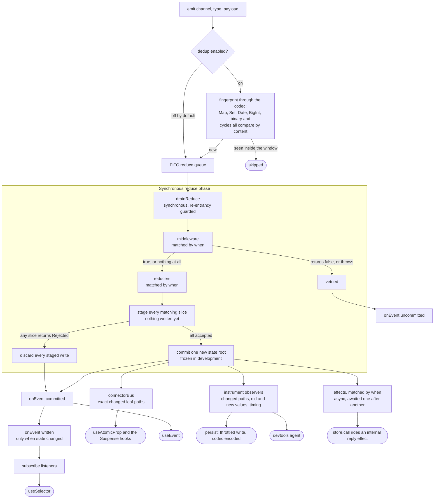
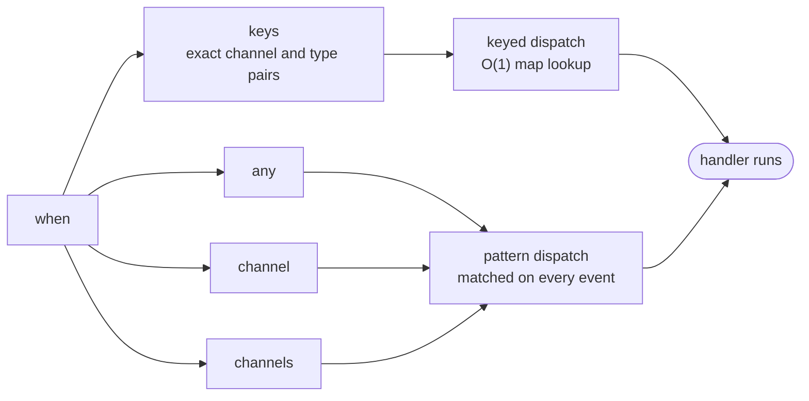

# Yoltra

> [ 🇲🇽 Versión en Español](./docs/es/README.md)&nbsp; | &nbsp; 👉 🇺🇸 English Version &nbsp;

[](https://www.npmjs.com/package/@yoltra/core)
[](https://www.npmjs.com/package/@yoltra/core)
[](https://www.npmjs.com/package/@yoltra/core)
[](https://github.com/yoltra/yoltra/blob/main/LICENSE)
[](https://github.com/yoltra/yoltra/actions/workflows/ci.yml)

**Fine-grained reactive state, event-sourced, with time-travel devtools. For complex,
interactive apps.**


> 3000 circles, each subscribing to its own position. Every circle re-renders independently.
> The rest of the tree is untouched. No selectors. No memoization.
> [See the demo source.](https://github.com/yoltra/yoltra/blob/main/examples/v0/yoltra-kinetic-logo/README.md) · [▶ Open the live demo](https://yoltra.dev/en/demos/kinetic-logo)

---

## The 30-second pitch

One call gives you a store **and** fully-typed hooks. Subscribe to a path with a typed accessor,
and the component re-renders only when that exact leaf changes:

```tsx
import { createYoltra } from "@yoltra/react";

// One call: store + typed hooks. No context, no createHooks, no boilerplate.
export const { useAtomicProp, useEmit } = createYoltra({
  name: "App",
  reducer: {
    todos: {
      state: { items: [{ id: "1", title: "Buy milk", done: false }] },
      when: { keys: [["todos", "rename"]] },
      reducer: (s, e) =>
        e.type === "rename"
          ? { items: s.items.map((t) => (t.id === e.payload.id ? { ...t, title: e.payload.title } : t)) }
          : s,
    },
  },
});

function TodoTitle() {
  // Object form: subscribe to the exact leaf `items.0.title`.
  // Re-renders ONLY when this exact leaf changes. No selectors, no memo.
  const title = useAtomicProp({ reducer: "todos", property: "items.0.title" });
  const emit = useEmit();
  return <span onClick={() => emit("todos", "rename", { id: "1", title: "New title" })}>{title}</span>;
}
```

The subscription _is_ the optimization.

---

## Who Yoltra is for

> **For teams building complex, interactive apps** (operational dashboards, trading and
> back-office UIs, multi-tab products, micro-frontend platforms) **who are tired of trading
> debuggability for render performance**, **Yoltra** is an **event-sourced state ecosystem**
> that delivers fine-grained re-renders _and_ a fully observable, replayable event log.
> **Unlike** Redux (observable, but coarse and verbose) **or** Jotai, Valtio, and signals
> (fine-grained, but opaque), Yoltra refuses that trade.

---

## What makes Yoltra different

Most state libraries make you pick two of the following. Yoltra is built to give you all four at
once. That intersection is where it lives:

|                    | Fine-grained (no manual memo) | Event log + time-travel  |  One-call setup  | Typed paths / end-to-end types |
| ------------------ | :---------------------------: | :----------------------: | :--------------: | :----------------------------: |
| **Redux Toolkit**  |      ✗ selectors + memo       | ✓ (the reason many stay) |  ✗ boilerplate   |            partial             |
| **Zustand**        |       ✗ manual equality       |            ✗             |        ✓         |            partial             |
| **Jotai / Recoil** |            ✓ atoms            |            ✗             |        ✓         |               ✓                |
| **Valtio / MobX**  |         ✓ proxy magic         |            ✗             |        ✓         |            partial             |
| **Signals**        |               ✓               |            ✗             |        ✓         |               ✓                |
| **Yoltra**         |     ✓ path subscriptions      |      ✓ **built-in**      | ✓ `createYoltra` |       ✓ typed accessors        |

The fine-grained camp (Jotai, Valtio, signals) has thin devtools and no event log. The
event-sourced camp (Redux) has great devtools but coarse reactivity and boilerplate. **Yoltra is
the one place you get fine-grained reactivity, an event log with real time-travel, one-call
setup, and full type-safety, together.** A deeper, honest
comparison lives in the
[library comparison](./docs/en/design/state-management-library-comparison.md).

---

## How a store works

One event, end to end. The reduce phase is synchronous, so `getState()` is correct the moment
`emit()` returns; effects run afterwards as an independent task.



### `when`: one matcher, two dispatch routes

Reducers, middleware and effects all target events the same way, and the shape you choose
decides how the store finds them.



`keys` is exact and typed against your event map, so a typo is a compile error. The other three
are matched at runtime, which is what lets one handler cover a whole channel.

### The niceties, and where they plug in

| Piece | Where it sits |
| --- | --- |
| **codec** | Content dedup, persistence on both read and write, devtools snapshots and event payloads. Round-trips `Map`, `Set`, `Date`, `RegExp`, `Error`, `BigInt`, typed arrays, cycles and shared references, and reports what it cannot represent instead of dropping it |
| **persistence** | `hydrate()` seeds initial state before the store exists, so there is no boot flash; `persist()` rides the instrumentation seam |
| **devtools** | `instrument()` streams events and patches; time travel applies state back through `__applyExternalState`. Replay does not re-run your `onEvent` handlers unless they opt in |
| **registration** | `registerSlice`, `registerMiddleware` and `registerEffect` add to a live store and widen its types. `replace*` replaces only what the application authored, so a hot reload leaves a library's slice alone |
| **cascade guard** | An event emitted from a handler carries its cause and its depth, so a cycle is stopped and named rather than hanging the tab |

---

## What you stop doing: the pains Yoltra removes

### Manual render optimization: delete your `useMemo`s

Subscribe to `items.0.title` or the wildcard `items.*.done` and re-render only when that exact
path changes, across nested objects, arrays, and dynamic keys. No selectors, no memoization, no
`React.memo` on every leaf.

```tsx
// Object form: subscribe to the exact path
const title = useAtomicProp({ reducer: "todos", property: "items.0.title" });

// Wildcard path + derive with a mapper
const allDone = useAtomicProp({ reducer: "todos", property: "items.*.done" }, (s) =>
  s.items.every((i) => i.done),
);
```

[See the flamegraph comparison (Redux vs Yoltra).](https://github.com/yoltra/yoltra/blob/main/examples/v0/yoltra-in-react/redux-yoltra-profiler.md)

### Store wiring and boilerplate

`createYoltra(spec)` returns the store and every typed hook (`useAtomicProp`, `useEmit`,
`useEvent`, `useSelector`, …). The hooks default to that store, so a `<Provider>` is optional. No
separate context file, no `createHooks` wiring.

### Guessing when state is current

The reduce phase (middleware → reducers → subscribers → coarse listeners) runs **synchronously**,
so `getState()` is correct the instant `emit()` returns, even with middleware. Effects run
afterward, asynchronously, and the returned promise resolves only once _this_ event's effects
finish. No stale reads, no "sometimes sync, sometimes async."

### Silent state surprises

Content-based dedup is **off by default**. Yoltra never silently swallows two legitimate rapid
events (double-clicks, repeated `+1`). Opt into coalescing with `dedupWindowMs`, or use a per-emit
`dedupKey` for identity-based dedup (e.g. a React Strict Mode double-invoke). Writes cost
O(change), not O(state size): a one-field update never clones or re-freezes the whole slice.

---

## What you start shipping: the gains Yoltra creates

### Time-travel devtools that show exactly what changed

Because Yoltra is event-sourced, its devtools are first-class, not an afterthought. The store
reports the **precise leaf paths** that changed on every event, so the panel renders exact RFC-6902
patches (`replace /todos/items/0/title`), a filterable event log with committed/rejected events,
real metrics (reduce timing, dedup hits, queue depth), and **time-travel + event replay**. This is
the capability the fine-grained camp can't cheaply match.

> **See it live →** [**Orbital Mission Control**](https://github.com/yoltra/yoltra/blob/main/examples/v0/yoltra-mission-control/README.md)
> runs the store, the hub, and this exact panel in one page, with no install. Pause the telemetry,
> scrub the mission timeline, and watch the state rebuild. ([Guided tour](https://github.com/yoltra/yoltra/blob/main/examples/v0/yoltra-mission-control/GUIDE.md).) · [▶ Open the live demo](https://yoltra.dev/en/demos/mission-control)

### Events you can intercept, reject, and audit

Events are `(channel, type, payload)` tuples, natural namespacing that scales without collisions.
They flow through a hookable pipeline. Middleware can **reject** an event, producing an
_uncommitted_ event your UI can react to, ideal for authorization, validation, and optimistic UI:

```tsx
await emit("auth", "login", credentials);
await emit("analytics", "track", event);

// React when middleware blocks a delete
useEvent("ui", "delete", () => showToast("Delete was blocked by permissions"), "uncommitted");
```

### Batteries for real apps: entities, persistence, Suspense

`createEntityAdapter` gives collections identity-stable paths (`entities.<id>.title`) that
survive reorders; `persist`/`hydrate` snapshot slices with versioned envelopes and migrations
(web storage, custom adapters, `dehydrate()` for SSR handoff); Suspense hooks cover async
reads. All inside the bundle-size budgets CI enforces.

---

## Packages

| Package                                                                                  | Description                                                                                                                                             |
| ---------------------------------------------------------------------------------------- | ------------------------------------------------------------------------------------------------------------------------------------------------------- |
| **[@yoltra/core](https://github.com/yoltra/yoltra/blob/main/packages/core/README.md)**   | Framework-agnostic store: reducers, middleware, effects, fine-grained change tracking, typed instrumentation, entity adapter, persistence + hydration   |
| **[@yoltra/react](https://github.com/yoltra/yoltra/blob/main/packages/react/README.md)** | React hooks: fine-grained subscriptions, typed path accessors, `createYoltra`, entity hooks, Suspense                                                   |
| **[@yoltra/ds](https://github.com/yoltra/yoltra/blob/main/packages/ds/README.md)**       | Design system: accessible React primitives (forms, tables, overlays, menus, tabs), three-tier `--yl-*` design tokens, light/dark theming with contrast checked in both. Standalone, usable without the store |
| **@yoltra/devtools-\***                                                                  | DevTools suite: protocol, hub server, browser/node agents, and the panel UI (browser extension + CLI)                                                   |

---

## Quick start (React)

[Quick-start guide](./docs/en/QUICK_START_GUIDE.md): a working app in under 3 minutes.

## DevTools

Yoltra's store exposes a typed instrumentation seam (`store.instrument(...)`) that the agents
consume with zero `as any` casts. A small hub relays events from your running app to the panel;
the panel renders the event log, the live state tree, precise per-event patches, metrics, and
time-travel. An event that did not commit says why, and names the middleware that vetoed it when
that middleware has a name. The browser and node agents are deliberately separate packages so a web bundle never
pulls in a Node-only WebSocket, and vice versa.

---

## Live examples

> ### 🛰️ [Orbital Mission Control](https://github.com/yoltra/yoltra/blob/main/examples/v0/yoltra-mission-control/README.md): the flagship demo
>
> **Start here.** Every Yoltra feature _and_ the live **DevTools panel** on one screen: fine-grained
> render counters, wildcard subscriptions, async effects, middleware veto, and time-travel, all running
> over an in-memory hub with **no install**. → **[Guided tour](https://github.com/yoltra/yoltra/blob/main/examples/v0/yoltra-mission-control/GUIDE.md)** · **[▶ Open the live demo](https://yoltra.dev/en/demos/mission-control)**

| Example                                                                                                                   | Description                                                                                                                                                                                                      |
| ------------------------------------------------------------------------------------------------------------------------- | ---------------------------------------------------------------------------------------------------------------------------------------------------------------------------------------------------------------- |
| **[Kinetic Logo (3000 particles)](https://github.com/yoltra/yoltra/blob/main/examples/v0/yoltra-kinetic-logo/README.md)** | Physics simulation with an independent path subscription per circle · [▶ Live demo](https://yoltra.dev/en/demos/kinetic-logo)                                                                                    |
| **[Todo App with Profiler](https://github.com/yoltra/yoltra/blob/main/examples/v0/yoltra-in-react/README.md)**            | Side-by-side flamegraph comparison with Redux ([results](https://github.com/yoltra/yoltra/blob/main/examples/v0/yoltra-in-react/redux-yoltra-profiler.md)) · [▶ Live demo](https://yoltra.dev/en/demos/in-react) |
| **[Counter](https://github.com/yoltra/yoltra/blob/main/examples/v0/yoltra-react-counter/README.md)**                      | The minimal end-to-end example · [▶ Live demo](https://yoltra.dev/en/demos/react-counter)                                                                                                                        |
| **[Next.js Theme Switcher](https://github.com/yoltra/yoltra/blob/main/examples/v0/yoltra-in-nextjs/README.md)**           | Client-side Yoltra inside a Next.js (Pages Router) app · [▶ Live demo](https://yoltra.dev/en/demos/in-nextjs)                                                                                                    |

---

## Documentation

- **[Quick Start Guide](https://github.com/yoltra/yoltra/blob/main/docs/en/QUICK_START_GUIDE.md)**: 3 steps to a working app
- **[Migration Guide](https://github.com/yoltra/yoltra/blob/main/docs/en/MIGRATION_GUIDE.md)**: coming from Redux, Zustand, or Jotai
- **[Request & Reply Guide](https://github.com/yoltra/yoltra/blob/main/docs/en/REQUEST_REPLY_GUIDE.md)**: `store.call()`: correlation without ids, streaming progress with real backpressure
- **[Upgrading to 0.10.0](https://github.com/yoltra/yoltra/blob/main/docs/en/UPGRADE_0.10.md)**: what changed, how you would notice, and what to do
- **[Upgrading to 0.8.0](https://github.com/yoltra/yoltra/blob/main/docs/en/UPGRADE_0.8.md)**: what changed, how you would notice, and what to do
- **[Upgrading @yoltra/ds to 0.4.0](https://github.com/yoltra/yoltra/blob/main/packages/ds/README.md#upgrading-from-03x)**: 38 renamed tokens, the codemod that ships in the package, and a denser default size
- **[Decoration Guide](https://github.com/yoltra/yoltra/blob/main/docs/en/DECORATION_GUIDE.md)**: adding a slice, middleware or effect to somebody else's store, with the types
- **[Testing Guide](https://github.com/yoltra/yoltra/blob/main/docs/en/TESTING_GUIDE.md)**: unit-test stores, effects, middleware, and components
- **[Next.js Guide](https://github.com/yoltra/yoltra/blob/main/docs/en/NEXTJS_GUIDE.md)**: client-side usage in the Pages and App Router
- **[@yoltra/core API](https://github.com/yoltra/yoltra/blob/main/packages/core/README.md)**: store, middleware, effects, `When` matchers, instrumentation
- **[@yoltra/react API](https://github.com/yoltra/yoltra/blob/main/packages/react/README.md)**: hooks, typed accessors, `createYoltra`, Suspense
- **[@yoltra/ds](https://github.com/yoltra/yoltra/blob/main/packages/ds/README.md)**: components, tokens, theming, and the SSR contract
- **[Event Pipeline Architecture](https://github.com/yoltra/yoltra/blob/main/docs/en/design/event-queue-architecture.md)**: how the synchronous reduce / async effect pipeline works
- **[Library Comparison](https://github.com/yoltra/yoltra/blob/main/docs/en/design/state-management-library-comparison.md)**: honest architectural comparison with Redux, Zustand, Jotai, and others

---

## Contributing

We welcome contributions! Please read the
[Contributing Guide](https://github.com/yoltra/yoltra/blob/main/CONTRIBUTING.md),
[Code of Conduct](https://github.com/yoltra/yoltra/blob/main/CODE_OF_CONDUCT.md),
[Governance](https://github.com/yoltra/yoltra/blob/main/GOVERNANCE.md), and
[Security Policy](https://github.com/yoltra/yoltra/blob/main/SECURITY.md).

---

## Development (Monorepo)

```bash
npm i -g @microsoft/rush
rush install
rush build
rush test
```

See the
**[Developer Guide](https://github.com/yoltra/yoltra/blob/main/docs/en/DEVELOPER_GUIDE.md)** for
more details.

---

## Status

Yoltra is in **Release Candidate** stage:

- The core and React APIs are stable and used in production applications.
- TypeScript types are strict and comprehensive; coverage, bundle-size, and benchmark gates run in CI.
- The DevTools suite attaches zero-config in the browser, and ships an embeddable panel and a Node terminal UI.
- Minor APIs may still evolve before v1.0.

Feedback and PRs are welcome.

---

## License

**MIT**. Free to use in commercial and open-source projects. Every published `@yoltra/*`
package ships under the same MIT license.
See [LICENSE](https://github.com/yoltra/yoltra/blob/main/LICENSE) for details.

**Trademarks:** “Yoltra” and the Yoltra logo are trademarks. The MIT license covers the code, not the marks. See
[TRADEMARKS.md](https://github.com/yoltra/yoltra/blob/main/TRADEMARKS.md).

---

## Community

- **Website:** [yoltra.dev](https://yoltra.dev)
- **Twitter/X:** [@yoltra_dev](https://twitter.com/yoltra_dev)
- **GitHub Discussions:** [Join the conversation](https://github.com/yoltra/yoltra/discussions)
- **Issues:** [Report bugs or request features](https://github.com/yoltra/yoltra/issues)
