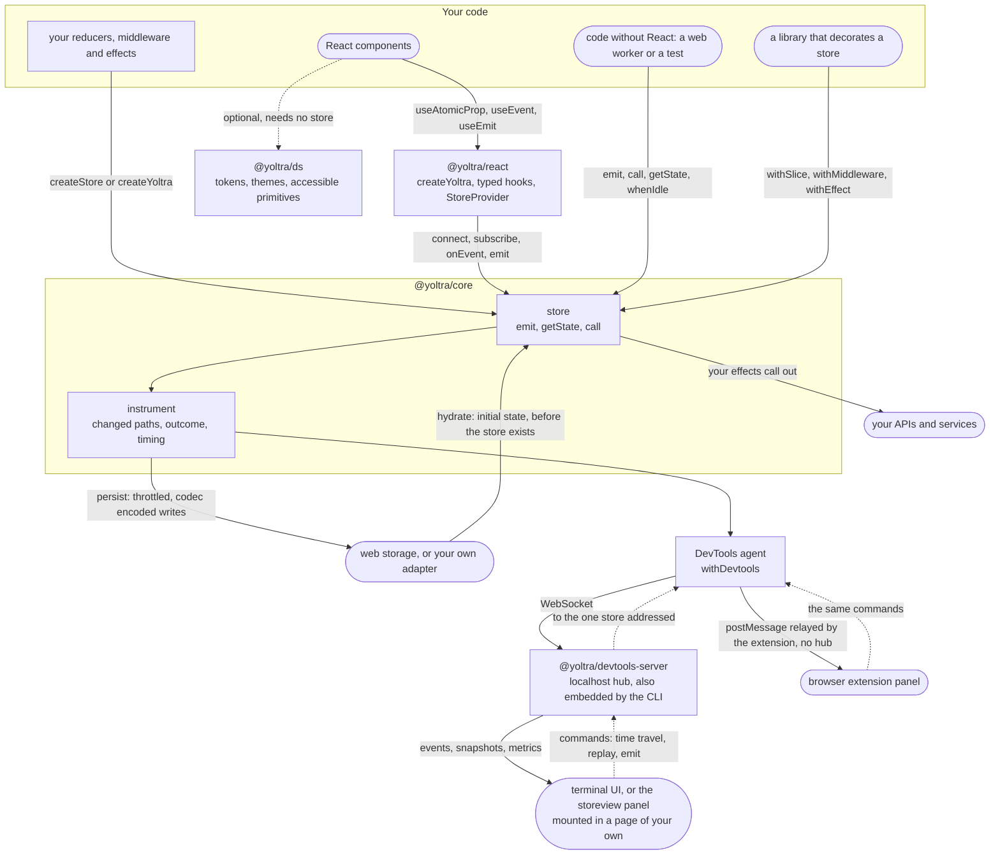
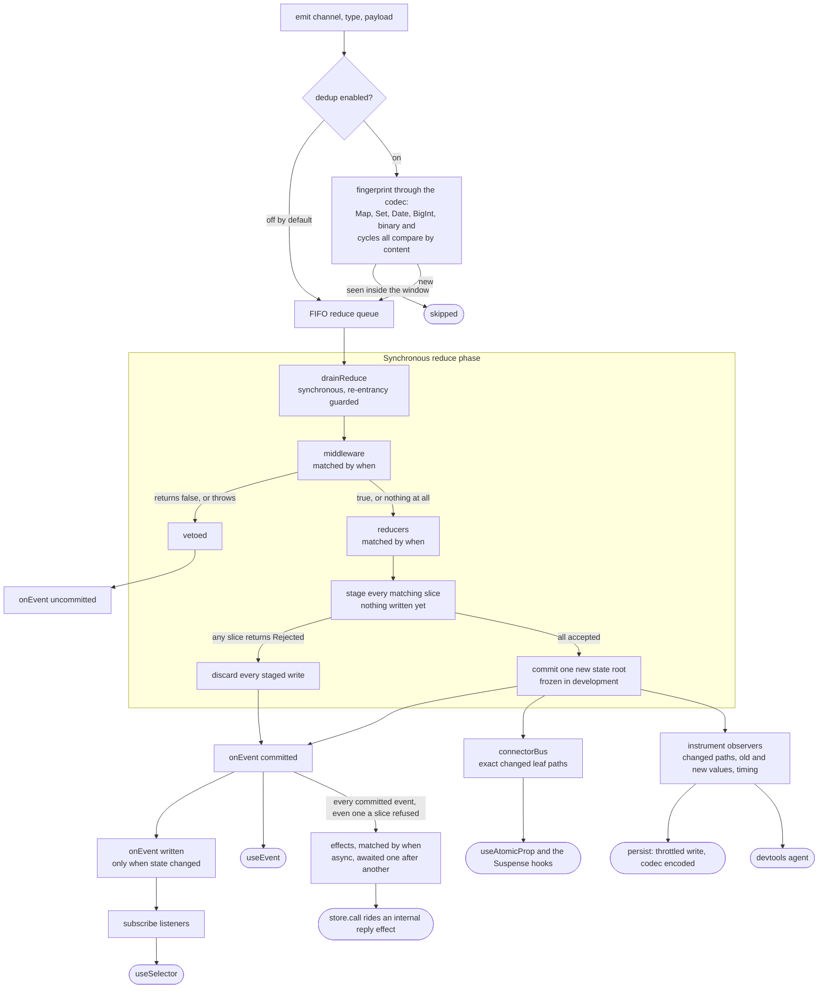
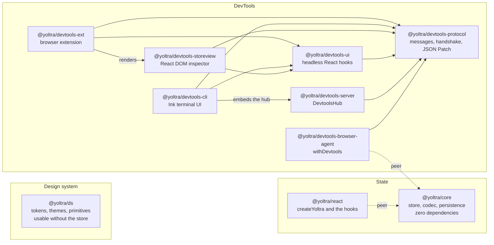

# Yoltra

> [ 🇲🇽 Versión en Español](./docs/es/README.md)&nbsp; | &nbsp; 👉 🇺🇸 English Version &nbsp;

[](https://www.npmjs.com/package/@yoltra/core)
[](https://www.npmjs.com/package/@yoltra/core)
[](https://www.npmjs.com/package/@yoltra/core)
[](https://github.com/yoltra/yoltra/blob/main/LICENSE)
[](https://github.com/yoltra/yoltra/actions/workflows/ci.yml)

**Fine-grained reactive state, event-sourced, with time-travel devtools. For complex,
interactive apps.**


> 3000 circles, each subscribing to its own position. Every circle re-renders independently.
> The rest of the tree is untouched. No selectors. No memoization.
> [See the demo source.](https://github.com/yoltra/yoltra/blob/main/examples/v0/yoltra-kinetic-logo/README.md) · [▶ Open the live demo](https://yoltra.dev/en/demos/kinetic-logo/)

A state library for TypeScript and React: you emit events, pure reducers compute the next state,
each component subscribes to the exact paths it reads, and the DevTools replay the event log.

> **Full guide:** [Yoltra on yoltra.dev](https://yoltra.dev/en/yoltra/)

## The 30-second pitch

One call gives you a store **and** fully-typed hooks. Subscribe to a path with a typed accessor,
and the component re-renders only when that exact leaf changes:

```tsx
import { createYoltra } from "@yoltra/react";

// One call: store + typed hooks. No context, no createHooks, no boilerplate.
export const { useAtomicProp, useEmit } = createYoltra({
  name: "App",
  reducer: {
    todos: {
      state: { items: [{ id: "1", title: "Buy milk", done: false }] },
      when: { keys: [["todos", "rename"]] },
      reducer: (s, e) =>
        e.type === "rename"
          ? { items: s.items.map((t) => (t.id === e.payload.id ? { ...t, title: e.payload.title } : t)) }
          : s,
    },
  },
});

function TodoTitle() {
  // Object form: subscribe to the exact leaf `items.0.title`.
  // Re-renders ONLY when this exact leaf changes. No selectors, no memo.
  const title = useAtomicProp({ reducer: "todos", property: "items.0.title" });
  const emit = useEmit();
  return <span onClick={() => emit("todos", "rename", { id: "1", title: "New title" })}>{title}</span>;
}
```

The subscription _is_ the optimization.

## Who Yoltra is for

Teams building complex, interactive apps (operational dashboards, trading and back-office UIs,
multi-tab products, micro-frontend platforms) who are tired of trading debuggability for render
performance. Redux is observable but coarse; Jotai, Valtio and signals are fine-grained but opaque.
Yoltra refuses that trade.

## What makes Yoltra different

|                    | Fine-grained (no manual memo) | Event log + time-travel  |  One-call setup  | Typed paths / end-to-end types |
| ------------------ | :---------------------------: | :----------------------: | :--------------: | :----------------------------: |
| **Redux Toolkit**  |      ✗ selectors + memo       | ✓ (the reason many stay) |  ✗ boilerplate   |            partial             |
| **Zustand**        |       ✗ manual equality       |            ✗             |        ✓         |            partial             |
| **Jotai / Recoil** |            ✓ atoms            |            ✗             |        ✓         |               ✓                |
| **Valtio / MobX**  |         ✓ proxy magic         |            ✗             |        ✓         |            partial             |
| **Signals**        |               ✓               |            ✗             |        ✓         |               ✓                |
| **Yoltra**         |     ✓ path subscriptions      |      ✓ **built-in**      | ✓ `createYoltra` |       ✓ typed accessors        |

- **No manual render optimization:** subscribe to `items.0.title` or the wildcard `items.*.done`; no selectors, no memo.
- **State is current when `emit()` returns:** the reduce phase is synchronous; the promise resolves when the effects finish.
- **No silent surprises:** dedup is off by default (`dedupWindowMs`, or a per-emit `dedupKey`); writes cost O(change).
- **Events you can intercept:** `(channel, type, payload)` tuples; middleware can reject one as an _uncommitted_ event.
- **Batteries:** `createEntityAdapter`, versioned `persist`/`hydrate`, `dehydrate()` for SSR, Suspense hooks.

More on yoltra.dev: [the pains Yoltra removes](https://yoltra.dev/en/yoltra/docs/overview/#what-you-stop-doing-the-pains-yoltra-removes),
[the gains it creates](https://yoltra.dev/en/yoltra/docs/overview/#what-you-start-shipping-the-gains-yoltra-creates), and the [library comparison](./docs/en/design/state-management-library-comparison.md).

## Where Yoltra sits in your code

Your code talks to one store. React components reach it through `@yoltra/react`; other code (a web
worker, a test, a library that decorates the store) calls it directly. Everything that watches
from the outside (persistence, the DevTools) attaches through the same `instrument()` seam, so none
of it asks anything of your reducers. The dotted arrows are DevTools commands, which the agent
carries out only when they are switched on (`allowReplay`, `allowEmit`).



## How a store works

One event, end to end. The reduce phase is synchronous, so `getState()` is correct the moment
`emit()` returns; effects run afterwards as an independent task.



One `when` matcher targets events for reducers, middleware and effects: `keys` (typed pairs, O(1)
lookup) or `any`, `channel`, `channels` (matched at runtime). The **codec** round-trips `Map`, `Set`,
`Date`, `BigInt` and cycles; `registerSlice` and friends extend a live store and widen its types; the
**cascade guard** stops and names an event cycle. More on yoltra.dev: [`when` dispatch](https://yoltra.dev/en/yoltra/docs/overview/#when-one-matcher-two-dispatch-routes), [the niceties](https://yoltra.dev/en/yoltra/docs/overview/#the-niceties-and-where-they-plug-in).

## Packages

| Package | Description |
| --- | --- |
| **[@yoltra/core](https://github.com/yoltra/yoltra/blob/main/packages/core/README.md)** | Framework-agnostic store: reducers, middleware, effects, fine-grained change tracking, typed instrumentation, entity adapter, persistence + hydration. Zero dependencies |
| **[@yoltra/react](https://github.com/yoltra/yoltra/blob/main/packages/react/README.md)** | React hooks: fine-grained subscriptions, typed path accessors, `createYoltra`, entity hooks, Suspense. Takes core as a peer |
| **[@yoltra/ds](https://github.com/yoltra/yoltra/blob/main/packages/ds/README.md)** | Design system: accessible React primitives, three-tier `--yl-*` tokens, light/dark theming with contrast checked in both. Standalone, usable without the store |
| **@yoltra/devtools-\*** | DevTools suite: protocol, hub server, browser agent, and the panel UI (browser extension + CLI) |



## Quick start (React)

Three steps, from install to a working, fully-typed app:

1. **Install:** `npm install @yoltra/core @yoltra/react` (`@yoltra/react` only when using React).
2. **Create the store and its typed hooks** with one `createYoltra` call, like the pitch above.
3. **Use the hooks:** read with `useAtomicProp`, change state with `useEmit`. No `<Provider>` needed.

The [Quick Start Guide](https://github.com/yoltra/yoltra/blob/main/docs/en/QUICK_START_GUIDE.md) walks the same three steps with a typed counter.

## DevTools

The browser agent (`withDevtools`) consumes the typed `store.instrument(...)` seam and feeds the
browser extension, or the localhost hub behind the terminal CLI and the embeddable storeview panel:
event log, live state tree, exact RFC-6902 patches, metrics, time-travel and replay. An event that
did not commit says why, naming the vetoing middleware when it has a name.

## Live examples

- **[Orbital Mission Control](https://github.com/yoltra/yoltra/blob/main/examples/v0/yoltra-mission-control/README.md)**, the flagship: every feature and the live DevTools panel on one screen, no install · [Guided tour](https://github.com/yoltra/yoltra/blob/main/examples/v0/yoltra-mission-control/GUIDE.md) · [▶ Live demo](https://yoltra.dev/en/demos/mission-control/)
- **[Kinetic Logo (3000 particles)](https://github.com/yoltra/yoltra/blob/main/examples/v0/yoltra-kinetic-logo/README.md)**: an independent path subscription per circle · [▶ Live demo](https://yoltra.dev/en/demos/kinetic-logo/)
- **[Todo App with Profiler](https://github.com/yoltra/yoltra/blob/main/examples/v0/yoltra-in-react/README.md)**: flamegraphs side by side with Redux ([results](https://github.com/yoltra/yoltra/blob/main/examples/v0/yoltra-in-react/redux-yoltra-profiler.md)) · [▶ Live demo](https://yoltra.dev/en/demos/in-react/)
- **[Counter](https://github.com/yoltra/yoltra/blob/main/examples/v0/yoltra-react-counter/README.md)**: the minimal end-to-end example · [▶ Live demo](https://yoltra.dev/en/demos/react-counter/)
- **[Next.js Theme Switcher](https://github.com/yoltra/yoltra/blob/main/examples/v0/yoltra-in-nextjs/README.md)**: client-side Yoltra in the Pages Router · [▶ Live demo](https://yoltra.dev/en/demos/in-nextjs/)

## Documentation

Each document in the repository is the brief version; its full page lives on yoltra.dev, next to
the [API reference](https://yoltra.dev/en/yoltra/api/) and [what's new in 0.10](https://yoltra.dev/en/yoltra/releases/0.10/).

| In the repository | What it covers | On yoltra.dev |
| --- | --- | --- |
| [Quick Start Guide](https://github.com/yoltra/yoltra/blob/main/docs/en/QUICK_START_GUIDE.md) | 3 steps to a working app | [Quick start](https://yoltra.dev/en/yoltra/docs/quick-start/) |
| [Migration Guide](https://github.com/yoltra/yoltra/blob/main/docs/en/MIGRATION_GUIDE.md) | Coming from Redux, Zustand or Jotai | [Migration](https://yoltra.dev/en/yoltra/docs/migration/) |
| [Request & Reply Guide](https://github.com/yoltra/yoltra/blob/main/docs/en/REQUEST_REPLY_GUIDE.md) | `store.call()`: correlation without ids, streaming progress with backpressure | [Request and reply](https://yoltra.dev/en/yoltra/docs/request-reply/) |
| [Decoration Guide](https://github.com/yoltra/yoltra/blob/main/docs/en/DECORATION_GUIDE.md) | Adding a slice, middleware or effect to somebody else's store, with the types | [Decoration](https://yoltra.dev/en/yoltra/docs/decoration/) |
| [Testing Guide](https://github.com/yoltra/yoltra/blob/main/docs/en/TESTING_GUIDE.md) | Testing stores, effects, middleware and components | [Testing](https://yoltra.dev/en/yoltra/docs/testing/) |
| [Next.js Guide](https://github.com/yoltra/yoltra/blob/main/docs/en/NEXTJS_GUIDE.md) | Client-side usage in the Pages and App Router | [Next.js](https://yoltra.dev/en/yoltra/docs/nextjs/) |
| [Upgrading to 0.10.0](https://github.com/yoltra/yoltra/blob/main/docs/en/UPGRADE_0.10.md) | What changed, how you would notice, what to do | [0.10 migration](https://yoltra.dev/en/yoltra/releases/0.10/migration/) |
| [Upgrading to 0.8.0](https://github.com/yoltra/yoltra/blob/main/docs/en/UPGRADE_0.8.md) | What changed, how you would notice, what to do | [0.8 migration](https://yoltra.dev/en/yoltra/releases/0.8/migration/) |
| [@yoltra/core](https://github.com/yoltra/yoltra/blob/main/packages/core/README.md) | Store, middleware, effects, `When` matchers, instrumentation | [core](https://yoltra.dev/en/yoltra/packages/core/) |
| [@yoltra/react](https://github.com/yoltra/yoltra/blob/main/packages/react/README.md) | Hooks, typed accessors, `createYoltra`, Suspense | [react](https://yoltra.dev/en/yoltra/packages/react/) |
| [@yoltra/ds](https://github.com/yoltra/yoltra/blob/main/packages/ds/README.md) | Components, tokens, theming, the SSR contract, and upgrading to 0.4.0 (38 renamed tokens, a codemod) | [ds](https://yoltra.dev/en/ds/docs/overview/) |
| [Event Pipeline Architecture](https://github.com/yoltra/yoltra/blob/main/docs/en/design/event-queue-architecture.md) | The synchronous reduce and async effect pipeline | [Event pipeline](https://yoltra.dev/en/yoltra/docs/design/event-queue-architecture/) |
| [Library Comparison](https://github.com/yoltra/yoltra/blob/main/docs/en/design/state-management-library-comparison.md) | Architectural comparison with Redux, Zustand, Jotai and others | [Comparison](https://yoltra.dev/en/yoltra/docs/design/state-management-comparison/) |

## Contributing

Contributions are welcome. Please read the [Contributing Guide](https://github.com/yoltra/yoltra/blob/main/CONTRIBUTING.md), [Code of Conduct](https://github.com/yoltra/yoltra/blob/main/CODE_OF_CONDUCT.md),
[Governance](https://github.com/yoltra/yoltra/blob/main/GOVERNANCE.md) and [Security Policy](https://github.com/yoltra/yoltra/blob/main/SECURITY.md).

## Development (Monorepo)

`npm i -g @microsoft/rush`, then `rush install`, `rush build` and `rush test`. The
**[Developer Guide](https://github.com/yoltra/yoltra/blob/main/docs/en/DEVELOPER_GUIDE.md)** has the rest.

## Status

**Release Candidate.** The core and React APIs are stable and used in production; types are strict;
coverage, bundle-size and benchmark gates run in CI. Minor APIs may still evolve before v1.0.

## License

**MIT**, for commercial and open-source projects; every published `@yoltra/*` package ships under
it. See [LICENSE](https://github.com/yoltra/yoltra/blob/main/LICENSE). “Yoltra” and the Yoltra logo
are trademarks; the license covers the code, not the marks. See [TRADEMARKS.md](https://github.com/yoltra/yoltra/blob/main/TRADEMARKS.md).

## Community

- **Website:** [yoltra.dev](https://yoltra.dev)
- **Twitter/X:** [@yoltra_dev](https://twitter.com/yoltra_dev)
- **GitHub Discussions:** [Join the conversation](https://github.com/yoltra/yoltra/discussions)
- **Issues:** [Report bugs or request features](https://github.com/yoltra/yoltra/issues)

> **Full guide:** [Yoltra on yoltra.dev](https://yoltra.dev/en/yoltra/)
