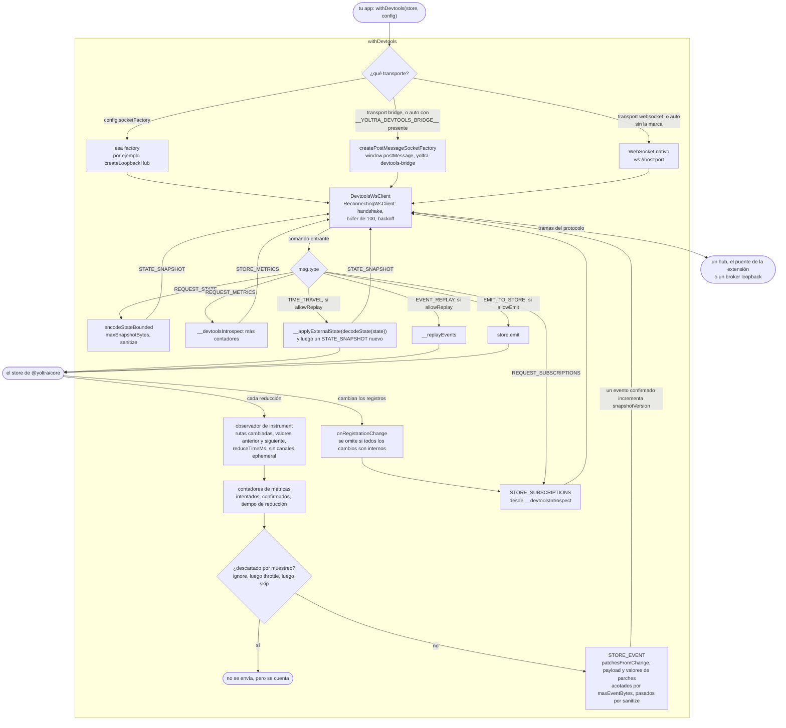

# @yoltra/devtools-browser-agent

> 👉 🇲🇽 Versión en Español&nbsp; | &nbsp;[ 🇺🇸 English Version](./README.md)&nbsp;

[](https://www.npmjs.com/package/@yoltra/devtools-browser-agent)
[](https://www.npmjs.com/package/@yoltra/devtools-browser-agent)
[](https://www.npmjs.com/package/@yoltra/devtools-browser-agent)
[](https://github.com/yoltra/yoltra/blob/main/LICENSE)

**Agente de DevTools para el navegador: conecta un store de Yoltra al hub de DevTools desde el
navegador.**

`@yoltra/devtools-browser-agent` instrumenta un store de Yoltra de forma transparente, así que
cada evento, cambio de estado y métrica se reenvía al hub de DevTools en tiempo real. Usa la API
nativa `WebSocket` del navegador (sin dependencias adicionales), con reconexión automática y
búfer de mensajes.

> **Documentación completa:** [@yoltra/devtools-browser-agent en yoltra.dev](https://yoltra.dev/es/yoltra/packages/devtools-browser-agent/)

## Instalación

```bash
npm install @yoltra/devtools-browser-agent
```

**Dependencia peer:** `@yoltra/core`

## Inicio rápido

```typescript
import { withDevtools } from "@yoltra/devtools-browser-agent";

// Instrumenta el store: se conecta al hub en ws://localhost:9800
withDevtools(store, { port: 9800 });

// Usa el store con normalidad: los eventos se reenvían automáticamente
await store.emit("todos", "add", { title: "Comprar leche" });
```

## Cómo funciona

El agente se engancha a la costura de instrumentación tipada del store,
`store.instrument(observer)`, convierte las rutas cambiadas de cada evento en parches RFC-6902 y
los envía como mensajes `STORE_EVENT`, con `reason` y `vetoedBy` para un evento no confirmado.
Guarda hasta 100 mensajes mientras está desconectado y responde a `REQUEST_STATE`,
`REQUEST_METRICS`, `REQUEST_SUBSCRIPTIONS`, `TIME_TRAVEL`, `EVENT_REPLAY` y `EMIT_TO_STORE`. Los
eventos de canales `ephemeral` no se reportan, y el envoltorio es **transparente**: devuelve la
misma instancia del store.

El transporte es un `socketFactory` propio, el puente `postMessage` de la extensión o un
`WebSocket` nativo. Los payloads se muestrean, se acotan con `maxEventBytes` y
`maxSnapshotBytes` y pasan por `sanitize`. El viaje en el tiempo tiene dos candados: el agente
necesita `allowReplay`, y el store debe crearse con `createStore({ devtools: { allowReplay: true } })`.

## Configuración

`withDevtools(store, config)` recibe un `DevtoolsWrapperConfig`: `port` (obligatorio), `host`
(`"localhost"`), `storeId` (`store.name`), `allowReplay` y `allowEmit` (ambos `false`),
`autoReconnect` (`true`), `maxReconnectAttempts`, `baseDelay` y `maxDelay`.

```typescript
withDevtools(store, {
  port: 9800,
  storeId: "my-app-store",
  allowReplay: true,
  allowEmit: true,
  autoReconnect: true,
  maxReconnectAttempts: 20,
  baseDelay: 1000,
  maxDelay: 15000,
});
```

El hub acepta una conexión por id de store: da `storeId` distintos a stores con el mismo `name`.

## Reconexión

Backoff exponencial con 10 % de jitter, desde `baseDelay` (1 s) hasta `maxDelay` (30 s). Los
mensajes se guardan en un búfer durante la desconexión y se vacían al reconectar.

## Referencia de la API

`withDevtools(store, config)` y el tipo `DevtoolsWrapperConfig`, en la
[referencia de la API](https://yoltra.dev/es/yoltra/api/devtools-browser-agent/). La página del
paquete diagrama [cómo funciona](https://yoltra.dev/es/yoltra/packages/devtools-browser-agent/#cómo-funciona).



## Paquetes relacionados

- **[@yoltra/devtools-protocol](../devtools-protocol/README.es.md)**: formato de cable y tipos de mensaje
- **[@yoltra/devtools-server](../devtools-server/README.es.md)**: el hub al que se conecta este agente
- **[@yoltra/devtools-ext](../devtools-ext/README.es.md)**: extensión de navegador que muestra la UI
- **[@yoltra/core](../../packages/core/README.es.md)**: el store que se instrumenta

## Licencia

**MIT**. De uso libre en proyectos comerciales y de código abierto.

> **Documentación completa:** [@yoltra/devtools-browser-agent en yoltra.dev](https://yoltra.dev/es/yoltra/packages/devtools-browser-agent/)
