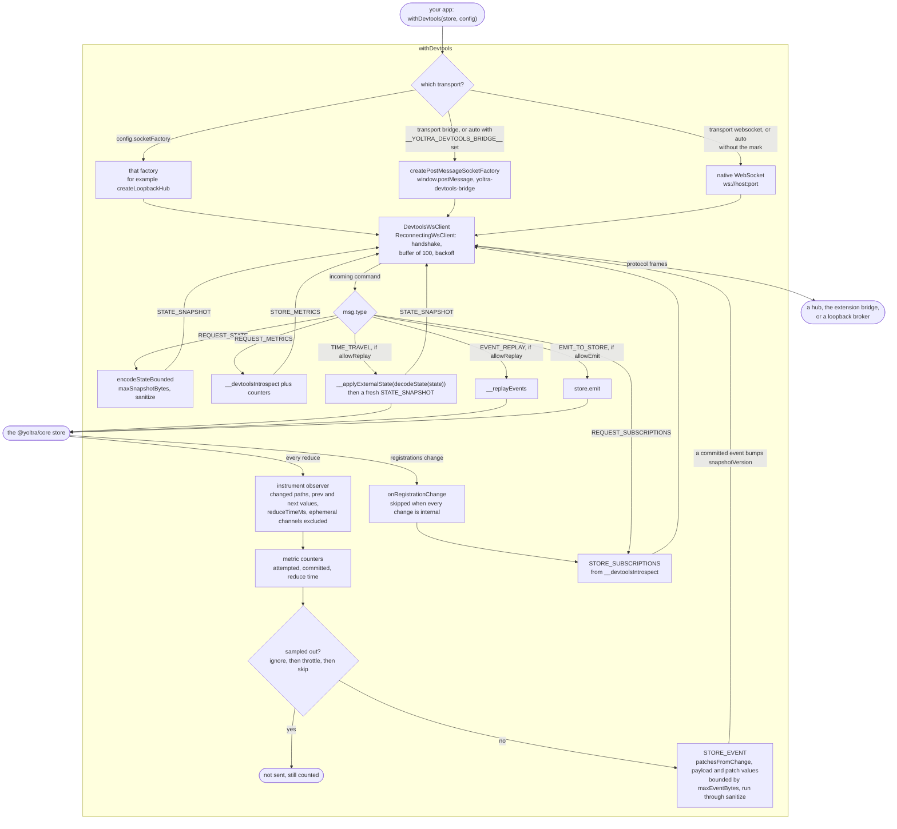

# @yoltra/devtools-browser-agent

> [ 🇲🇽 Versión en Español](./README.es.md)&nbsp;
> | 👉
> [ 🇺🇸 English Version](./README.md)&nbsp;

[](https://www.npmjs.com/package/@yoltra/devtools-browser-agent)
[](https://www.npmjs.com/package/@yoltra/devtools-browser-agent)
[](https://www.npmjs.com/package/@yoltra/devtools-browser-agent)
[](https://github.com/yoltra/yoltra/blob/main/LICENSE)

**Browser DevTools agent — connect a Yoltra store to the DevTools hub from the browser.**

`@yoltra/devtools-browser-agent` transparently instruments a Yoltra store so every event, state
change, and metric is forwarded to the DevTools hub in real time. Uses the native browser
`WebSocket` API (no extra dependency) with automatic reconnection and message buffering.

---

## Installation

```bash
npm install @yoltra/devtools-browser-agent
```

**Peer dependency:** `@yoltra/core`

---

## Quick Start

```typescript
import { createStore } from "@yoltra/core";
import { withDevtools } from "@yoltra/devtools-browser-agent";

const store = createStore({
  name: "TodoApp",
  reducer: {
    todos: {
      state: { items: [] },
      when: { channel: "todos" },
      reducer: (state, event) => {
        if (event.type === "add") return { items: [...state.items, event.payload] };
        return state;
      },
    },
  },
});

// Instrument the store — connects to hub on ws://localhost:9800
withDevtools(store, { port: 9800 });

// Use the store as normal — events are automatically forwarded
await store.emit("todos", "add", { title: "Buy milk" });
```

---

## How It Works

1. **Attaches to the typed instrumentation seam**, `store.instrument(observer)`. The store reports
   each event with its exact changed leaf paths, previous and next values, commit status and
   reduce timing, and for an event that did not commit, `reason` and `vetoedBy`. There is no
   interceptor effect and no state diffing, and the seam costs nothing while no observer is attached.
2. **Maps the reported paths to RFC-6902 patches** with `patchesFromChange`, and forwards
   `reason` and `vetoedBy` on `STORE_EVENT` so the panel can say why an event did not commit
3. **Sends `STORE_EVENT` messages** with patches to the hub
4. **Buffers messages** (up to 100) while disconnected, flushes on reconnect
5. **Handles incoming commands** from extensions:
   - `REQUEST_STATE` → full state snapshot
   - `REQUEST_METRICS` → performance counters
   - `REQUEST_SUBSCRIPTIONS` → reducer/effect inventory
   - `TIME_TRAVEL` → restore store to a previous state
   - `EVENT_REPLAY` → replay events through reducers only
   - `EMIT_TO_STORE` → inject a synthetic event

Events on the store's `ephemeral` channels are not reported: the agent registers its observer
without `{ ephemeral: true }`, so that traffic never reaches the timeline and costs it nothing.

The wrapper is **transparent** — it returns the same store instance.

The diagram below shows both directions inside `withDevtools`. Outbound, each observed event
becomes one `STORE_EVENT`, sampled and size-bounded before it is sent. Inbound, a command touches
the store only when the matching capability is on: `allowReplay` for `TIME_TRAVEL` and
`EVENT_REPLAY`, `allowEmit` for `EMIT_TO_STORE`. The transport is picked once, at wrap time.



Time-travel is gated twice: the agent ignores `TIME_TRAVEL` without `allowReplay`, and the store
itself throws from `__applyExternalState` unless it was created with
`createStore({ devtools: { allowReplay: true } })`.

---

## Configuration

```typescript
interface DevtoolsWrapperConfig {
  /** Hub server port. Required. */
  port: number;
  /** Hub server host. @default "localhost" */
  host?: string;
  /** Store ID the hub and panels key on (survives reconnects). @default store.name */
  storeId?: string;
  /** Enable time-travel and event replay. @default false */
  allowReplay?: boolean;
  /** Allow extensions to emit events to this store. @default false */
  allowEmit?: boolean;
  /** Auto-reconnect on disconnect. @default true */
  autoReconnect?: boolean;
  /** Max reconnection attempts. @default Infinity */
  maxReconnectAttempts?: number;
  /** Base delay for exponential backoff (ms). @default 1000 */
  baseDelay?: number;
  /** Max delay cap for backoff (ms). @default 30000 */
  maxDelay?: number;
}
```

The hub accepts one connection per store id. Two stores with the same `name` and no `storeId`
present the same id, so the second is refused with a handshake error naming the id, and retries
until the first disconnects. Give such stores distinct `storeId` values. The same holds through
the extension's bridge, where each store on a page keeps its own connection to the panel.

### Full-Featured Setup

```typescript
withDevtools(store, {
  port: 9800,
  storeId: "my-app-store",
  allowReplay: true,
  allowEmit: true,
  autoReconnect: true,
  maxReconnectAttempts: 20,
  baseDelay: 1000,
  maxDelay: 15000,
});
```

---

## Reconnection

The agent uses exponential backoff with jitter for reconnection:

- Starts at `baseDelay` (default 1s)
- Doubles each attempt, capped at `maxDelay` (default 30s)
- Adds 10% jitter to prevent thundering herd
- Messages are buffered during disconnects and flushed on reconnect

---

## API Reference

| Export                        | Description                               |
| ----------------------------- | ----------------------------------------- |
| `withDevtools(store, config)` | Instrument a store and connect to the hub |
| `DevtoolsWrapperConfig`       | Configuration type                        |

---

## Related Packages

- **[@yoltra/devtools-protocol](../devtools-protocol/README.md)** — Wire format and message
  types
- **[@yoltra/devtools-server](../devtools-server/README.md)** — The hub this agent connects to
- **[@yoltra/devtools-ext](../devtools-ext/README.md)** — Browser extension that displays the UI
- **[@yoltra/core](../../packages/core/README.md)** — The store being instrumented

---

## License

**MIT** — Free to use in commercial and open-source projects.
