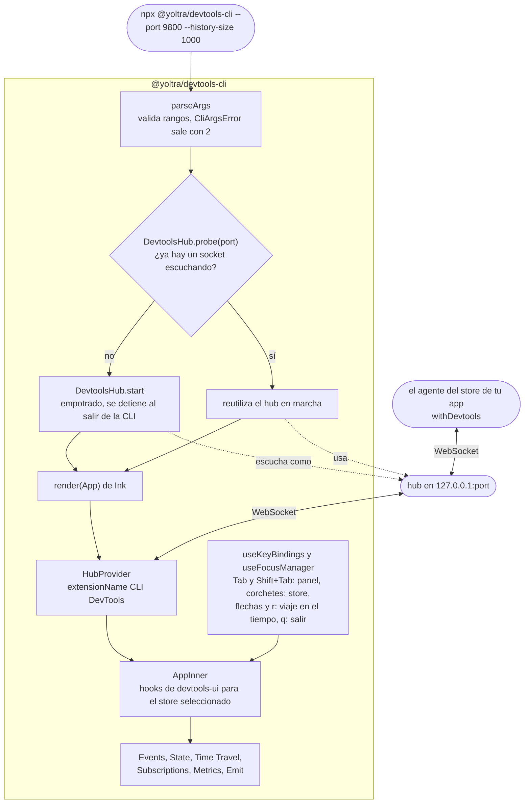

# @yoltra/devtools-cli

> 👉 🇲🇽 Versión en Español&nbsp; | &nbsp;[ 🇺🇸 English Version](./README.md)&nbsp;

[](https://www.npmjs.com/package/@yoltra/devtools-cli)
[](https://www.npmjs.com/package/@yoltra/devtools-cli)
[](https://www.npmjs.com/package/@yoltra/devtools-cli)
[](https://github.com/yoltra/yoltra/blob/main/LICENSE)

**UI de terminal para Yoltra DevTools — inspecciona stores desde la línea de comandos.**

`@yoltra/devtools-cli` es una aplicación de terminal hecha con React + Ink que empotra un hub de
DevTools y renderiza una TUI completa para inspeccionar stores de Yoltra. Útil cuando prefieres tener el
inspector en una terminal, o en una sesión SSH donde no hay navegador disponible.

---

## Instalación

```bash
npm install -g @yoltra/devtools-cli
```

O ejecútalo directamente:

```bash
npx @yoltra/devtools-cli
```

---

## Inicio rápido

```bash
# Arranca la CLI (levanta el hub en el puerto 9800 automáticamente)
npx @yoltra/devtools-cli

# Puerto y tamaño de historial personalizados
npx @yoltra/devtools-cli --port 8900 --history-size 2000
```

Después, conecta el store de tu app a ese hub. `transport: "websocket"` lo envía al hub aunque la
extensión de navegador esté instalada:

```typescript
import { withDevtools } from "@yoltra/devtools-browser-agent";

withDevtools(store, { port: 9800, transport: "websocket" });
```

La CLI mostrará los stores conectados y los datos de eventos en vivo.

---

## Características

- Hub de DevTools empotrado (arranca solo, y se omite si ya hay uno corriendo)
- Selector de stores por pestañas para varios stores conectados
- Línea de tiempo de eventos con canal y tipo
- Explorador interactivo del árbol de estado
- Viaje en el tiempo por los eventos registrados, para un store que permite replay
- Panel de suscripciones (reducers, efectos, middleware)
- Panel de métricas de rendimiento
- Emisor de eventos para inyectar eventos de prueba
- Navegación por teclado con gestión del foco

---

## Paneles

Seis paneles, en este orden. No hay atajos por panel: `Tab` pasa al siguiente panel y
`Shift+Tab` al anterior.

| Panel         | Descripción                                                                         |
| ------------- | ----------------------------------------------------------------------------------- |
| Events        | Flujo de eventos en vivo con canal, tipo y marca de tiempo                          |
| State         | Árbol de estado plegable con los valores actuales                                   |
| Time Travel   | Recorre los eventos registrados; solo para un store que permite replay (`allowReplay`) |
| Subscriptions | Reducers, efectos y middleware registrados                                          |
| Metrics       | Conteo de eventos, tasa, tiempo de proceso, profundidad de cola                     |
| Emit          | Compone y emite eventos al store seleccionado                                       |

| Tecla               | Acción                                                         |
| ------------------- | -------------------------------------------------------------- |
| `Tab` / `Shift+Tab` | Panel siguiente / anterior                                     |
| `]` / `[`           | Store conectado siguiente / anterior                           |
| `←` / `→`           | En Time Travel: retrocede / avanza un evento                   |
| `r`                 | En Time Travel: vuelve al estado en vivo                       |
| `q`                 | Salir                                                          |

---

## Opciones de la CLI

| Flag             | Por defecto | Descripción                                            |
| ---------------- | ----------- | ------------------------------------------------------ |
| `--port`         | `9800`      | Puerto del servidor hub                                |
| `--history-size` | `1000`      | Máximo de eventos retenidos para clientes tardíos      |

Estos símbolos también se exportan (`parseArgs`, `CliArgs`, `CliArgsError`, `DEFAULT_PORT`,
`DEFAULT_HISTORY_SIZE`), así que una herramienta que empotre el hub puede reutilizar el mismo contrato
de argumentos en vez de volver a deducirlo.

---

## Cómo funciona

```
┌──────────────┐     ┌──────────────┐     ┌──────────────┐
│  Tu app      │     │  CLI         │     │  TUI de Ink  │
│  (con        │ WS  │  (hub        │     │  (React +    │
│  withDevtools│────►│  empotrado)  │────►│   Ink)       │
│  )           │     │              │     │              │
└──────────────┘     └──────────────┘     └──────────────┘
```

1. La CLI arranca un `DevtoolsHub` empotrado (o detecta uno existente mediante `probe()`)
2. La TUI de Ink se conecta al hub como extensión usando los hooks de `@yoltra/devtools-ui`
3. El agente del store de tu app se conecta al hub por WebSocket
4. Eventos, estado y comandos fluyen por el hub en tiempo real

La CLI son dos cosas en un proceso: un hub opcional y un panel. Arranca el hub solo cuando
`DevtoolsHub.probe` no encuentra nada escuchando en el puerto, y la UI de terminal siempre se
conecta como una extensión normal mediante `HubProvider`, así que se comporta igual con su propio
hub que con uno que ya estaba corriendo.



---

## Arquitectura

| Archivo                             | Responsabilidad                                          |
| ----------------------------------- | -------------------------------------------------------- |
| `index.ts`                          | Punto de entrada, parseo de argumentos, ciclo de vida hub |
| `app.tsx`                           | Componente raíz de Ink con `HubProvider`                  |
| `components/StoreTabs.tsx`          | Selector de stores por pestañas                           |
| `components/EventTimeline.tsx`      | Registro de eventos en terminal                           |
| `components/StateTree.tsx`          | Árbol de estado plegable                                  |
| `components/SubscriptionsPanel.tsx` | Inventario de suscripciones                               |
| `components/MetricsDashboard.tsx`   | Contadores de rendimiento                                 |
| `components/EventEmitter.tsx`       | Formulario de composición de eventos                      |
| `components/StatusBar.tsx`          | Barra de estado de la conexión                            |
| `hooks/useKeyBindings.ts`           | Gestión de atajos de teclado                              |
| `hooks/useFocusManager.ts`          | Ciclado del foco entre paneles                            |

---

## Paquetes relacionados

- **[@yoltra/devtools-server](../devtools-server/README.md)** — El hub que empotra esta CLI
- **[@yoltra/devtools-ui](../devtools-ui/README.md)** — Hooks de React que dan lógica a la TUI
- **[@yoltra/devtools-protocol](../devtools-protocol/README.md)** — Formato de cable para hablar
  con el hub
- **[@yoltra/devtools-browser-agent](../devtools-browser-agent/README.md)** — Agente para conectar
  stores del navegador
- **[@yoltra/devtools-ext](../devtools-ext/README.md)** — Alternativa: extensión de navegador

---

## Licencia

**MIT** — De uso libre en proyectos comerciales y de código abierto.
