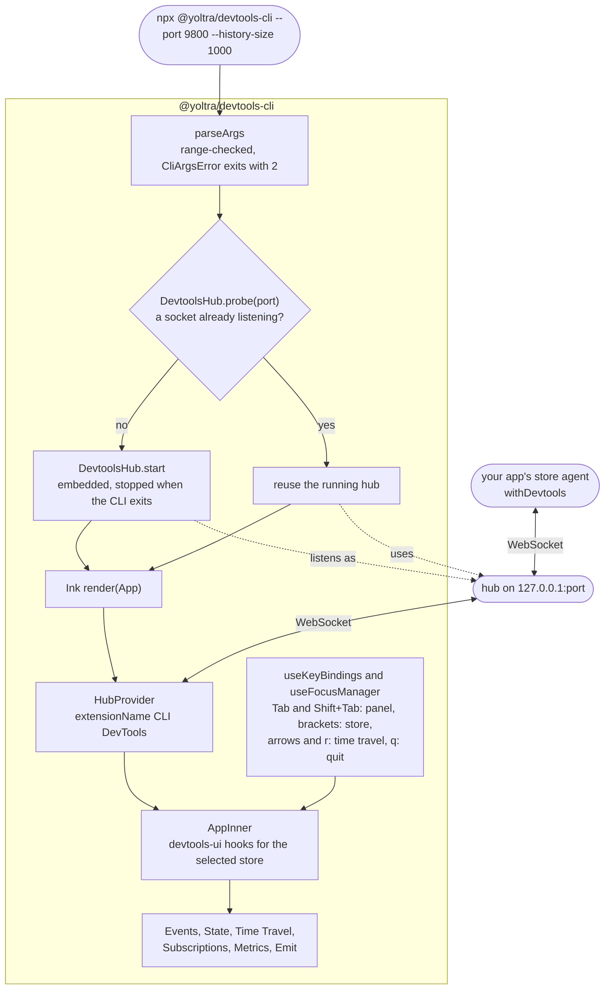

# @yoltra/devtools-cli

> [ 🇲🇽 Versión en Español](./README.es.md)&nbsp; | 👉 🇺🇸 English Version &nbsp;

[](https://www.npmjs.com/package/@yoltra/devtools-cli)
[](https://www.npmjs.com/package/@yoltra/devtools-cli)
[](https://www.npmjs.com/package/@yoltra/devtools-cli)
[](https://github.com/yoltra/yoltra/blob/main/LICENSE)

**Terminal UI for Yoltra DevTools — inspect stores from the command line.**

`@yoltra/devtools-cli` is a React + Ink terminal application that embeds a DevTools hub and
renders a full-featured TUI for inspecting Yoltra stores. Useful when you would rather keep the
inspector in a terminal, or in an SSH session where a browser is not available.

---

## Installation

```bash
npm install -g @yoltra/devtools-cli
```

Or run directly:

```bash
npx @yoltra/devtools-cli
```

---

## Quick Start

```bash
# Start the CLI (auto-starts hub on port 9800)
npx @yoltra/devtools-cli

# Custom port and history size
npx @yoltra/devtools-cli --port 8900 --history-size 2000
```

Then connect your app's store to that hub. `transport: "websocket"` sends it to the hub even when
the browser extension is installed:

```typescript
import { withDevtools } from "@yoltra/devtools-browser-agent";

withDevtools(store, { port: 9800, transport: "websocket" });
```

The CLI will display connected stores and live event data.

---

## Features

- Embedded DevTools hub (auto-starts, skips if one is already running)
- Tabbed store selector for multiple connected stores
- Event timeline with channel/type display
- Interactive state tree explorer
- Time travel through the recorded events, for a store that allows replay
- Subscriptions panel (reducers, effects, middleware)
- Performance metrics dashboard
- Event emitter for injecting test events
- Keyboard navigation with focus management

---

## Panels

Six panels, in this order. There are no per-panel shortcuts: `Tab` moves to the next panel and
`Shift+Tab` to the previous one.

| Panel         | Description                                                                      |
| ------------- | -------------------------------------------------------------------------------- |
| Events        | Live event stream with channel, type, and timestamp                              |
| State         | Collapsible state tree with current values                                       |
| Time Travel   | Scrub the recorded events; only for a store that allows replay (`allowReplay`)   |
| Subscriptions | Registered reducers, effects, middleware                                         |
| Metrics       | Event count, rate, processing time, queue depth                                  |
| Emit          | Compose and emit events to the selected store                                    |

| Key                 | Action                                                         |
| ------------------- | -------------------------------------------------------------- |
| `Tab` / `Shift+Tab` | Next / previous panel                                          |
| `]` / `[`           | Next / previous connected store                                |
| `←` / `→`           | On Time Travel: step one event back / forward                  |
| `r`                 | On Time Travel: resume live state                              |
| `q`                 | Quit                                                           |

---

## CLI Options

| Flag             | Default | Description                                     |
| ---------------- | ------- | ----------------------------------------------- |
| `--port`         | `9800`  | Hub server port                                 |
| `--history-size` | `1000`  | Max events retained for late-connecting clients |

---

## How It Works

```
┌──────────────┐     ┌──────────────┐     ┌──────────────┐
│  Your App    │     │  CLI         │     │  Ink TUI     │
│  (with       │ WS  │  (embedded   │     │  (React +    │
│  withDevtools│────►│   hub)       │────►│   Ink)       │
│  )           │     │              │     │              │
└──────────────┘     └──────────────┘     └──────────────┘
```

1. The CLI starts an embedded `DevtoolsHub` (or detects an existing one via `probe()`)
2. The Ink TUI connects to the hub as an extension using `@yoltra/devtools-ui` hooks
3. Your app's store agent connects to the hub via WebSocket
4. Events, state, and commands flow through the hub in real time

The CLI is two things in one process: an optional hub and a panel. It starts the hub only when
`DevtoolsHub.probe` finds nothing listening on the port, and the terminal UI always connects as a
regular extension through `HubProvider`, so it behaves the same against its own hub or one
already running.



---

## Architecture

| File                                | Responsibility                                   |
| ----------------------------------- | ------------------------------------------------ |
| `index.ts`                          | CLI entry point, argument parsing, hub lifecycle |
| `app.tsx`                           | Root Ink component with `HubProvider`            |
| `components/StoreTabs.tsx`          | Tabbed store selector                            |
| `components/EventTimeline.tsx`      | Terminal event log                               |
| `components/StateTree.tsx`          | Collapsible state tree                           |
| `components/SubscriptionsPanel.tsx` | Subscription inventory                           |
| `components/MetricsDashboard.tsx`   | Performance counters                             |
| `components/EventEmitter.tsx`       | Event composition form                           |
| `components/StatusBar.tsx`          | Connection status bar                            |
| `hooks/useKeyBindings.ts`           | Keyboard shortcut management                     |
| `hooks/useFocusManager.ts`          | Focus cycling between panels                     |

---

## Related Packages

- **[@yoltra/devtools-server](../devtools-server/README.md)** — The hub embedded by this CLI
- **[@yoltra/devtools-ui](../devtools-ui/README.md)** — React hooks powering the TUI logic
- **[@yoltra/devtools-protocol](../devtools-protocol/README.md)** — Wire format for hub
  communication
- **[@yoltra/devtools-browser-agent](../devtools-browser-agent/README.md)** — Agent for
  connecting browser stores
- **[@yoltra/devtools-ext](../devtools-ext/README.md)** — Alternative: Browser extension

---

## License

**MIT** — Free to use in commercial and open-source projects.
