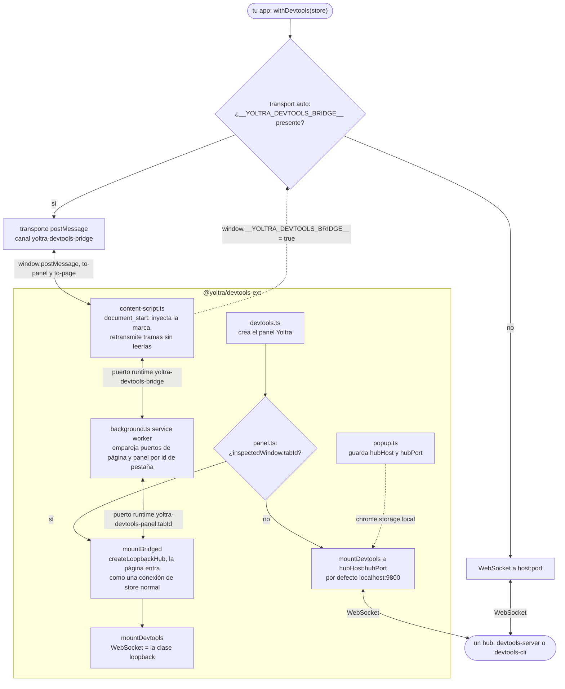

# @yoltra/devtools-ext

> 👉 🇲🇽 Versión en Español&nbsp; | &nbsp;[ 🇺🇸 English Version](./README.md)&nbsp;

**Extensión de navegador para Yoltra DevTools — Chrome y Firefox (Manifest V3).**

`@yoltra/devtools-ext` es una extensión de navegador ligera que añade un panel «Yoltra» a las
DevTools de Chrome y Firefox. El panel renderiza `@yoltra/devtools-storeview` y se conecta al hub
de DevTools que corre en localhost. Un popup permite configurar el host y el puerto del hub.

---

## Características

- Añade una pestaña «Yoltra» a las DevTools del navegador
- Inspector de store completo: eventos, árbol de estado, suscripciones, viaje en el tiempo,
  emisión y métricas
- Conexión al hub configurable desde los ajustes del popup
- Inspecciona una página **sin hub**: un content script retransmite las tramas del protocolo y un
  service worker empareja cada página con el panel que inspecciona su pestaña
- Compatible con MV3 (Chrome + Firefox)

---

## Instalación

### Desde el código fuente (desarrollo)

```bash
# Compila la extensión
cd devtools/devtools-ext
pnpm build

# Cargar en Chrome:
# 1. Abre chrome://extensions
# 2. Activa el «Modo de desarrollador»
# 3. Pulsa «Cargar descomprimida»
# 4. Selecciona la carpeta dist/

# Cargar en Firefox:
# 1. Abre about:debugging
# 2. Pulsa «Este Firefox»
# 3. Pulsa «Cargar complemento temporal»
# 4. Selecciona dist/manifest.json
```

---

## Cómo funciona

El panel llega al store de una página por uno de dos caminos. Dentro de DevTools usa el puente:
el content script y el service worker llevan las tramas entre la página y el panel, y el panel
ejecuta su propio broker en memoria (`createLoopbackHub`), así que no interviene ningún servidor.
Fuera de ese contexto se conecta a un hub por WebSocket. Ningún relevo lee ni reescribe una
trama.



1. En cada página `http://` y `https://`, el content script inyecta un script en línea que fija
   `__YOLTRA_DEVTOOLS_BRIDGE__` en `document_start`, antes de que corra tu código.
2. Tu app instrumenta un store con `withDevtools()`. Con el `transport: "auto"` por defecto ve la
   marca y habla por `postMessage` en lugar de abrir un WebSocket.
3. El panel Yoltra de DevTools monta `@yoltra/devtools-storeview` sobre su propio broker en
   memoria, y el service worker lo une a la página de la pestaña inspeccionada.

**Dentro de un panel de DevTools, la extensión siempre usa el puente.** `panel.ts` elige el hub
solo cuando falta `chrome.devtools.inspectedWindow.tabId`, lo que ocurre solo si `panel.html` se
abre fuera de DevTools, por ejemplo como una página de extensión suelta. Así que el panel de
DevTools no usa el host y el puerto del hub configurados en el popup, y un store cuyo agente habla
con un hub (`transport: "websocket"`, un `socketFactory` explícito, una página donde no
corre el content script, como `file://`, o una página cuya Content-Security-Policy bloquea ese
script en línea) no aparece en él. Inspecciona esos con
[`@yoltra/devtools-cli`](../devtools-cli/README.es.md), o con `@yoltra/devtools-storeview` montado
en una página propia, ambos conectados al hub.

---

## Configuración

Pulsa el icono del popup de la extensión para configurar:

| Ajuste | Por defecto | Descripción                  |
| ------ | ----------- | ---------------------------- |
| Host   | `localhost` | Nombre de host del hub       |
| Port   | `9800`      | Puerto del servidor hub      |

Los ajustes se guardan en `chrome.storage.local`.

---

## Arquitectura

| Archivo                         | Responsabilidad                                            |
| ------------------------------- | ---------------------------------------------------------- |
| `manifest.json`                 | Manifiesto MV3 (permisos, página de devtools)              |
| `devtools.html` / `devtools.ts` | Registra el panel de DevTools                              |
| `panel.html` / `panel.ts`       | Monta `@yoltra/devtools-storeview` en el panel             |
| `popup.html` / `popup.ts`       | UI de ajustes de conexión al hub                           |
| `content-script.ts`             | Relevo página ↔ extensión; anuncia el puente               |
| `background.ts`                 | Service worker que une una página con su panel por pestaña |

---

## Requisitos previos

El panel de DevTools **no necesita hub**: ver [Cómo funciona](#cómo-funciona). Un hub solo importa
cuando `panel.html` se abre fuera de DevTools, que entonces se conecta a un **hub de DevTools en
ejecución**. Arranca uno con cualquiera de estos:

```bash
# Servidor independiente
npx @yoltra/devtools-server --port 9800

# Empotrado en la UI de terminal
npx @yoltra/devtools-cli --port 9800
```

Después, instrumenta tu store:

```typescript
import { withDevtools } from "@yoltra/devtools-browser-agent";

withDevtools(store, { port: 9800 });
```

---

## Paquetes relacionados

- **[@yoltra/devtools-storeview](../devtools-storeview/README.md)** — La UI de React que se
  renderiza en el panel
- **[@yoltra/devtools-server](../devtools-server/README.md)** — El hub al que se conecta esta
  extensión
- **[@yoltra/devtools-browser-agent](../devtools-browser-agent/README.md)** — Instrumenta stores
  del navegador
- **[@yoltra/devtools-protocol](../devtools-protocol/README.md)** — Formato de cable para hablar
  con el hub

---

## Licencia

**MIT** — De uso libre en proyectos comerciales y de código abierto.
