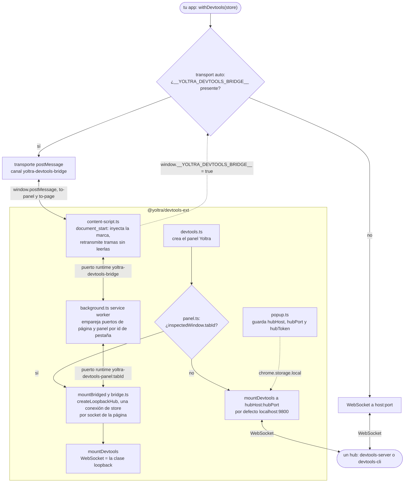

# @yoltra/devtools-ext

> 👉 🇲🇽 Versión en Español&nbsp; | &nbsp;[ 🇺🇸 English Version](./README.md)&nbsp;

**Extensión de navegador para Yoltra DevTools: Chrome y Firefox (Manifest V3).**

`@yoltra/devtools-ext` añade un panel «Yoltra» a las DevTools de Chrome y Firefox que renderiza
`@yoltra/devtools-storeview`: eventos, árbol de estado, suscripciones, viaje en el tiempo,
emisión y métricas. Inspecciona una página **sin hub**, mediante un puente; un popup configura el hub
cuando hace falta. No recopila ni envía nada: ver la [política de privacidad](./PRIVACY.md).

> **Documentación completa:** [@yoltra/devtools-ext en yoltra.dev](https://yoltra.dev/es/yoltra/packages/devtools-ext/)

## Instalación

Desde el código fuente (desarrollo):

```bash
# Compila la extensión
cd devtools/devtools-ext
pnpm build
```

- **Chrome:** abre `chrome://extensions`, activa el «Modo de desarrollador», «Cargar
  descomprimida» y selecciona `dist/`.
- **Firefox:** abre `about:debugging`, «Este Firefox», «Cargar complemento temporal» y
  selecciona `dist/manifest.json`.

## Cómo funciona

Dentro de DevTools el panel usa el puente: el content script y el service worker llevan las
tramas entre página y panel, que ejecuta su propio broker en memoria (`createLoopbackHub`), sin
servidor. Fuera de DevTools se conecta a un hub por WebSocket. Ningún relevo lee una trama.



En las páginas `http://` y `https://` el content script fija `__YOLTRA_DEVTOOLS_BRIDGE__` antes de
que corra tu código, así que `withDevtools()` con el `transport: "auto"` por defecto habla por
`postMessage`, una conexión por store. Un store cuyo agente habla con un hub (`transport:
"websocket"`, un `socketFactory`, una página `file://`, o una Content-Security-Policy que bloquea
el script en línea) no aparece en el panel: inspecciónalo con [`@yoltra/devtools-cli`](../devtools-cli/README.es.md).
Ver la [arquitectura](https://yoltra.dev/es/yoltra/packages/devtools-ext/#arquitectura).

## Configuración

Pulsa el icono del popup de la extensión para configurar:

| Ajuste | Por defecto | Descripción                                        |
| ------ | ----------- | -------------------------------------------------- |
| Host   | `localhost` | Nombre de host del hub                             |
| Port   | `9800`      | Puerto del servidor hub                            |
| Token  | ninguno     | El token del hub, solo si se inició con uno        |

Los ajustes se guardan en `chrome.storage.local`; el token se envía en el handshake. El panel de
DevTools **no necesita hub**: estos ajustes aplican solo a `panel.html` abierto fuera de DevTools,
que necesita un hub en ejecución (`npx @yoltra/devtools-server --port 9800`, ver los
[requisitos previos](https://yoltra.dev/es/yoltra/packages/devtools-ext/#requisitos-previos)).

## Paquetes relacionados

- **[@yoltra/devtools-storeview](../devtools-storeview/README.es.md)**: la UI de React que se renderiza en el panel
- **[@yoltra/devtools-server](../devtools-server/README.es.md)**: el hub al que se conecta esta extensión
- **[@yoltra/devtools-browser-agent](../devtools-browser-agent/README.es.md)**: instrumenta stores del navegador
- **[@yoltra/devtools-protocol](../devtools-protocol/README.es.md)**: formato de cable para hablar con el hub

## Licencia

**MIT**. De uso libre en proyectos comerciales y de código abierto. Privacidad: [PRIVACY.md](./PRIVACY.md).

> **Documentación completa:** [@yoltra/devtools-ext en yoltra.dev](https://yoltra.dev/es/yoltra/packages/devtools-ext/)
