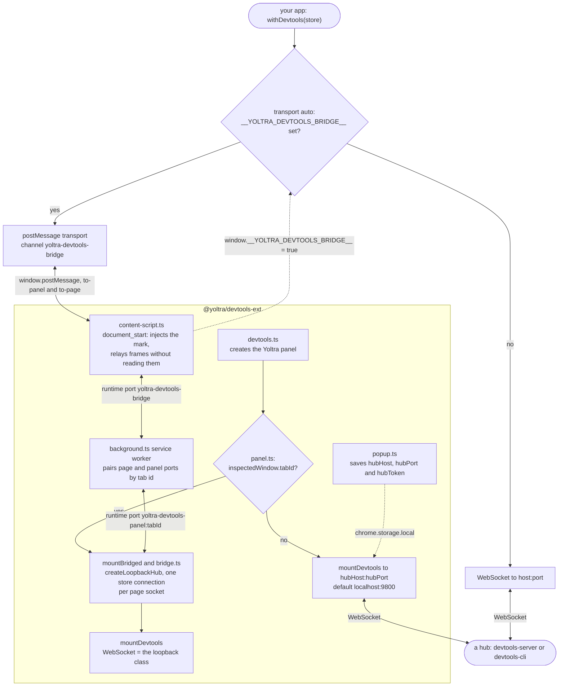

# @yoltra/devtools-ext

> [ 🇲🇽 Versión en Español](./README.es.md)&nbsp; | 👉 🇺🇸 English Version &nbsp;

**Browser extension for Yoltra DevTools: Chrome and Firefox (Manifest V3).**

`@yoltra/devtools-ext` adds a "Yoltra" panel to Chrome/Firefox DevTools that renders
`@yoltra/devtools-storeview`: events, state tree, subscriptions, time travel, emit and metrics.
It inspects a page **without a hub**, through a bridge, and a popup configures a hub connection
for the cases that need one. It collects and sends nothing: see the [privacy policy](./PRIVACY.md).

> **Full documentation:** [@yoltra/devtools-ext on yoltra.dev](https://yoltra.dev/en/yoltra/packages/devtools-ext/)

## Installation

From source (development):

```bash
# Build the extension
cd devtools/devtools-ext
pnpm build
```

- **Chrome:** open `chrome://extensions`, enable "Developer mode", "Load unpacked", select `dist/`.
- **Firefox:** open `about:debugging`, "This Firefox", "Load Temporary Add-on", select
  `dist/manifest.json`.

## How It Works

Inside DevTools the panel uses the bridge: the content script and service worker carry frames
between page and panel, which runs its own in-memory broker (`createLoopbackHub`), so no server is
involved. Outside DevTools it connects to a hub over a WebSocket. No relay reads a frame.



On `http://` and `https://` pages the content script sets `__YOLTRA_DEVTOOLS_BRIDGE__` before your
code runs, so `withDevtools()` with the default `transport: "auto"` talks `postMessage`, one
connection per store. A store whose agent talks to a hub (`transport: "websocket"`, a
`socketFactory`, a `file://` page, or a Content-Security-Policy that blocks the inline script)
does not appear in the panel: inspect it with [`@yoltra/devtools-cli`](../devtools-cli/README.md).
See the [architecture](https://yoltra.dev/en/yoltra/packages/devtools-ext/#architecture).

## Configuration

Click the extension popup icon to configure:

| Setting | Default     | Description                                          |
| ------- | ----------- | ---------------------------------------------------- |
| Host    | `localhost` | Hub server hostname                                  |
| Port    | `9800`      | Hub server port                                      |
| Token   | none        | The hub's token, if the hub was started with one     |

Settings are persisted in `chrome.storage.local`; the token is sent in the handshake. The
DevTools panel needs **no hub**: these apply only to `panel.html` opened outside DevTools, which
needs a running hub (`npx @yoltra/devtools-server --port 9800`, see the
[prerequisites](https://yoltra.dev/en/yoltra/packages/devtools-ext/#prerequisites)).

## Related Packages

- **[@yoltra/devtools-storeview](../devtools-storeview/README.md)**: the React UI rendered in the panel
- **[@yoltra/devtools-server](../devtools-server/README.md)**: the hub this extension connects to
- **[@yoltra/devtools-browser-agent](../devtools-browser-agent/README.md)**: instruments browser stores
- **[@yoltra/devtools-protocol](../devtools-protocol/README.md)**: wire format for hub communication

## License

**MIT**. Free to use in commercial and open-source projects. Privacy: [PRIVACY.md](./PRIVACY.md).

> **Full documentation:** [@yoltra/devtools-ext on yoltra.dev](https://yoltra.dev/en/yoltra/packages/devtools-ext/)
