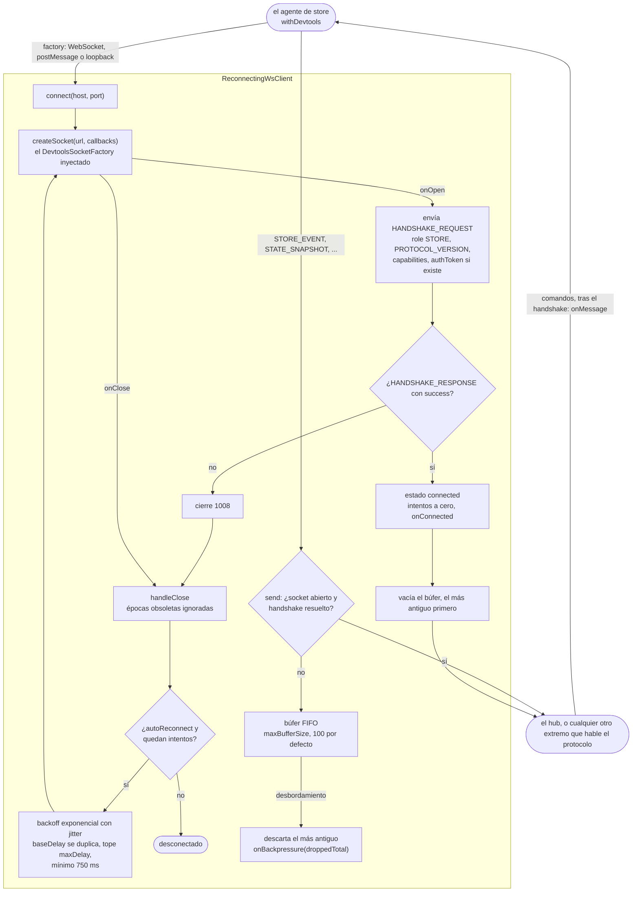
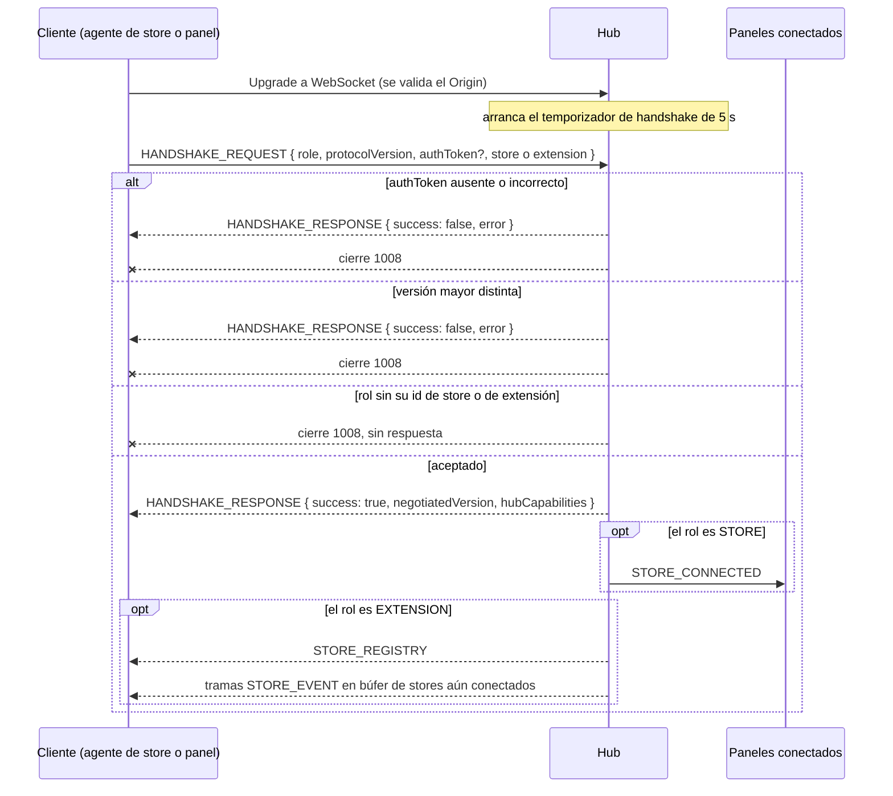

# @yoltra/devtools-protocol

> 👉 🇲🇽 Versión en Español &nbsp; | [ 🇺🇸 English Version](./README.md)&nbsp;

[](https://www.npmjs.com/package/@yoltra/devtools-protocol)
[](https://www.npmjs.com/package/@yoltra/devtools-protocol)
[](https://www.npmjs.com/package/@yoltra/devtools-protocol)
[](https://github.com/yoltra/yoltra/blob/main/LICENSE)

**Tipos de protocolo compartidos, definiciones de mensajes y utilidades para el conjunto de
Yoltra DevTools.**

`@yoltra/devtools-protocol` es el paquete de vocabulario fundamental para todo el ecosistema
DevTools. Define el formato de comunicación, los tipos de mensajes, la negociación de
capacidades y las utilidades de JSON Patch de las que dependen todos los demás paquetes
DevTools.

---

## Instalación

```bash
npm install @yoltra/devtools-protocol
```

---

## Qué Incluye

### Versión del Protocolo

Una cadena semver utilizada durante la negociación del handshake. El hub rechaza conexiones con
una versión mayor incompatible.

```typescript
import { PROTOCOL_VERSION } from "@yoltra/devtools-protocol";

console.log(PROTOCOL_VERSION); // "0.1.0"
```

### Roles

Un enum que identifica a los tres participantes del protocolo DevTools:

```typescript
import { DevtoolsRole } from "@yoltra/devtools-protocol";

DevtoolsRole.STORE; // Una instancia de store de Yoltra
DevtoolsRole.EXTENSION; // Una UI de DevTools (panel del navegador, CLI, VSCode)
DevtoolsRole.HUB; // El broker central de mensajes
```

### Tipos de Mensajes

Todos los mensajes están discriminados por un campo `type` para permitir un enrutamiento seguro
por tipo:

| Dirección           | Mensaje                 | Descripción                               |
| ------------------- | ----------------------- | ----------------------------------------- |
| Store → Extensiones | `STORE_EVENT`           | Evento con delta en JSON Patch, `committed` y, para un evento que no se confirmó, `reason` y `vetoedBy` opcionales |
| Store → Extensiones | `STATE_SNAPSHOT`        | Árbol de estado completo en versión       |
| Store → Extensiones | `STORE_METRICS`         | Contadores de rendimiento                 |
| Store → Extensiones | `STORE_SUBSCRIPTIONS`   | Inventario de reducers/effects/middleware |
| Hub → Extensiones   | `STORE_CONNECTED`       | Un store completó el handshake            |
| Hub → Extensiones   | `STORE_DISCONNECTED`    | Un store se desconectó                    |
| Hub → Extensiones   | `STORE_REGISTRY`        | Snapshot completo del registro            |
| Extensión → Store   | `REQUEST_STATE`         | Solicita un snapshot de estado            |
| Extensión → Store   | `REQUEST_METRICS`       | Solicita métricas de rendimiento          |
| Extensión → Store   | `REQUEST_SUBSCRIPTIONS` | Solicita información de suscripciones     |
| Extensión → Store   | `TIME_TRAVEL`           | Lleva el store a un estado específico     |
| Extensión → Store   | `EVENT_REPLAY`          | Reproduce eventos en los reducers         |
| Extensión → Store   | `EMIT_TO_STORE`         | Inyecta un evento sintético               |

### Capacidades

Los stores, extensiones y el hub anuncian sus capacidades durante el handshake:

```typescript
import type { StoreCapabilities, ExtensionCapabilities } from "@yoltra/devtools-protocol";

const storeCaps: StoreCapabilities = {
  replay: true,
  stateSnapshot: true,
  emit: false,
};
```

### Utilidades JSON Patch

Convierte la salida de detección de cambios de Yoltra en operaciones JSON Patch RFC 6902:

```typescript
import { computePatches, getAtPath } from "@yoltra/devtools-protocol";

const prev = { counter: { value: 1 } };
const next = { counter: { value: 2 } };

const patches = computePatches(prev, next, ["counter.value"]);
// [{ op: "replace", path: "/counter/value", value: 2 }]

getAtPath(next, "counter.value"); // 2
```

---

## Manejo de Mensajes con Seguridad de Tipos

```typescript
import type { DevtoolsMessage } from "@yoltra/devtools-protocol";

function handle(msg: DevtoolsMessage) {
  switch (msg.type) {
    case "STORE_EVENT":
      console.log("Patches:", msg.patches);
      break;
    case "STATE_SNAPSHOT":
      console.log("State:", msg.state, "v" + msg.version);
      break;
    case "STORE_CONNECTED":
      console.log("Store conectado:", msg.store.name);
      break;
    // TypeScript exige manejo exhaustivo
  }
}
```

---

## Cómo Funciona la Conexión del Store

El agente de store se conecta mediante `ReconnectingWsClient`, que se encarga del
handshake, del búfer de envío y del ciclo de reconexión. El agente solo inyecta el socket como un
`DevtoolsSocketFactory`, así que este paquete no importa ningún transporte. Nada sale antes de un
`HANDSHAKE_RESPONSE` exitoso: hasta entonces las tramas esperan en un búfer FIFO acotado, y un
desbordamiento descarta la trama más antigua y lo reporta mediante `onBackpressure`. El lado del
panel (`HubProvider` en `@yoltra/devtools-ui`) tiene su propio código de conexión y no usa este
cliente.



---

## Flujo de Handshake

```
Cliente (Store/Extensión)              Hub
  │                                     │
  ├─ HANDSHAKE_REQUEST ───────────────► │
  │  { role, protocolVersion, ... }     │
  │                                     │
  │ ◄─────────────── HANDSHAKE_RESPONSE │
  │  { success, negotiatedVersion }     │
  │                                     │
  │  (si es store) Hub transmite        │
  │  STORE_CONNECTED a extensiones      │
  │                                     │
  │  (si es extensión) Hub envía        │
  │  STORE_REGISTRY + eventos bufferizados |
```

El mismo intercambio con cada resultado que produce el hub. Un cliente se registra solo cuando el
token, la versión mayor y el id de su rol son válidos; cualquier fallo termina con el código de
cierre `1008`, igual que un cliente que no envía `HANDSHAKE_REQUEST` en 5 segundos.



---

## Documentación Técnica

La referencia completa de la API, generada a partir del código fuente, está en [yoltra.dev](https://yoltra.dev/es/yoltra/api/devtools-protocol/) (en inglés).

## Referencia de API

### Constantes

| Export             | Descripción                                        |
| ------------------ | -------------------------------------------------- |
| `PROTOCOL_VERSION` | Cadena de versión actual del protocolo (`"0.1.0"`) |
| `DevtoolsRole`     | Enum de roles participantes del protocolo          |

### Funciones

| Export                              | Descripción                                           |
| ----------------------------------- | ----------------------------------------------------- |
| `computePatches(prev, next, paths)` | Convierte rutas modificadas en operaciones JSON Patch |
| `getAtPath(obj, dottedPath)`        | Lee un valor de un objeto mediante ruta punteada      |

### Tipos

| Export                  | Descripción                              |
| ----------------------- | ---------------------------------------- |
| `DevtoolsMessage`       | Unión discriminada de todos los mensajes |
| `StoreCapabilities`     | Flags de capacidades del store           |
| `ExtensionCapabilities` | Flags de capacidades de la extensión     |
| `HubCapabilities`       | Flags de capacidades del hub             |
| `HandshakeRequest`      | Payload de solicitud de handshake        |
| `HandshakeResponse`     | Payload de respuesta de handshake        |
| `JsonPatch`             | Operación individual RFC 6902            |
| `BaseMessage`           | Campos comunes en todos los mensajes     |

---

## Paquetes Relacionados

- **[@yoltra/devtools-server](../devtools-server/README.md)** — Hub WebSocket que enruta
  mensajes del protocolo
- **[@yoltra/devtools-browser-agent](../devtools-browser-agent/README.md)** — Wrapper de store
  para navegador
- **[@yoltra/devtools-ui](../devtools-ui/README.md)** — Hooks de React para consumir mensajes
  del protocolo

---

## Licencia

**MIT** — Libre de usar en proyectos comerciales y de código abierto.
