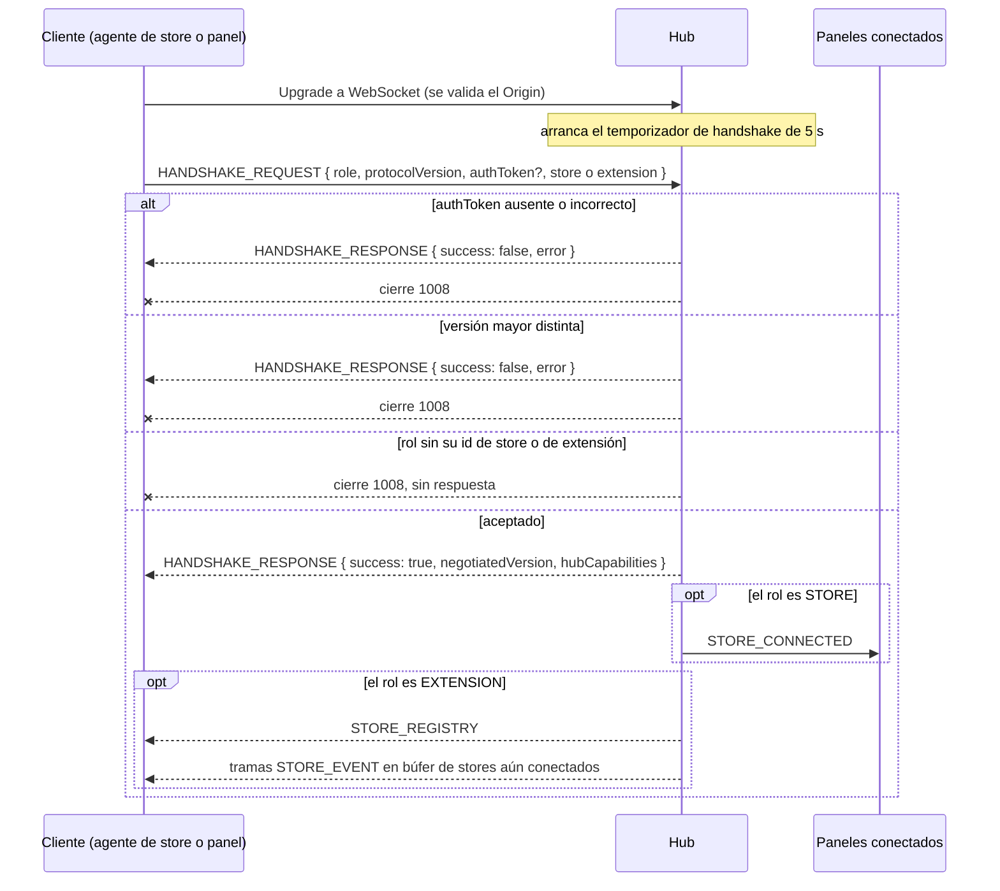

# @yoltra/devtools-protocol

> 👉 🇲🇽 Versión en Español &nbsp; | [ 🇺🇸 English Version](./README.md)&nbsp;

[](https://www.npmjs.com/package/@yoltra/devtools-protocol)
[](https://www.npmjs.com/package/@yoltra/devtools-protocol)
[](https://www.npmjs.com/package/@yoltra/devtools-protocol)
[](https://github.com/yoltra/yoltra/blob/main/LICENSE)

**Tipos de protocolo compartidos, definiciones de mensajes y utilidades para el conjunto de
Yoltra DevTools.**

`@yoltra/devtools-protocol` es el paquete de vocabulario fundamental para todo el ecosistema
DevTools. Define el formato de comunicación, los tipos de mensajes, la negociación de capacidades
y las utilidades de JSON Patch de las que dependen todos los demás paquetes DevTools.

> **Documentación completa:** [@yoltra/devtools-protocol en yoltra.dev](https://yoltra.dev/es/yoltra/packages/devtools-protocol/)

## Instalación

```bash
npm install @yoltra/devtools-protocol
```

## Qué Incluye

`PROTOCOL_VERSION` (`"0.1.0"`) se negocia en el handshake; el hub rechaza otra versión mayor.
`DevtoolsRole` nombra a los participantes (`STORE`, `EXTENSION`, `HUB`), que anuncian sus
capacidades en el handshake. Los mensajes van del store a las extensiones (`STORE_EVENT`, un delta
JSON Patch con `committed`, `reason` y `vetoedBy`; `STATE_SNAPSHOT`; `STORE_METRICS`;
`STORE_SUBSCRIPTIONS`), del hub a las extensiones (`STORE_CONNECTED`, `STORE_DISCONNECTED`,
`STORE_REGISTRY`) y de la extensión al store (`REQUEST_STATE`, `REQUEST_METRICS`,
`REQUEST_SUBSCRIPTIONS`, `TIME_TRAVEL`, `EVENT_REPLAY`, `EMIT_TO_STORE`). `computePatches`
convierte la detección de cambios de Yoltra en operaciones RFC 6902, y `getAtPath` lee una ruta
con puntos.

`DevtoolsMessage` es una unión discriminada, así que un `switch (msg.type)` se verifica como
exhaustivo: ver [manejo de mensajes con seguridad de tipos](https://yoltra.dev/es/yoltra/packages/devtools-protocol/#manejo-de-mensajes-con-seguridad-de-tipos).

## Cómo Funciona la Conexión del Store

El agente de store se conecta mediante `ReconnectingWsClient` (handshake, búfer de envío,
reconexión), con el socket inyectado como un `DevtoolsSocketFactory`, así que este paquete no
importa ningún transporte. Hasta un `HANDSHAKE_RESPONSE` exitoso, las tramas esperan en un búfer
FIFO acotado que llama a `onBackpressure`.

## Flujo de Handshake

Un cliente se registra solo cuando el token, la versión mayor y el id de su rol son válidos;
cualquier fallo, o no enviar `HANDSHAKE_REQUEST` en 5 segundos, termina con el código `1008`.



## Referencia de API

`PROTOCOL_VERSION`, `DevtoolsRole`, `computePatches`, `getAtPath`, y los tipos `DevtoolsMessage`,
`StoreCapabilities`, `ExtensionCapabilities`, `HubCapabilities`, `HandshakeRequest`,
`HandshakeResponse`, `JsonPatch`, `BaseMessage`: ver la [referencia completa](https://yoltra.dev/es/yoltra/api/devtools-protocol/).

## Paquetes Relacionados

- **[@yoltra/devtools-server](../devtools-server/README.es.md)**: hub WebSocket que enruta los mensajes del protocolo
- **[@yoltra/devtools-browser-agent](../devtools-browser-agent/README.es.md)**: envoltorio de stores del navegador
- **[@yoltra/devtools-ui](../devtools-ui/README.es.md)**: hooks de React para consumir los mensajes del protocolo

## Licencia

**MIT**. De uso libre en proyectos comerciales y de código abierto.

> **Documentación completa:** [@yoltra/devtools-protocol en yoltra.dev](https://yoltra.dev/es/yoltra/packages/devtools-protocol/)
