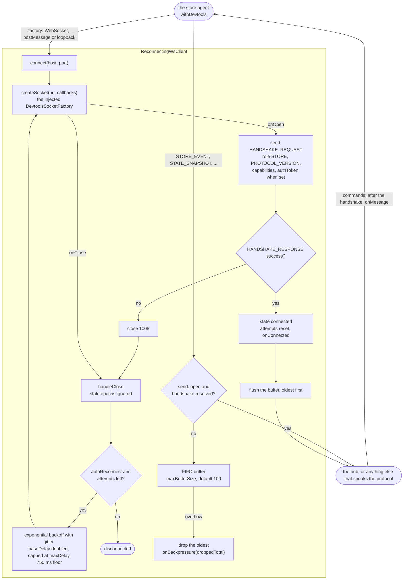
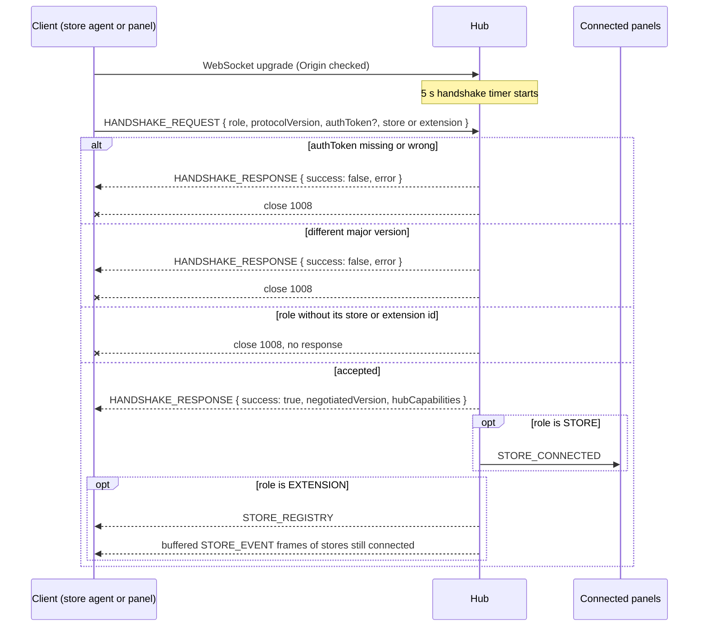

# @yoltra/devtools-protocol

> [ 🇲🇽 Versión en Español](./README.es.md) &nbsp; | 👉 🇺🇸 English Version &nbsp;

[](https://www.npmjs.com/package/@yoltra/devtools-protocol)
[](https://www.npmjs.com/package/@yoltra/devtools-protocol)
[](https://www.npmjs.com/package/@yoltra/devtools-protocol)
[](https://github.com/yoltra/yoltra/blob/main/LICENSE)

**Shared protocol types, message definitions, and utilities for the Yoltra DevTools suite.**

`@yoltra/devtools-protocol` is the foundational vocabulary package for the entire DevTools
ecosystem. It defines the wire format, message types, capability negotiation, and JSON Patch
utilities that all other DevTools packages depend on.

---

## Installation

```bash
npm install @yoltra/devtools-protocol
```

---

## What's Inside

### Protocol Version

A semver string used during handshake negotiation. The hub rejects connections with an
incompatible major version.

```typescript
import { PROTOCOL_VERSION } from "@yoltra/devtools-protocol";

console.log(PROTOCOL_VERSION); // "0.1.0"
```

### Roles

An enum identifying the three participants in the DevTools protocol:

```typescript
import { DevtoolsRole } from "@yoltra/devtools-protocol";

DevtoolsRole.STORE; // A Yoltra store instance
DevtoolsRole.EXTENSION; // A DevTools UI (browser panel, CLI, VSCode)
DevtoolsRole.HUB; // The central message broker
```

### Message Types

All messages are discriminated on a `type` field for type-safe routing:

| Direction          | Message                 | Description                         |
| ------------------ | ----------------------- | ----------------------------------- |
| Store → Extensions | `STORE_EVENT`           | Event with JSON Patch delta, `committed`, and for an event that did not commit, optional `reason` and `vetoedBy` |
| Store → Extensions | `STATE_SNAPSHOT`        | Full state tree at a version        |
| Store → Extensions | `STORE_METRICS`         | Performance counters                |
| Store → Extensions | `STORE_SUBSCRIPTIONS`   | Reducer/effect/middleware inventory |
| Hub → Extensions   | `STORE_CONNECTED`       | A store completed handshake         |
| Hub → Extensions   | `STORE_DISCONNECTED`    | A store disconnected                |
| Hub → Extensions   | `STORE_REGISTRY`        | Full registry snapshot              |
| Extension → Store  | `REQUEST_STATE`         | Request a state snapshot            |
| Extension → Store  | `REQUEST_METRICS`       | Request performance metrics         |
| Extension → Store  | `REQUEST_SUBSCRIPTIONS` | Request subscription info           |
| Extension → Store  | `TIME_TRAVEL`           | Jump store to a specific state      |
| Extension → Store  | `EVENT_REPLAY`          | Replay events through reducers      |
| Extension → Store  | `EMIT_TO_STORE`         | Inject a synthetic event            |

### Capabilities

Stores, extensions, and the hub advertise capabilities during handshake:

```typescript
import type { StoreCapabilities, ExtensionCapabilities } from "@yoltra/devtools-protocol";

const storeCaps: StoreCapabilities = {
  replay: true,
  stateSnapshot: true,
  emit: false,
};
```

### JSON Patch Utilities

Convert Yoltra change-detection output into RFC 6902 JSON Patch operations:

```typescript
import { computePatches, getAtPath } from "@yoltra/devtools-protocol";

const prev = { counter: { value: 1 } };
const next = { counter: { value: 2 } };

const patches = computePatches(prev, next, ["counter.value"]);
// [{ op: "replace", path: "/counter/value", value: 2 }]

getAtPath(next, "counter.value"); // 2
```

---

## Type-Safe Message Handling

```typescript
import type { DevtoolsMessage } from "@yoltra/devtools-protocol";

function handle(msg: DevtoolsMessage) {
  switch (msg.type) {
    case "STORE_EVENT":
      console.log("Patches:", msg.patches);
      break;
    case "STATE_SNAPSHOT":
      console.log("State:", msg.state, "v" + msg.version);
      break;
    case "STORE_CONNECTED":
      console.log("Store joined:", msg.store.name);
      break;
    // TypeScript enforces exhaustive handling
  }
}
```

---

## How the Store Connection Works

The store agent connects through `ReconnectingWsClient`, which owns the handshake, the send
buffer and the reconnection loop. The agent only injects the socket as a `DevtoolsSocketFactory`,
so this package imports no transport. Nothing goes out before a successful `HANDSHAKE_RESPONSE`:
until then frames wait in a bounded FIFO buffer, and an overflow drops the oldest frame and
reports it through `onBackpressure`. The panel side (`HubProvider` in `@yoltra/devtools-ui`) has
its own connection code and does not use this client.



---

## Handshake Flow

```
Client (Store/Extension)              Hub
  │                                     │
  ├─ HANDSHAKE_REQUEST ───────────────► │
  │  { role, protocolVersion, ... }     │
  │                                     │
  │ ◄─────────────── HANDSHAKE_RESPONSE │
  │  { success, negotiatedVersion }     │
  │                                     │
  │  (if store) Hub broadcasts          │
  │  STORE_CONNECTED to all extensions  │
  │                                     │
  │  (if extension) Hub sends           │
  │  STORE_REGISTRY + buffered events   │
```

The same exchange with every outcome the hub produces. A client is registered only after the
token, the major version and the role's id all pass; any failure ends with close code `1008`, and
so does a client that sends no `HANDSHAKE_REQUEST` within 5 seconds.



---

## Technical Docs

[TypeDoc](./docs/README.md) auto-generated documentation.

## API Reference

### Constants

| Export             | Description                                 |
| ------------------ | ------------------------------------------- |
| `PROTOCOL_VERSION` | Current protocol version string (`"0.1.0"`) |
| `DevtoolsRole`     | Enum of protocol participant roles          |

### Functions

| Export                              | Description                                    |
| ----------------------------------- | ---------------------------------------------- |
| `computePatches(prev, next, paths)` | Convert changed paths to JSON Patch operations |
| `getAtPath(obj, dottedPath)`        | Read a value from an object by dotted path     |

### Types

| Export                  | Description                              |
| ----------------------- | ---------------------------------------- |
| `DevtoolsMessage`       | Discriminated union of all message types |
| `StoreCapabilities`     | Store capability flags                   |
| `ExtensionCapabilities` | Extension capability flags               |
| `HubCapabilities`       | Hub capability flags                     |
| `HandshakeRequest`      | Handshake request payload                |
| `HandshakeResponse`     | Handshake response payload               |
| `JsonPatch`             | Single RFC 6902 patch operation          |
| `BaseMessage`           | Common fields on all messages            |

---

## Related Packages

- **[@yoltra/devtools-server](../devtools-server/README.md)** — WebSocket hub that routes
  protocol messages
- **[@yoltra/devtools-browser-agent](../devtools-browser-agent/README.md)** — Browser store
  wrapper
- **[@yoltra/devtools-ui](../devtools-ui/README.md)** — React hooks for consuming protocol
  messages

---

## License

**MIT** — Free to use in commercial and open-source projects.
