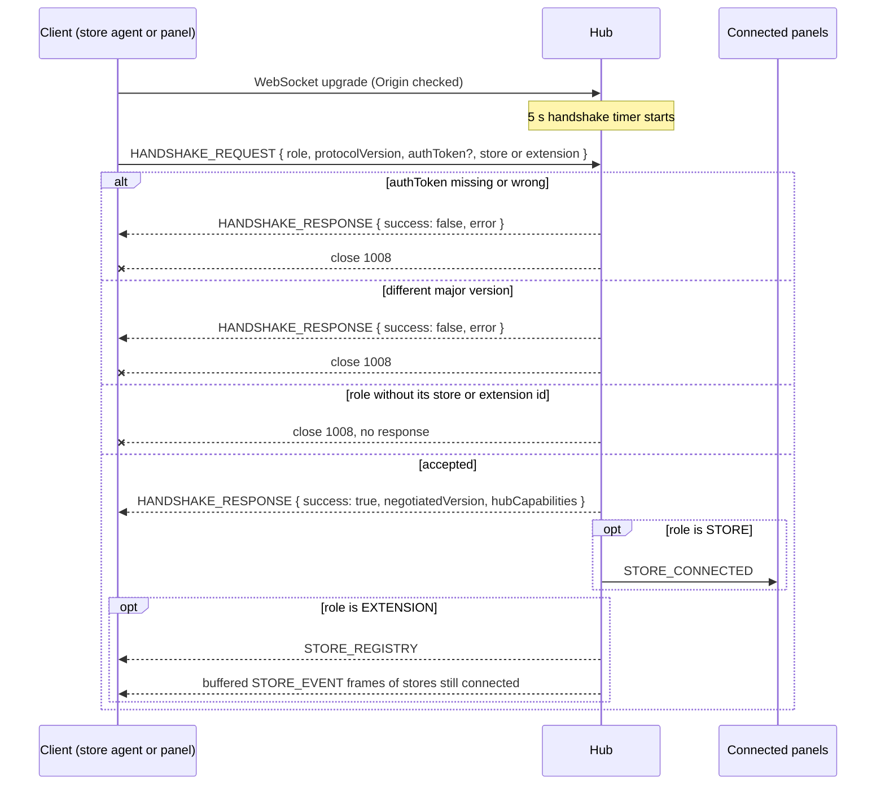

# @yoltra/devtools-protocol

> [ 🇲🇽 Versión en Español](./README.es.md) &nbsp; | 👉 🇺🇸 English Version &nbsp;

[](https://www.npmjs.com/package/@yoltra/devtools-protocol)
[](https://www.npmjs.com/package/@yoltra/devtools-protocol)
[](https://www.npmjs.com/package/@yoltra/devtools-protocol)
[](https://github.com/yoltra/yoltra/blob/main/LICENSE)

**Shared protocol types, message definitions, and utilities for the Yoltra DevTools suite.**

`@yoltra/devtools-protocol` is the foundational vocabulary package for the entire DevTools
ecosystem. It defines the wire format, message types, capability negotiation, and JSON Patch
utilities that all other DevTools packages depend on.

> **Full documentation:** [@yoltra/devtools-protocol on yoltra.dev](https://yoltra.dev/en/yoltra/packages/devtools-protocol/)

## Installation

```bash
npm install @yoltra/devtools-protocol
```

## What's Inside

`PROTOCOL_VERSION` (`"0.1.0"`) is negotiated in the handshake; the hub rejects another major.
`DevtoolsRole` names the participants (`STORE`, `EXTENSION`, `HUB`), which advertise their
capabilities in the handshake. Messages go store to extensions (`STORE_EVENT`, a JSON Patch delta
with `committed`, `reason` and `vetoedBy`; `STATE_SNAPSHOT`; `STORE_METRICS`;
`STORE_SUBSCRIPTIONS`), hub to extensions (`STORE_CONNECTED`, `STORE_DISCONNECTED`,
`STORE_REGISTRY`) and extension to store (`REQUEST_STATE`, `REQUEST_METRICS`,
`REQUEST_SUBSCRIPTIONS`, `TIME_TRAVEL`, `EVENT_REPLAY`, `EMIT_TO_STORE`). `computePatches` turns
Yoltra change-detection output into RFC 6902 operations, and `getAtPath` reads a dotted path.

`DevtoolsMessage` is a discriminated union, so a `switch (msg.type)` is checked for exhaustiveness:
see [type-safe message handling](https://yoltra.dev/en/yoltra/packages/devtools-protocol/#type-safe-message-handling).

## How the Store Connection Works

The store agent connects through `ReconnectingWsClient` (handshake, send buffer, reconnection),
with the socket injected as a `DevtoolsSocketFactory`, so this package imports no transport. Until
a successful `HANDSHAKE_RESPONSE`, frames wait in a bounded FIFO buffer that calls `onBackpressure`.

## Handshake Flow

A client is registered only after the token, the major version and the role's id all pass; any
failure, or no `HANDSHAKE_REQUEST` within 5 seconds, ends with close code `1008`.



## API Reference

`PROTOCOL_VERSION`, `DevtoolsRole`, `computePatches`, `getAtPath`, and the types `DevtoolsMessage`,
`StoreCapabilities`, `ExtensionCapabilities`, `HubCapabilities`, `HandshakeRequest`,
`HandshakeResponse`, `JsonPatch`, `BaseMessage`: see the [full reference](https://yoltra.dev/en/yoltra/api/devtools-protocol/).

## Related Packages

- **[@yoltra/devtools-server](../devtools-server/README.md)**: WebSocket hub that routes protocol messages
- **[@yoltra/devtools-browser-agent](../devtools-browser-agent/README.md)**: browser store wrapper
- **[@yoltra/devtools-ui](../devtools-ui/README.md)**: React hooks for consuming protocol messages

## License

**MIT**. Free to use in commercial and open-source projects.

> **Full documentation:** [@yoltra/devtools-protocol on yoltra.dev](https://yoltra.dev/en/yoltra/packages/devtools-protocol/)
