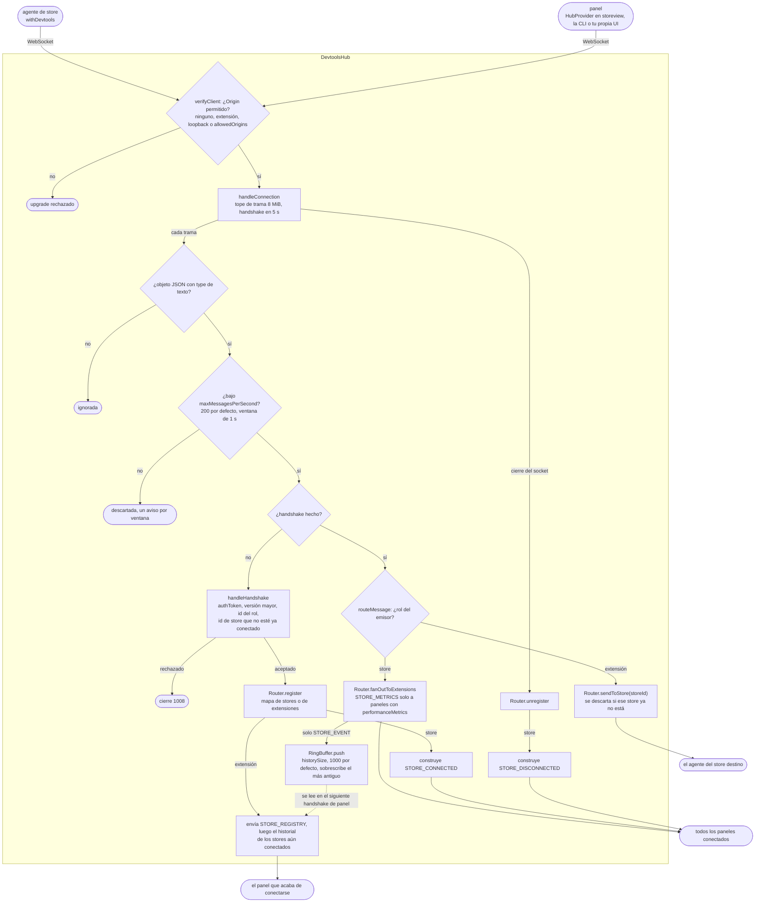

# @yoltra/devtools-server

> 👉 🇲🇽 Versión en Español&nbsp; | &nbsp;[ 🇺🇸 English Version](./README.md)&nbsp;

[](https://www.npmjs.com/package/@yoltra/devtools-server)
[](https://www.npmjs.com/package/@yoltra/devtools-server)
[](https://www.npmjs.com/package/@yoltra/devtools-server)
[](https://github.com/yoltra/yoltra/blob/main/LICENSE)

**Hub WebSocket central que intermedia el tráfico del protocolo DevTools entre los stores de
Yoltra y las extensiones.**

`@yoltra/devtools-server` levanta un servidor WebSocket accesible solo desde localhost que atiende
los handshakes del protocolo, enruta mensajes entre stores y UIs de DevTools, y mantiene un búfer
circular de eventos recientes para las extensiones que se conectan tarde.

---

## Instalación

```bash
npm install @yoltra/devtools-server
```

---

## Inicio rápido

### Como librería

Empotra el hub en tu propio proceso (runner de pruebas, servidor de desarrollo, extensión de
VSCode):

```typescript
import { DevtoolsHub } from "@yoltra/devtools-server";

const hub = new DevtoolsHub({ port: 9800 });
await hub.start();

console.log("Hub escuchando en ws://127.0.0.1:9800");
console.log("Stores conectados:", hub.storeCount);
console.log("Extensiones conectadas:", hub.extensionCount);

// Más tarde...
await hub.stop();
```

### Como CLI independiente

```bash
npx @yoltra/devtools-server --port 9800 --history-size 1000
```

Para exigir un token a cada cliente, pasa `--token <secreto>` o define `YOLTRA_DEVTOOLS_TOKEN`, que
lo mantiene fuera de la lista de procesos; si están los dos, gana el flag. Da el mismo valor a
cada agente de store y a cada panel en `authToken`.

```bash
YOLTRA_DEVTOOLS_TOKEN=s3cret npx @yoltra/devtools-server --port 9800
```

O mediante el binario del proyecto:

```bash
node ./bin/devtools-server.js --port 9800
```

---

## Cómo funciona

```
┌─────────────┐      ┌──────────────┐      ┌───────────────┐
│  Store de   │ ──── │  Hub de      │ ──── │  UI de        │
│  Yoltra     │  WS  │  DevTools    │  WS  │  DevTools     │
│             │ ───► │  (este pkg)  │ ───► │  (Extensión)  │
└─────────────┘      └──────────────┘      └───────────────┘
                          │
                     Búfer circular
                  (historial de eventos)
```

1. Los **stores** se conectan y realizan el handshake del protocolo
2. Los eventos del store se **difunden** a todas las extensiones conectadas
3. Los comandos de las extensiones (peticiones de estado, viaje en el tiempo) se **enrutan** al
   store destino por su `storeId`
4. Los eventos recientes se **guardan en un búfer circular**, así que una extensión que se conecta
   tarde recibe el historial

Dentro de `DevtoolsHub`, cada trama pasa los mismos filtros (origen, forma, tasa, handshake) antes
de llegar al `Router`. Una trama de store se difunde a todos los paneles, y un `STORE_EVENT`
además se guarda en el `RingBuffer`; un comando de panel va a un solo store, elegido por `storeId`.

Un id de store pertenece a una sola conexión a la vez. Un store que presenta un id ya conectado se
rechaza con un error de handshake que nombra el id, y su agente sigue reintentando hasta que el
primer store se va. Los agentes usan el nombre del store cuando no se da `storeId`, así que dos
stores con el mismo nombre necesitan valores de `storeId` distintos para inspeccionarse a la vez.



---

## Configuración

```typescript
interface DevtoolsHubOptions {
  /** Puerto en el que escuchar. @default 9800 */
  port?: number;
  /** Host en el que escuchar. @default "127.0.0.1" */
  host?: string;
  /** Máximo de eventos retenidos para extensiones que se conectan tarde. @default 1000 */
  historySize?: number;
}
```

---

## Referencia de la API

### `DevtoolsHub`

| Método / Propiedad        | Descripción                                        |
| ------------------------- | -------------------------------------------------- |
| `new DevtoolsHub(opts?)`  | Crea una instancia del hub                         |
| `hub.start()`             | Arranca el servidor WS (devuelve una Promise)      |
| `hub.stop()`              | Detiene el servidor y cierra todas las conexiones  |
| `DevtoolsHub.probe(port)` | Comprueba si ya hay un hub corriendo en un puerto  |
| `hub.storeCount`          | Número de stores conectados                        |
| `hub.extensionCount`      | Número de extensiones conectadas                   |
| `hub.historySize`         | Número de eventos en el búfer circular             |

### `RingBuffer<T>`

Un búfer circular de tamaño fijo, usado internamente para el historial de eventos:

```typescript
import { RingBuffer } from "@yoltra/devtools-server";

const buf = new RingBuffer<string>(100);
buf.push("event-1");
buf.push("event-2");
buf.toArray(); // ['event-1', 'event-2']
buf.size; // 2
buf.clear();
```

---

## Sondear antes de arrancar

Evita conflictos de puerto comprobando si ya hay un hub corriendo:

```typescript
import { DevtoolsHub } from "@yoltra/devtools-server";

const alreadyRunning = await DevtoolsHub.probe(9800);

if (!alreadyRunning) {
  const hub = new DevtoolsHub({ port: 9800 });
  await hub.start();
}
```

---

## Seguridad

El hub escucha en `127.0.0.1` (solo localhost) por defecto. Es una restricción de seguridad
deliberada para v1: el hub no se expone a la red.

---

## Paquetes relacionados

- **[@yoltra/devtools-protocol](../devtools-protocol/README.md)** — Formato de cable y tipos de
  mensaje
- **[@yoltra/devtools-browser-agent](../devtools-browser-agent/README.md)** — Conecta stores del
  navegador a este hub

---

## Licencia

**MIT** — De uso libre en proyectos comerciales y de código abierto.
