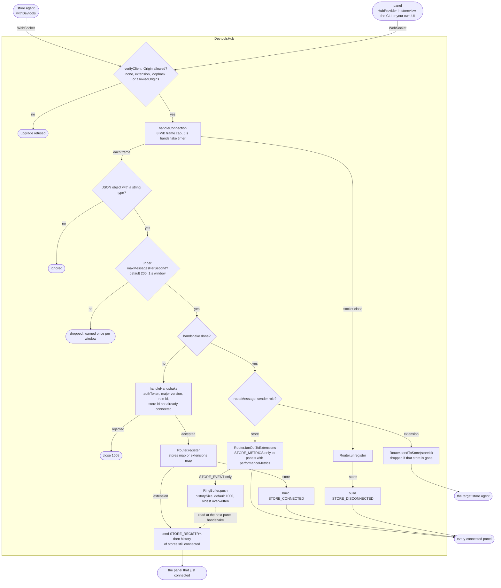

# @yoltra/devtools-server

> [ 🇲🇽 Versión en Español](./README.es.md)&nbsp; | 👉 🇺🇸 English Version &nbsp;

[](https://www.npmjs.com/package/@yoltra/devtools-server)
[](https://www.npmjs.com/package/@yoltra/devtools-server)
[](https://www.npmjs.com/package/@yoltra/devtools-server)
[](https://github.com/yoltra/yoltra/blob/main/LICENSE)

**Central WebSocket hub that brokers DevTools protocol traffic between Yoltra stores and
extensions.**

`@yoltra/devtools-server` runs a localhost-only WebSocket server that handles protocol
handshakes, routes messages between stores and DevTools UIs, and maintains a ring buffer of
recent events for late-connecting extensions.

> **Full documentation:** [@yoltra/devtools-server on yoltra.dev](https://yoltra.dev/en/yoltra/packages/devtools-server/)

## Installation

```bash
npm install @yoltra/devtools-server
```

## Quick Start

As a library, embedded in your own dev tooling:

```typescript
import { DevtoolsHub } from "@yoltra/devtools-server";

const hub = new DevtoolsHub({ port: 9800 });
await hub.start();
```

As a standalone CLI. To require a token of every client, pass `--token <secret>` or set
`YOLTRA_DEVTOOLS_TOKEN`, and give the same value to each store agent and panel as `authToken`:

```bash
YOLTRA_DEVTOOLS_TOKEN=s3cret npx @yoltra/devtools-server --port 9800
```

## How It Works

Stores connect and handshake; their events are **fanned out** to every panel, panel commands are
**routed** to one store by `storeId`, and recent events are **buffered** in a `RingBuffer` for
late panels. Every frame passes the same gates (origin, shape, rate, handshake). A store id
belongs to one connection at a time, so stores sharing a name need distinct `storeId` values. See
the [diagram of the hub](https://yoltra.dev/en/yoltra/packages/devtools-server/#how-it-works).



## Configuration

`new DevtoolsHub(options)` takes a `DevtoolsHubOptions`: `port` (`9800`), `host`
(`"127.0.0.1"`), `historySize` (`1000`), `authToken`, `allowedOrigins`, `allowedExtensionIds`
and `maxMessagesPerSecond` (`200`).

## API Reference

`new DevtoolsHub(opts?)`, `hub.start()`, `hub.stop()`, `DevtoolsHub.probe(port)`, the `storeCount`,
`extensionCount` and `historySize` counters, and `RingBuffer<T>`, the fixed-size buffer behind the
event history: see the [API reference](https://yoltra.dev/en/yoltra/api/devtools-server/).

## Probe Before Starting

Avoid port conflicts: `await DevtoolsHub.probe(9800)` is `true` when a hub already listens on that
port, so start your own only when it is `false`.

## Security

The hub binds to `127.0.0.1` (localhost only) by default, a deliberate v1 constraint: it is not
exposed to the network. Loopback is not an authentication boundary, though, so set `authToken`
where other local processes are not trusted. It accepts no `Origin` or a loopback, extension or
listed one (`allowedExtensionIds` narrows extensions), limits each client's message rate, and
closes a client that does not complete the handshake within 5 seconds.

## Related Packages

- **[@yoltra/devtools-protocol](../devtools-protocol/README.md)**: wire format and message types
- **[@yoltra/devtools-browser-agent](../devtools-browser-agent/README.md)**: connects browser stores to this hub

## License

**MIT**. Free to use in commercial and open-source projects.

> **Full documentation:** [@yoltra/devtools-server on yoltra.dev](https://yoltra.dev/en/yoltra/packages/devtools-server/)
