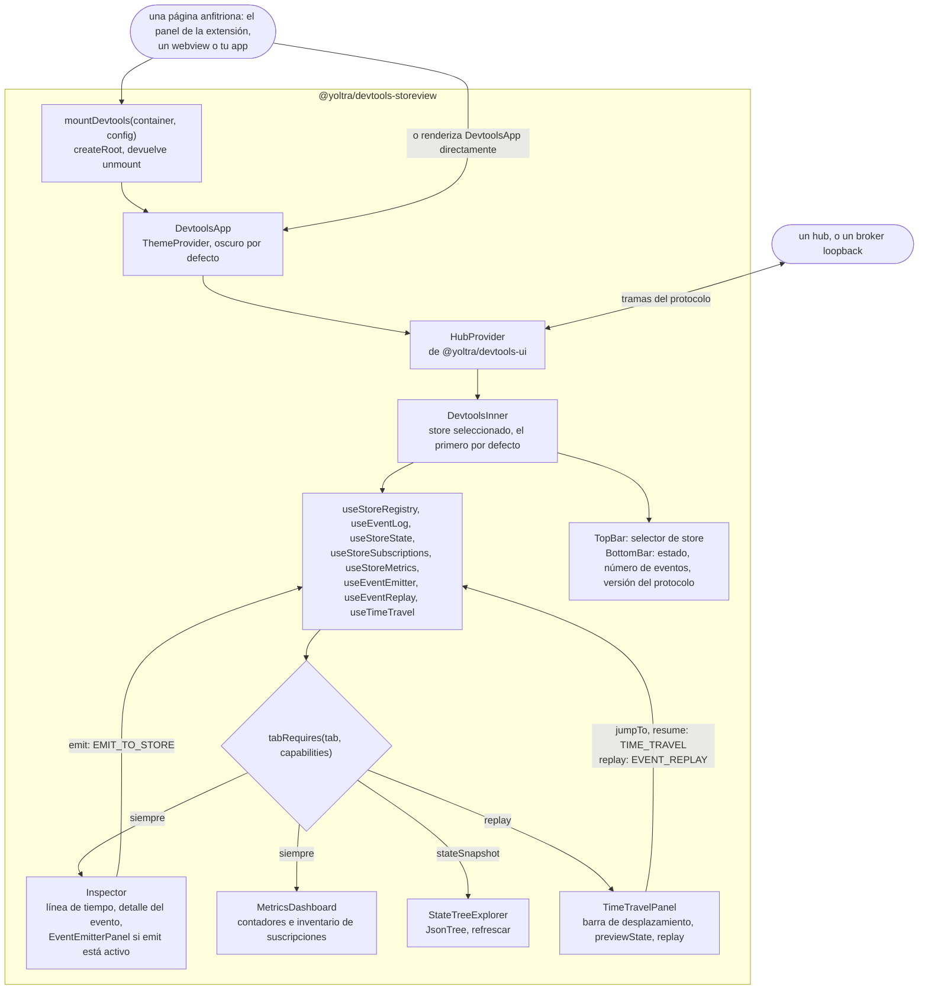

# @yoltra/devtools-storeview

> 👉 🇲🇽 Versión en Español&nbsp; | &nbsp;[ 🇺🇸 English Version](./README.md)&nbsp;

[](https://www.npmjs.com/package/@yoltra/devtools-storeview)
[](https://www.npmjs.com/package/@yoltra/devtools-storeview)
[](https://www.npmjs.com/package/@yoltra/devtools-storeview)
[](https://github.com/yoltra/yoltra/blob/main/LICENSE)

**UI de React DOM para Yoltra DevTools — el inspector visual de stores.**

`@yoltra/devtools-storeview` ofrece una aplicación de React completa para inspeccionar stores de
Yoltra en tiempo real. Renderiza líneas de tiempo de eventos, árboles de estado, grafos de
suscripciones, métricas de rendimiento, controles de viaje en el tiempo y un emisor de eventos. La
usan tanto el panel de la extensión de navegador como la webview de VSCode.

---

## Instalación

```bash
npm install @yoltra/devtools-storeview
```

**Dependencias peer:** `react` ^18, `react-dom` ^18

---

## Inicio rápido

### Montar en un elemento del DOM

```typescript
import { mountDevtools } from "@yoltra/devtools-storeview";

const container = document.getElementById("root")!;

const unmount = mountDevtools(container, {
  port: 9800,
  extensionName: "My DevTools",
  autoReconnect: true,
});

// Más tarde...
unmount();
```

Si el hub se inició con un token, pasa el mismo valor en `authToken`; el hub rechaza un panel que
no lo envía.

### Usar como componente de React

```tsx
import { DevtoolsApp } from "@yoltra/devtools-storeview";

function MyPanel() {
  return <DevtoolsApp config={{ port: 9800, extensionName: "My Panel" }} />;
}
```

---

## Paneles

La app ofrece cuatro pestañas, cada una respaldada por hooks de `@yoltra/devtools-ui`:

| Panel           | Descripción                                                                                                                                                        |
| --------------- | ------------------------------------------------------------------------------------------------------------------------------------------------------------------ |
| **Inspector**   | Línea de tiempo de eventos (filtrable por canal/tipo y por estado confirmado/no confirmado; un evento que no se confirmó se etiqueta con su motivo, como `vetoed: authGuard`, nombrando al middleware cuando tiene nombre) con detalle por evento — rutas cambiadas, parches — más un compositor **Emit** ad-hoc |
| **State**       | Explorador interactivo del árbol JSON, con actualización en vivo y refresco manual                                                                                 |
| **Time Travel** | Recorre el historial de eventos, salta a cualquier índice y vuelve al modo en vivo                                                                                  |
| **Metrics**     | Panel de métricas del store (tiempos de reducción, aciertos de dedup, profundidad de cola) más el inventario de **suscripciones** de reducers, efectos y middleware  |

---

## Disposición

```
┌─────────────────────────────────────────────┐
│  TopBar  (selector de store + punto de con.)│
├─────────────────────────────────────────────┤
│  TabBar  (Events | State | Subscriptions…)  │
├─────────────────────────────────────────────┤
│                                             │
│         Contenido del panel activo          │
│                                             │
├─────────────────────────────────────────────┤
│  BottomBar  (estado de la conexión)         │
└─────────────────────────────────────────────┘
```

---

## Cómo funciona

`DevtoolsApp` no tiene lógica de protocolo propia: envuelve `HubProvider` de
`@yoltra/devtools-ui`, ejecuta los hooks de ese paquete para el store seleccionado y pasa los
resultados a paneles de presentación. Las pestañas que aparecen dependen de las capacidades que
anuncia el store, así que un store que no puede hacer replay nunca muestra la pestaña Time Travel.



Al cambiar de store, `resolveTab` conserva la pestaña actual solo si el nuevo store la admite, y
si no vuelve a Inspector.

---

## Componentes exportados

### API de montaje

| Export                             | Descripción                                                     |
| ---------------------------------- | --------------------------------------------------------------- |
| `mountDevtools(container, config)` | Monta la app completa en un elemento del DOM; devuelve `unmount()` |
| `DevtoolsApp`                      | Componente raíz de React, con `HubProvider` incluido             |

### Disposición

| Export      | Descripción                                            |
| ----------- | ------------------------------------------------------ |
| `TopBar`    | Desplegable de selección de store con indicador de conexión |
| `BottomBar` | Barra de estado de la conexión                         |

### Paneles

| Export               | Descripción                                              |
| -------------------- | -------------------------------------------------------- |
| `EventTimeline`      | Registro de eventos con filtrado e inspección de detalle |
| `StateTreeExplorer`  | Árbol de estado JSON plegable, con refresco              |
| `SubscriptionsPanel` | Tablas de reducers, efectos, middleware y suscripciones  |
| `TimeTravelPanel`    | Control del historial con paso, salto y reanudación      |
| `EventEmitterPanel`  | Formulario para componer y emitir eventos                |
| `MetricsDashboard`   | Contadores de rendimiento y estadísticas en tiempo real  |

### Compartidos

| Export          | Descripción                              |
| --------------- | ---------------------------------------- |
| `JsonTree`      | Renderizador recursivo de árboles JSON   |
| `FilterBar`     | Controles de filtro por texto y toggles  |
| `ConnectionDot` | Indicador de estado por color            |

---

## Temas

La app usa CSS Modules con propiedades personalizadas de CSS. Se incluye un tema compatible con
VSCode en `styles/vscode-theme.css` para empotrar la UI en paneles de tipo webview.

---

## Paquetes relacionados

- **[@yoltra/devtools-ui](../devtools-ui/README.md)** — Hooks y lógica sobre los que se construye
  esta UI
- **[@yoltra/devtools-protocol](../devtools-protocol/README.md)** — Formato de cable y tipos de
  mensaje
- **[@yoltra/devtools-ext](../devtools-ext/README.md)** — Extensión de navegador que monta esta app

---

## Licencia

**MIT** — De uso libre en proyectos comerciales y de código abierto.
