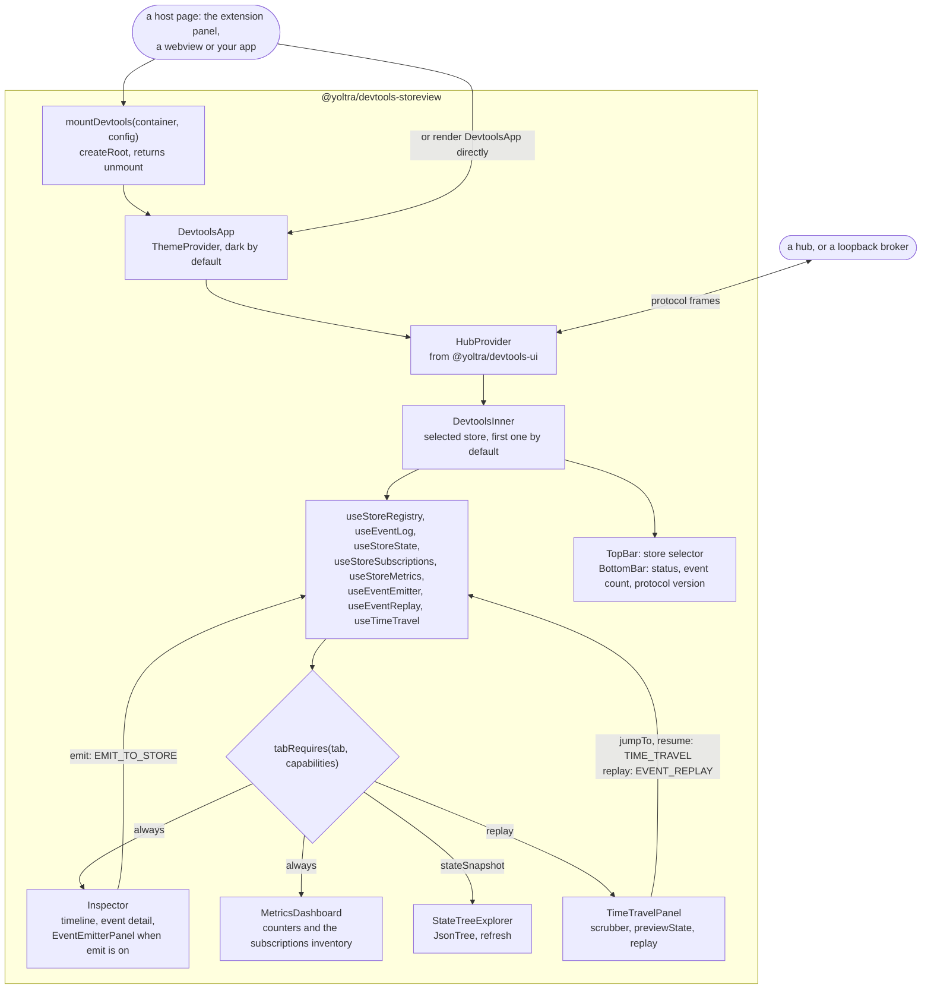

# @yoltra/devtools-storeview

> [ 🇲🇽 Versión en Español](./README.es.md)&nbsp; | 👉 🇺🇸 English Version &nbsp;

[](https://www.npmjs.com/package/@yoltra/devtools-storeview)
[](https://www.npmjs.com/package/@yoltra/devtools-storeview)
[](https://www.npmjs.com/package/@yoltra/devtools-storeview)
[](https://github.com/yoltra/yoltra/blob/main/LICENSE)

**React DOM UI for Yoltra DevTools: the visual store inspector.**

`@yoltra/devtools-storeview` provides a full-featured React application for inspecting Yoltra
stores in real time: event timelines, state trees, subscriptions, performance metrics,
time-travel controls and an event emitter. The browser extension panel and the VSCode webview
both use it.

> **Full documentation:** [@yoltra/devtools-storeview on yoltra.dev](https://yoltra.dev/en/yoltra/packages/devtools-storeview/)

## Installation

```bash
npm install @yoltra/devtools-storeview
```

**Peer dependencies:** `react` ^18, `react-dom` ^18

## Quick Start

`mountDevtools(container, { port: 9800, extensionName, autoReconnect })` mounts the whole app into
a DOM element and returns `unmount()`. When the hub was started with a token, pass the same value
as `authToken`. In React, render the root component:

```tsx
import { DevtoolsApp } from "@yoltra/devtools-storeview";

function MyPanel() {
  return <DevtoolsApp config={{ port: 9800, extensionName: "My Panel" }} />;
}
```

## Panels

Four tabs, each backed by hooks from `@yoltra/devtools-ui`: **Inspector** (event timeline with
filters, per-event detail, the reason an event did not commit, and an **Emit** composer),
**State** (live JSON tree), **Time Travel** (step, jump, resume) and **Metrics** (timing, dedup
hits, queue depth and the subscriptions inventory). The layout is a `TopBar` with the store
selector, a tab bar, the active panel and a `BottomBar` with the connection status.

## How It Works

`DevtoolsApp` holds no protocol logic of its own: it wraps `HubProvider` from
`@yoltra/devtools-ui`, runs that package's hooks for the selected store, and passes the results
to presentational panels. The store's capabilities decide which tabs appear, so a store that
cannot replay never shows Time Travel. The package page has the
[diagram](https://yoltra.dev/en/yoltra/packages/devtools-storeview/#how-it-works).



## Exported Components

`mountDevtools` and `DevtoolsApp`; the layout parts `TopBar` and `BottomBar`; the panels
`EventTimeline`, `StateTreeExplorer`, `SubscriptionsPanel`, `TimeTravelPanel`,
`EventEmitterPanel` and `MetricsDashboard`; and the shared `JsonTree`, `FilterBar` and
`ConnectionDot`. See the [API reference](https://yoltra.dev/en/yoltra/api/devtools-storeview/).

## Theming

CSS Modules with CSS custom properties. `styles/vscode-theme.css` is a VSCode-compatible theme
for webview panels.

## Related Packages

- **[@yoltra/devtools-ui](../devtools-ui/README.md)**: hooks and logic this UI is built on
- **[@yoltra/devtools-protocol](../devtools-protocol/README.md)**: wire format and message types
- **[@yoltra/devtools-ext](../devtools-ext/README.md)**: browser extension that mounts this app

## License

**MIT**. Free to use in commercial and open-source projects.

> **Full documentation:** [@yoltra/devtools-storeview on yoltra.dev](https://yoltra.dev/en/yoltra/packages/devtools-storeview/)
