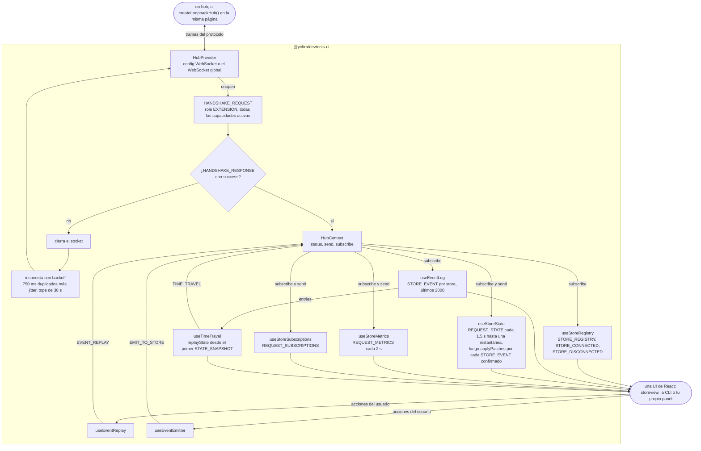
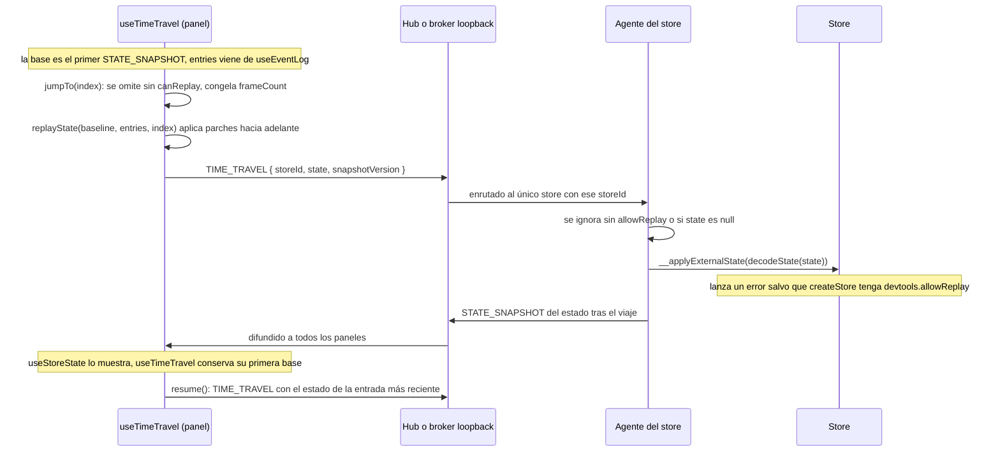

# @yoltra/devtools-ui

> 👉 🇲🇽 Versión en Español&nbsp; | &nbsp;[ 🇺🇸 English Version](./README.md)&nbsp;

[](https://www.npmjs.com/package/@yoltra/devtools-ui)
[](https://www.npmjs.com/package/@yoltra/devtools-ui)
[](https://www.npmjs.com/package/@yoltra/devtools-ui)
[](https://github.com/yoltra/yoltra/blob/main/LICENSE)

**Hooks de React y lógica de negocio compartidos por las UIs de Yoltra DevTools.**

`@yoltra/devtools-ui` es una capa de lógica sin interfaz que ofrece hooks de React para conectarse
al hub de DevTools, seguir el estado de un store, explorar eventos y controlar el viaje en el
tiempo. **No contiene componentes de UI**: el renderizado corre a cargo de paquetes posteriores
como `@yoltra/devtools-storeview` (React DOM) y `@yoltra/devtools-cli` (Ink).

---

## Instalación

```bash
npm install @yoltra/devtools-ui
```

**Dependencia peer:** `react` ^18

---

## Inicio rápido

Envuelve tu UI de DevTools en un `HubProvider` y usa los hooks:

```tsx
import {
  HubProvider,
  useHubConnection,
  useStoreRegistry,
  useEventLog,
  useStoreState,
} from "@yoltra/devtools-ui";

function App() {
  return (
    <HubProvider config={{ port: 9800, extensionName: "My Panel" }}>
      <Dashboard />
    </HubProvider>
  );
}

function Dashboard() {
  const { status } = useHubConnection();
  const stores = useStoreRegistry();
  const storeId = stores[0]?.id ?? null;

  const { entries } = useEventLog(storeId);
  const { state, loading, refresh } = useStoreState(storeId);

  if (status !== "connected") return <p>Conectando...</p>;
  if (!storeId) return <p>Esperando stores...</p>;

  return (
    <div>
      <h2>Eventos: {entries.length}</h2>
      <pre>{JSON.stringify(state, null, 2)}</pre>
      <button onClick={refresh}>Refrescar estado</button>
    </div>
  );
}
```

---

## Hooks

### Conexión y registro

| Hook                 | Descripción                                                               |
| -------------------- | ------------------------------------------------------------------------- |
| `useHubConnection()` | Estado de conexión, `send()`, `subscribe()`, `disconnect()`, `reconnect()` |
| `useStoreRegistry()` | Lista en vivo de los stores conectados, con sus capacidades                |

### Datos

| Hook                             | Descripción                                                            |
| -------------------------------- | ---------------------------------------------------------------------- |
| `useEventLog(storeId)`           | Registro cronológico de eventos, con `clear()`                         |
| `useStoreState(storeId)`         | Árbol de estado en vivo, parcheado de forma incremental con JSON Patch |
| `useStoreSubscriptions(storeId)` | Inventario de reducers, efectos y middleware                           |
| `useStoreMetrics(storeId)`       | Contadores de rendimiento (tasa de eventos, tiempo de proceso, cola)   |

### Acciones

| Hook                              | Descripción                                                       |
| --------------------------------- | ----------------------------------------------------------------- |
| `useTimeTravel(storeId, entries)` | Salta a cualquier índice de evento, avanza o retrocede, y reanuda  |
| `useEventReplay(storeId)`         | Reproduce eventos por los reducers, sin efectos secundarios        |
| `useEventEmitter(storeId)`        | Emite eventos sintéticos a un store                                |

---

## Contexto

### `HubProvider`

Envuelve los componentes hijos en un contexto de conexión WebSocket:

```tsx
<HubProvider
  config={{
    port: 9800,
    host: "localhost",
    extensionName: "My DevTools",
    autoReconnect: true,
    maxReconnectAttempts: 10,
  }}
>
  {children}
</HubProvider>
```

### `HubConnectionConfig`

```typescript
interface HubConnectionConfig {
  port: number;
  host?: string; // por defecto: "localhost"
  extensionName?: string; // nombre visible de esta extensión
  autoReconnect?: boolean; // por defecto: true
  maxReconnectAttempts?: number; // por defecto: Infinity
}
```

---

## Cómo funciona

`HubProvider` es dueño del único socket y entrega a cada hook el mismo `send` y `subscribe` a
través de `HubContext`. Los hooks de datos filtran el flujo entrante por `storeId`, y los hooks de
acción solo envían comandos; `send` escribe solo mientras el socket está abierto, así que el lado
del panel no guarda nada en búfer. El hub puede ser uno real o `createLoopbackHub()`, que habla el
mismo protocolo dentro de la página.



---

## Sincronización del estado

`useStoreState` usa una estrategia de parcheo incremental eficiente:

1. Pide un `STATE_SNAPSHOT` completo al montarse
2. Guarda en un búfer los parches `STORE_EVENT` que lleguen antes de la instantánea
3. Reproduce los parches del búfer por orden de versión en cuanto llega la instantánea
4. Aplica los parches posteriores de forma incremental con `applyPatches`

Así la UI siempre refleja el estado más reciente del store sin pedir instantáneas completas una y
otra vez.

---

## Viaje en el tiempo

```tsx
function TimeTravelControls({ storeId, entries }) {
  const { currentIndex, isTimeTraveling, jumpTo, stepBack, stepForward, resume } =
    useTimeTravel(storeId, entries);

  return (
    <div>
      <button onClick={stepBack} disabled={currentIndex <= 0}>
        Atrás
      </button>
      <span>
        {currentIndex + 1} / {entries.length}
      </span>
      <button onClick={stepForward} disabled={currentIndex >= entries.length - 1}>
        Adelante
      </button>
      {isTimeTraveling && <button onClick={resume}>Reanudar</button>}
    </div>
  );
}
```

Un salto, de punta a punta. El panel reconstruye él mismo el estado destino, aplicando parches
hacia adelante desde la primera instantánea que vio, y envía ese estado completo; el store no
busca nada en su propio historial. Tanto el agente como el store se niegan si el replay no está
habilitado.



---

## Referencia de la API

### Contexto

| Export        | Descripción                                                  |
| ------------- | ------------------------------------------------------------ |
| `HubProvider` | Provider de contexto de React que envuelve una conexión al hub |
| `HubContext`  | El contexto de React en crudo (para uso avanzado)            |

### Hooks

| Export                            | Devuelve                                                                   |
| --------------------------------- | -------------------------------------------------------------------------- |
| `useHubConnection()`              | `{ status, send, subscribe, disconnect, reconnect }`                       |
| `useStoreRegistry()`              | `RegisteredStore[]`                                                        |
| `useEventLog(storeId)`            | `{ entries, clear }`                                                       |
| `useStoreState(storeId)`          | `{ state, version, loading, refresh }`                                     |
| `useStoreSubscriptions(storeId)`  | `{ data, loading }`                                                        |
| `useStoreMetrics(storeId)`        | `{ metrics, loading }`                                                     |
| `useTimeTravel(storeId, entries)` | `{ currentIndex, isTimeTraveling, jumpTo, stepBack, stepForward, resume }` |
| `useEventReplay(storeId)`         | `{ replay }`                                                               |
| `useEventEmitter(storeId)`        | `{ emit }`                                                                 |

### Utilidades

| Export                         | Descripción                                              |
| ------------------------------ | -------------------------------------------------------- |
| `applyPatches(state, patches)` | Aplica JSON Patches RFC 6902 a un árbol de estado         |

### Tipos

| Export                | Descripción                                     |
| --------------------- | ----------------------------------------------- |
| `HubConnectionConfig` | Configuración del provider                      |
| `HubConnectionStatus` | `"disconnected" \| "connecting" \| "connected"` |
| `HubContextValue`     | Forma completa del valor de contexto            |
| `RegisteredStore`     | Entrada de store en el registro                 |
| `EventLogEntry`       | Un único evento del registro, con `reason` y `vetoedBy` cuando no se confirmó |

---

## Paquetes relacionados

- **[@yoltra/devtools-protocol](../devtools-protocol/README.md)** — Formato de cable que consumen
  estos hooks
- **[@yoltra/devtools-storeview](../devtools-storeview/README.md)** — UI de React DOM construida
  sobre estos hooks
- **[@yoltra/devtools-server](../devtools-server/README.md)** — El hub al que se conectan estos
  hooks

---

## Licencia

**MIT** — De uso libre en proyectos comerciales y de código abierto.
