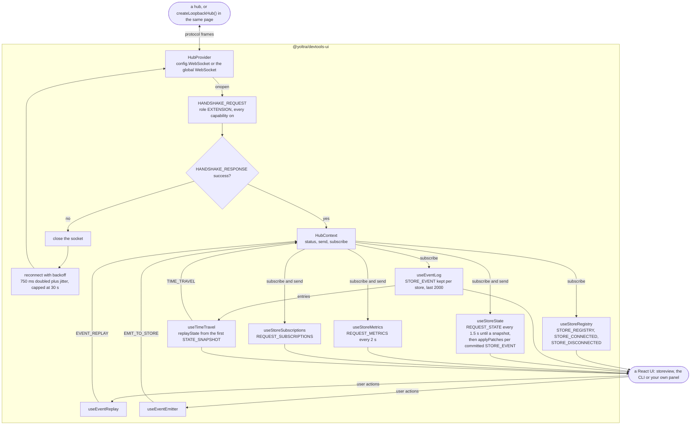
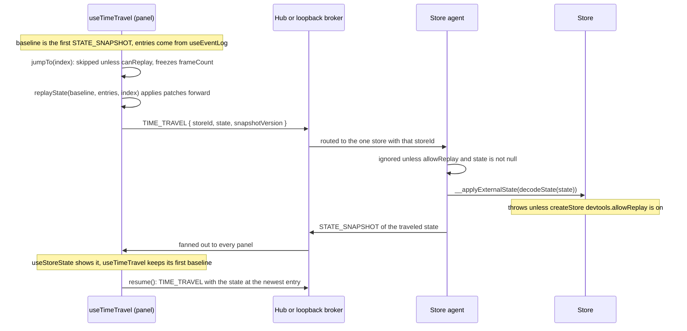

# @yoltra/devtools-ui

> [ 🇲🇽 Versión en Español](./README.es.md)&nbsp; | 👉 🇺🇸 English Version &nbsp;

[](https://www.npmjs.com/package/@yoltra/devtools-ui)
[](https://www.npmjs.com/package/@yoltra/devtools-ui)
[](https://www.npmjs.com/package/@yoltra/devtools-ui)
[](https://github.com/yoltra/yoltra/blob/main/LICENSE)

**Shared React hooks and business logic for Yoltra DevTools UIs.**

`@yoltra/devtools-ui` is a headless logic layer that provides React hooks for connecting to the
Yoltra DevTools hub, tracking store state, browsing events, and controlling time travel. It
contains **no UI components** — rendering is handled by downstream packages like
`@yoltra/devtools-storeview` (React DOM) and `@yoltra/devtools-cli` (Ink).

---

## Installation

```bash
npm install @yoltra/devtools-ui
```

**Peer dependency:** `react` ^18

---

## Quick Start

Wrap your DevTools UI in a `HubProvider` and use the hooks:

```tsx
import {
  HubProvider,
  useHubConnection,
  useStoreRegistry,
  useEventLog,
  useStoreState,
} from "@yoltra/devtools-ui";

function App() {
  return (
    <HubProvider config={{ port: 9800, extensionName: "My Panel" }}>
      <Dashboard />
    </HubProvider>
  );
}

function Dashboard() {
  const { status } = useHubConnection();
  const stores = useStoreRegistry();
  const storeId = stores[0]?.id ?? null;

  const { entries } = useEventLog(storeId);
  const { state, loading, refresh } = useStoreState(storeId);

  if (status !== "connected") return <p>Connecting...</p>;
  if (!storeId) return <p>Waiting for stores...</p>;

  return (
    <div>
      <h2>Events: {entries.length}</h2>
      <pre>{JSON.stringify(state, null, 2)}</pre>
      <button onClick={refresh}>Refresh State</button>
    </div>
  );
}
```

---

## Hooks

### Connection & Registry

| Hook                 | Description                                                               |
| -------------------- | ------------------------------------------------------------------------- |
| `useHubConnection()` | Connection status, `send()`, `subscribe()`, `disconnect()`, `reconnect()` |
| `useStoreRegistry()` | Live list of connected stores with capabilities                           |

### Data

| Hook                             | Description                                                     |
| -------------------------------- | --------------------------------------------------------------- |
| `useEventLog(storeId)`           | Chronological event log with `clear()`                          |
| `useStoreState(storeId)`         | Live state tree, incrementally patched via JSON Patches         |
| `useStoreSubscriptions(storeId)` | Reducer/effect/middleware inventory                             |
| `useStoreMetrics(storeId)`       | Performance counters (event rate, processing time, queue depth) |

### Actions

| Hook                              | Description                                         |
| --------------------------------- | --------------------------------------------------- |
| `useTimeTravel(storeId, entries)` | Jump to any event index, step forward/back, resume  |
| `useEventReplay(storeId)`         | Replay events through reducers without side effects |
| `useEventEmitter(storeId)`        | Emit synthetic events to a store                    |

---

## Context

### `HubProvider`

Wraps child components in a WebSocket connection context:

```tsx
<HubProvider
  config={{
    port: 9800,
    host: "localhost",
    extensionName: "My DevTools",
    autoReconnect: true,
    maxReconnectAttempts: 10,
  }}
>
  {children}
</HubProvider>
```

### `HubConnectionConfig`

```typescript
interface HubConnectionConfig {
  port: number;
  host?: string; // default: "localhost"
  extensionName?: string; // display name for this extension
  autoReconnect?: boolean; // default: true
  maxReconnectAttempts?: number; // default: Infinity
  authToken?: string; // the hub's token, when it was started with one
}
```

---

## How It Works

`HubProvider` owns the one socket and hands every hook the same `send` and `subscribe` through
`HubContext`. Data hooks filter the incoming frames by `storeId`, and action hooks only send
commands; `send` writes only while the socket is open, so nothing is buffered on the panel side.
The hub can be a real one or `createLoopbackHub()`, which speaks the same protocol inside the page.



---

## State Synchronization

`useStoreState` uses an efficient incremental patching strategy:

1. Requests a full `STATE_SNAPSHOT` on mount
2. Buffers any `STORE_EVENT` patches that arrive before the snapshot
3. Replays buffered patches in version order once the snapshot lands
4. Applies subsequent patches incrementally via `applyPatches`

This means the UI always reflects the latest store state without repeated full snapshots.

---

## Time Travel

```tsx
function TimeTravelControls({ storeId, entries }) {
  const { currentIndex, isTimeTraveling, jumpTo, stepBack, stepForward, resume } =
    useTimeTravel(storeId, entries);

  return (
    <div>
      <button onClick={stepBack} disabled={currentIndex <= 0}>
        Back
      </button>
      <span>
        {currentIndex + 1} / {entries.length}
      </span>
      <button onClick={stepForward} disabled={currentIndex >= entries.length - 1}>
        Forward
      </button>
      {isTimeTraveling && <button onClick={resume}>Resume</button>}
    </div>
  );
}
```

One jump, end to end. The panel rebuilds the target state itself, replaying patches forward from
the first snapshot it saw, and sends that whole state; the store does not look anything up in its
own history. Both the agent and the store refuse unless replay was enabled.



---

## API Reference

### Context

| Export        | Description                                      |
| ------------- | ------------------------------------------------ |
| `HubProvider` | React context provider wrapping a hub connection |
| `HubContext`  | The raw React context (for advanced use)         |

### Hooks

| Export                            | Returns                                                                    |
| --------------------------------- | -------------------------------------------------------------------------- |
| `useHubConnection()`              | `{ status, send, subscribe, disconnect, reconnect }`                       |
| `useStoreRegistry()`              | `RegisteredStore[]`                                                        |
| `useEventLog(storeId)`            | `{ entries, clear }`                                                       |
| `useStoreState(storeId)`          | `{ state, version, loading, refresh }`                                     |
| `useStoreSubscriptions(storeId)`  | `{ data, loading }`                                                        |
| `useStoreMetrics(storeId)`        | `{ metrics, loading }`                                                     |
| `useTimeTravel(storeId, entries)` | `{ currentIndex, isTimeTraveling, jumpTo, stepBack, stepForward, resume }` |
| `useEventReplay(storeId)`         | `{ replay }`                                                               |
| `useEventEmitter(storeId)`        | `{ emit }`                                                                 |

### Utilities

| Export                         | Description                                 |
| ------------------------------ | ------------------------------------------- |
| `applyPatches(state, patches)` | Apply RFC 6902 JSON Patches to a state tree |

### Types

| Export                | Description                                     |
| --------------------- | ----------------------------------------------- |
| `HubConnectionConfig` | Provider configuration                          |
| `HubConnectionStatus` | `"disconnected" \| "connecting" \| "connected"` |
| `HubContextValue`     | Full context value shape                        |
| `RegisteredStore`     | Store entry from the registry                   |
| `EventLogEntry`       | Single event in the log, with `reason` and `vetoedBy` when it did not commit |

---

## Related Packages

- **[@yoltra/devtools-protocol](../devtools-protocol/README.md)** — Wire format consumed by
  these hooks
- **[@yoltra/devtools-storeview](../devtools-storeview/README.md)** — React DOM UI built on
  these hooks
- **[@yoltra/devtools-server](../devtools-server/README.md)** — The hub these hooks connect to

---

## License

**MIT** — Free to use in commercial and open-source projects.
