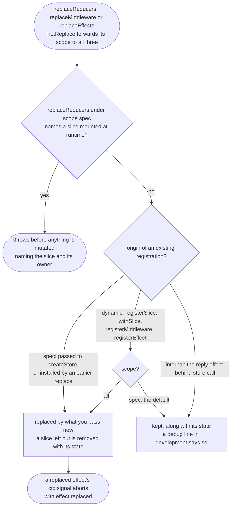

# Decorating a store

> 👉 🇺🇸 English Version&nbsp; | &nbsp;[ 🇲🇽 Versión en Español](../es/DECORATION_GUIDE.md)

A store is created by an application. A capability (feature flags, an undo history, a form
validator) is often written by somebody else, and it needs to add a slice, guard some events and
react to others on a store it did not create. Decoration is how a library does that with full
types, and without the application's next hot reload quietly undoing it.

> **Full guide:** [Decorating a store on yoltra.dev](https://yoltra.dev/en/yoltra/docs/decoration/)

## Declaring what a decoration contributes

A spec's `when` carries channel and type strings, with no payload types, so there is nothing to
infer an event map from, and TypeScript has no partial type-argument inference. `defineSlice` puts
the event map in a value position, where inference works:

```typescript
import { defineSlice } from "@yoltra/core";

type FlagsEM = {
  flag: { enabled: { id: string }; disabled: { id: string } };
};

export const flags = defineSlice<FlagsEM>()({
  state: { enabled: [] as string[] },
  when: { keys: [["flag", "enabled"]] },
  reducer: (s, e) => (e.type === "enabled" ? { enabled: [...s.enabled, e.payload.id] } : s),
});
```

Named once, it lets every registration site infer, with no type argument and no cast.
`defineMiddleware` and `defineEffect` do the same. A bare middleware function registers fine but can
never widen the event map: only the spec form carries it.

## Growing the store's type

```typescript
const app = store.withSlice("flags", flags, { owner: "@scope/flags" });

app.getState().flags.enabled;          // string[]
app.emit("flag", "enabled", { id: "a1" });  // the new channel is emittable
```

`withSlice`, `withMiddleware` and `withEffect` all return the store with its types widened, so
calls chain. **It is the same object** (`store.withSlice("flags", flags) === store`): decoration is
a type-level operation, so nothing re-subscribes, no state moves, the dedup cache is untouched and
an in-flight `store.call()` carries on.

## Publishing a decorator

A library exports a function that takes a store and returns one, generic over the incoming store:

```typescript
import type { EventMapBase, StoreInstance } from "@yoltra/core";

export function withFlags<
  R extends string,
  S extends Record<R, any>,
  EM extends EventMapBase,
>(store: StoreInstance<R, S, EM>, config: FlagsConfig) {
  return store.withSlice("flags", flags, { owner: "@scope/flags" });
}
```

`R`, `S` and `EM` are inference sites, so decorators compose by nesting in any order:
`withFlags(withUndo(store, undoConfig), config)` and `withUndo(withFlags(store, config), undoConfig)`
reach the same type. To require another decoration, constrain the input
(`EM extends EventMapBase & FlagsEM`): an undecorated store then fails at the call site, naming the
missing channels. `withDevtools(store, config)` is the degenerate case: it adds nothing.

## Surviving a hot reload

`replace*` replaces only what the application authored. A slice, middleware or effect registered
after construction survives, with its state. The store decides from the origin it recorded, never
from anything a library passes, so forgetting an option cannot delete a library's slice.



## More on yoltra.dev

- [The shape of the problem](https://yoltra.dev/en/yoltra/docs/decoration/#the-shape-of-the-problem): the casts decoration used to need, and the hot reload that deleted a library's slice.
- [There is no `pipe`](https://yoltra.dev/en/yoltra/docs/decoration/#there-is-no-pipe): why decorators compose by nesting.
- [Requiring another decoration](https://yoltra.dev/en/yoltra/docs/decoration/#requiring-another-decoration): the type constraint, and a runtime check with `onRegistrationChange`.
- [When the decorator owns something the store must not hold](https://yoltra.dev/en/yoltra/docs/decoration/#when-the-decorator-owns-something-the-store-must-not-hold): returning `{ store, handle }`, and what it costs.
- [Surviving a hot reload](https://yoltra.dev/en/yoltra/docs/decoration/#surviving-a-hot-reload): `{ scope: "all" }`, collisions, the debug line, `ReducerReplacement` and the `"effect replaced"` signal.
- [React](https://yoltra.dev/en/yoltra/docs/decoration/#react): `createYoltra(...).withSlice(...)` once at module scope; providers interoperate; free `withSlice(yoltra, name, spec)`.
- [Targeting a channel you cannot name in advance](https://yoltra.dev/en/yoltra/docs/decoration/#targeting-a-channel-you-cannot-name-in-advance): `channelPattern`, for middleware only; reducers and effects throw on it.
- [Watching what is installed](https://yoltra.dev/en/yoltra/docs/decoration/#watching-what-is-installed): `onRegistrationChange`, in batches, with `emitCurrent`.
- [Observing a store you did not build](https://yoltra.dev/en/yoltra/docs/decoration/#observing-a-store-you-did-not-build): `store.onDiagnostic`, additive to the owner's sink.
- [Disposal, and the one thing types cannot express](https://yoltra.dev/en/yoltra/docs/decoration/#disposal-and-the-one-thing-types-cannot-express): `registerSlice` and a disposer kept inside the library.
- [When the store itself is disposed](https://yoltra.dev/en/yoltra/docs/decoration/#when-the-store-itself-is-disposed): tie a decoration's resources to `store.signal`.
- [Ordering](https://yoltra.dev/en/yoltra/docs/decoration/#ordering): decorate at module scope, before the first render.

> **Full guide:** [Decorating a store on yoltra.dev](https://yoltra.dev/en/yoltra/docs/decoration/)
