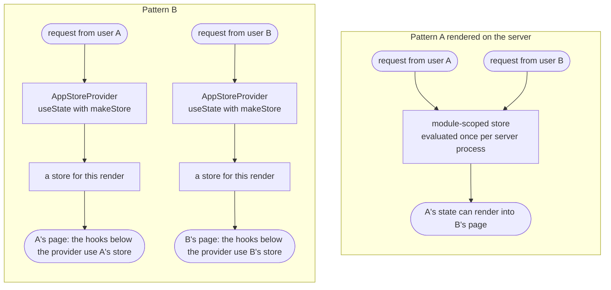

# Yoltra with Next.js

> 👉 English &nbsp;|&nbsp; [🇲🇽 Español](../es/NEXTJS_GUIDE.md)

Yoltra runs in Next.js as **client-side** state, in both routers, with one pattern for safe SSR.

> **Full guide:** [Next.js on yoltra.dev](https://yoltra.dev/en/yoltra/docs/nextjs/)

## Scope: Yoltra is client state

SSR and React Server Components are out of scope by design: Yoltra state lives in the browser. Fetch
initial data with Next's tools (Server Components, `getServerSideProps`, route handlers). **Yoltra
hooks run in Client Components**: `"use client"` in the App Router; every Pages Router component is one.

## Pages Router (the included example)

In the [`yoltra-in-nextjs`](../../examples/v0/yoltra-in-nextjs) example ([▶ Open the live demo](https://yoltra.dev/en/demos/in-nextjs/)),
`createYoltra` is called once in `state/yoltra.ts` and components import its hooks with no
Provider. Wrap with `<StoreProvider>` in `_app.tsx` only to scope a specific store instance.

## App Router

App Router components are **Server Components by default**; put the store and its readers behind
`"use client"`. A module-scoped store (Pattern A) is evaluated once per server process, so in SSR
it is shared across requests. If components render on the server, create it per render (Pattern B):



```tsx
// state/StoreProvider.tsx
"use client";
import { useState, type ReactNode } from "react";
import { StoreProvider as YoltraProvider } from "@/state/yoltra";
import { makeStore } from "@/state/makeStore";

export function AppStoreProvider({ children }: { children: ReactNode }) {
  // One fresh store per client render, never shared across requests.
  const [store] = useState(() => makeStore());
  return <YoltraProvider store={store}>{children}</YoltraProvider>;
}
```

Mount `AppStoreProvider` once in `app/layout.tsx`; the hooks below it use that instance.

## DevTools in Next.js

`withDevtools` uses the browser's `WebSocket`, so guard it with `typeof window !== "undefined"`,
then start the hub (`npx @yoltra/devtools-server --port 9800`) and open the [extension panel](../../devtools/devtools-ext/README.md).

## Checklist

Client Components; a store **per request** for SSR; `withDevtools` guarded; server data emitted on the client.

## Next steps

- [Migration Guide](./MIGRATION_GUIDE.md) · [Testing Guide](./TESTING_GUIDE.md) · [@yoltra/react API](../../packages/react/README.md)

> **Full guide:** [Next.js on yoltra.dev](https://yoltra.dev/en/yoltra/docs/nextjs/)
