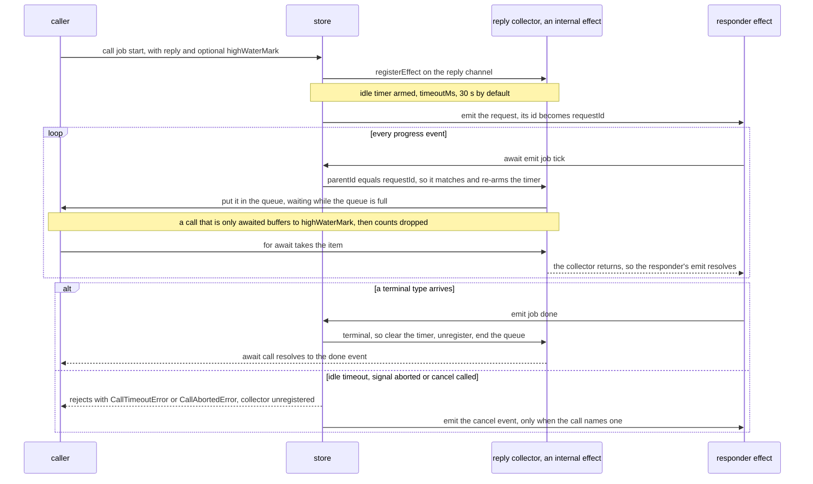

# Request and reply

> 👉 🇺🇸 English Version&nbsp; | &nbsp;[ 🇲🇽 Versión en Español](../es/REQUEST_REPLY_GUIDE.md)

An event bus is one-way, but some interactions are a question and an answer. `store.call()` pairs
the reply with the request, with progress, backpressure, timeouts and cancellation built in.

> **Full guide:** [Request and reply on yoltra.dev](https://yoltra.dev/en/yoltra/docs/request-reply/)

## The call

```typescript
const res = await store.call("rpc", "ask", { q: "who?" }, { reply: ["rpc", "answer"] });
res.payload.text;
```

The responder is an ordinary effect replying through the `emit` it was handed; the store stamps
`parentId` on that reply, so there is no correlation id to mint or echo. `payload` is the request.
`reply` names the types that end the call, which resolves to the reply **event**: with several
(`["rpc", ["answer", "error"]]`), switch on `res.type`.



## Progress, and why the producer waits

```typescript
const call = store.call("job", "start", { id }, {
  reply: ["job", "done"],
  highWaterMark: 4,
});

for await (const step of call) {
  await renderProgress(step.payload);
}

const { payload } = await call; // the terminal reply
```

Non-terminal correlated events are progress. The responder's `await emit(...)` waits while the
reader is behind; a call only awaited buffers to `highWaterMark` and counts the rest in `dropped`.

## Giving up

```typescript
const call = store.call("job", "start", { id }, {
  reply: ["job", "done"],
  timeoutMs: 5_000,
  signal: AbortSignal.timeout(60_000),
});
```

`timeoutMs` is idle, not total: every correlated event resets it. `signal` is a real deadline, and
`call.cancel(reason)` stops early. However a call ends, the subscription is removed and a parked
producer is released; disposing the store rejects pending calls with `CallAbortedError`.

## Telling the responder you gave up

Pass `cancel: ["job", "cancel"]`, an event typed `CallCancellation` (`{ requestId, reason, detail? }`),
and the call emits it when it is cancelled, aborted or times out, never after a terminal reply. The
responder aborts the work for that `requestId`, combined with its own `ctx.signal`.

## More on yoltra.dev

- [The shape of the problem](https://yoltra.dev/en/yoltra/docs/request-reply/#the-shape-of-the-problem): the hand-written version and its two usual bugs.
- [Not knowing what will come back](https://yoltra.dev/en/yoltra/docs/request-reply/#not-knowing-what-will-come-back): the three forms of `reply`. [The backpressure is real](https://yoltra.dev/en/yoltra/docs/request-reply/#the-backpressure-is-real) and [engages when you start iterating](https://yoltra.dev/en/yoltra/docs/request-reply/#backpressure-engages-when-you-start-iterating).
- [When the reply cannot be a direct child](https://yoltra.dev/en/yoltra/docs/request-reply/#when-the-reply-cannot-be-a-direct-child): `correlationId` and `correlation: "either" | "causal" | "id"`.
- [Testing a call](https://yoltra.dev/en/yoltra/docs/request-reply/#testing-a-call): a responder effect, and a `scheduler` that fires the idle timer. See also the [`@yoltra/core` README](../../packages/core/README.md) and the [event pipeline architecture](./design/event-queue-architecture.md).

> **Full guide:** [Request and reply on yoltra.dev](https://yoltra.dev/en/yoltra/docs/request-reply/)
