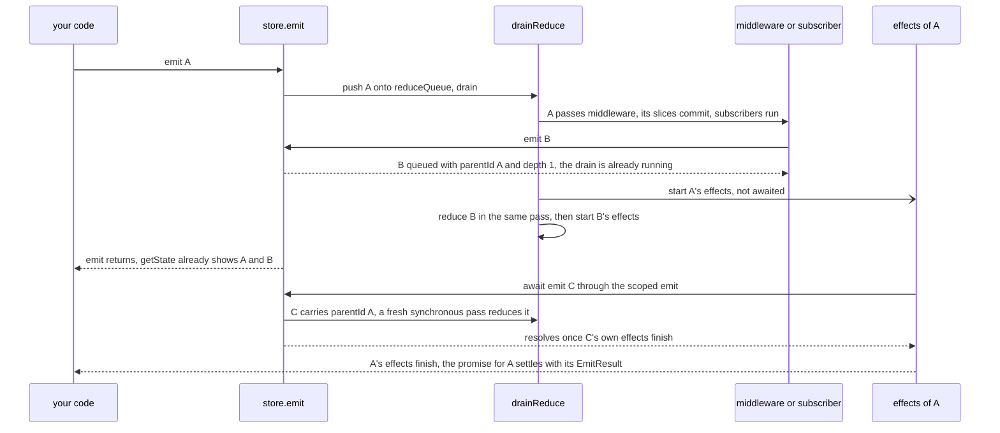
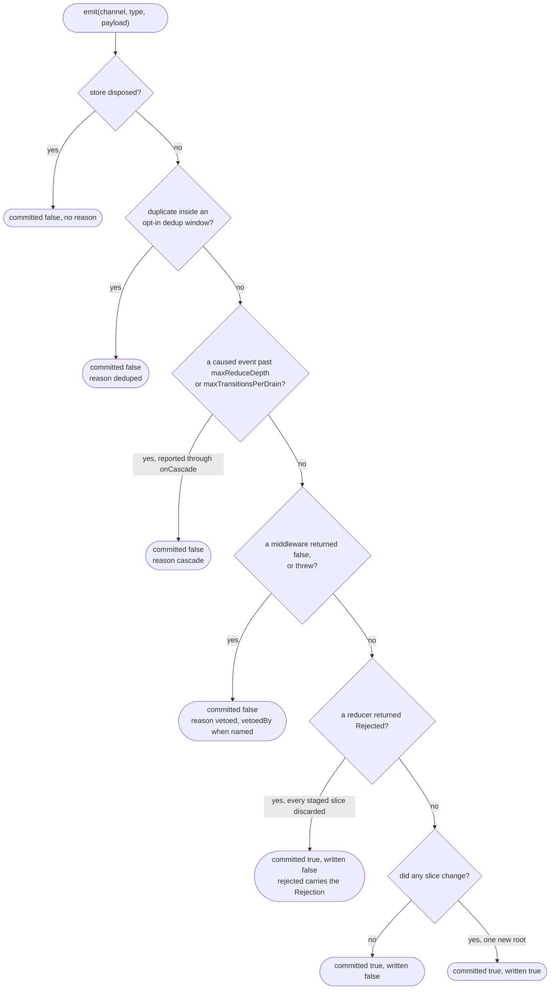

# Event Pipeline Architecture

> 👉 English &nbsp;|&nbsp; [🇲🇽 Español](../../es/design/event-queue-architecture.md)

**Applies to:** `@yoltra/core` 0.10.0
**Last Updated:** October 2026
**Status:** Stable

How a Yoltra store processes an event: what runs in which phase, what `emit()` returns and when,
how ordering and deduplication work, and how the pipeline fails safely.

> **Full guide:** [Event Pipeline Architecture on yoltra.dev](https://yoltra.dev/en/yoltra/docs/design/event-queue-architecture/)

## Overview

Every event goes through **two phases**:

1. **A synchronous reduce phase.** Middleware, reducers, event subscribers and coarse listeners all
   run in the same tick, before `emit()` returns, so `getState()` is correct the instant `emit()`
   returns, with or without middleware. Reducers **stage** their results, and every slice is
   written under one new root before anything is notified: no subscriber sees an event half-applied.
2. **An asynchronous effect phase.** Each committed event's effects run afterward as an
   **independent task**. The promise `emit()` returns resolves when _that event's_ effects finish.

State transitions are synchronous and predictable; side effects are async and non-blocking, with no
separate orchestration layer. Reducers and middleware stay synchronous; anything async is an effect.

## Re-entrancy and ordering

- Events are reduced from **one FIFO queue**, in the order emitted. Reducer order is always strict.
- An `emit()` inside middleware or a subscriber joins the queue and is reduced by the pass already
  running, after the current event, with no reducer interleaving.
- An `emit()` inside an effect starts a fresh synchronous pass.
- Effects of different events may be in flight at once: effect completion order is not serialized.
  If one effect must follow another, emit the follow-up from inside the first.

## Deduplication (opt-in)

Deduplication is **off by default**: two identical rapid emits both dispatch. Opt in by content with
`createStore({ dedupWindowMs: N })`, or by identity with `emit(c, t, p, { dedupKey })`, the right
tool for React Strict Mode's development-only double-invoke. Development builds warn, per store,
when two `(channel, type)` pairs join to the same internal key.

## The `emit()` promise contract

`emit()` returns a `Promise<EmitResult>` that resolves **when that specific event's effects
complete**. State has already changed by then; await only to wait for the effects.

| Field       | Meaning                                                                    |
| ----------- | -------------------------------------------------------------------------- |
| `committed` | Middleware allowed it: it reached the reducers                             |
| `written`   | State actually changed                                                     |
| `rejected`  | The `Rejection` a reducer returned, when one refused                       |
| `reason`    | Why it did not commit: `"vetoed"`, `"deduped"` or `"cascade"`              |
| `vetoedBy`  | The vetoing middleware's name, when it has one                             |

Every way an `emit()` can end, in the order the store checks them. Only the last outcome writes
state; the four that end with `committed: false` never reach a reducer.

Each event has its own completion promise, so `await emit(b)` never resolves early because another
event was in flight.

## Failure modes

- **Middleware veto.** Only an explicit `false` vetoes; a middleware that throws vetoes too. Reducers
  and effects never see the event, and `uncommitted` subscribers fire.
- **Effect errors.** A throwing effect is caught and logged; other effects and the pipeline continue.
  Effects should catch their own errors and emit failure events.
- **Long reducers.** Reducers run on the main thread; keep them fast and pure.
- **Reducer refusal.** A reducer returning `Rejected(reason)` makes the whole event yield: no slice
  is written, and the caller learns why through `EmitResult.rejected`.
- **Runaway re-emission.** Every caused event carries `parentId` and `depth`; `maxReduceDepth`
  (64 by default) refuses a chain past it and reports through `onCascade`. `maxTransitionsPerDrain`
  bounds burst width and is opt-in.

## More on yoltra.dev

- [Core mechanism](https://yoltra.dev/en/yoltra/docs/design/event-queue-architecture/#core-mechanism): the reduce queue, the `emit()` entry point and the processing flow.
- [Phase 1 - Synchronous reduce](https://yoltra.dev/en/yoltra/docs/design/event-queue-architecture/#phase-1---synchronous-reduce) and [Phase 2 - Asynchronous effects](https://yoltra.dev/en/yoltra/docs/design/event-queue-architecture/#phase-2---asynchronous-effects), in code.
- [Event subscriptions](https://yoltra.dev/en/yoltra/docs/design/event-queue-architecture/#event-subscriptions): the `committed`, `written`, `uncommitted` and `all` phases.
- [Comparison to other libraries](https://yoltra.dev/en/yoltra/docs/design/event-queue-architecture/#comparison-to-other-libraries) and [design rationale](https://yoltra.dev/en/yoltra/docs/design/event-queue-architecture/#design-rationale).
- [Appendix: implementation reference](https://yoltra.dev/en/yoltra/docs/design/event-queue-architecture/#appendix-implementation-reference), the [glossary](https://yoltra.dev/en/yoltra/docs/design/event-queue-architecture/#glossary) and the [revision history](https://yoltra.dev/en/yoltra/docs/design/event-queue-architecture/#revision-history).

> **Full guide:** [Event Pipeline Architecture on yoltra.dev](https://yoltra.dev/en/yoltra/docs/design/event-queue-architecture/)
