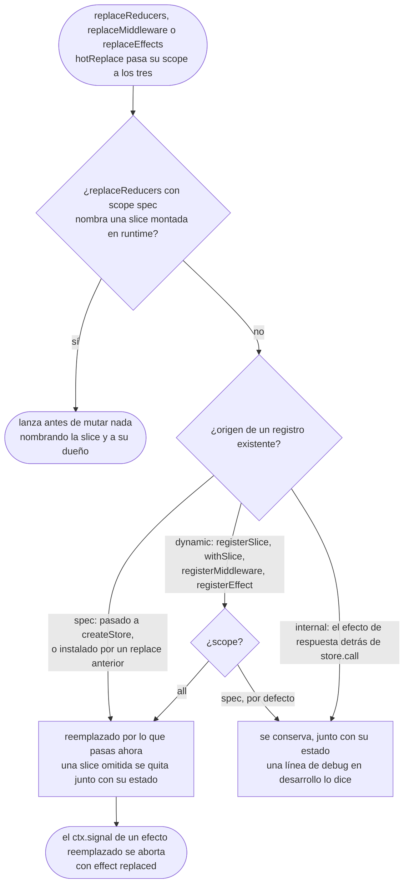

# Decorar un store

> 👉 🇲🇽 Versión en Español&nbsp; | &nbsp;[ 🇺🇸 English Version](../en/DECORATION_GUIDE.md)

Un store lo crea una aplicación. Una capacidad (feature flags, un historial de deshacer, un validador
de formularios) a menudo la escribe alguien más, y necesita agregar una slice, vetar algunos eventos y
reaccionar a otros sobre un store que no creó. Decorar es como una librería lo hace con tipos
completos, sin que la siguiente recarga en caliente de la aplicación lo deshaga en silencio.

> **Guía completa:** [Decorar un store en yoltra.dev](https://yoltra.dev/es/yoltra/docs/decoration/)

## Declarar lo que aporta una decoración

El `when` de un spec lleva cadenas de canal y tipo, sin tipos de payload, así que no hay nada de lo
que inferir un mapa de eventos, y TypeScript no tiene inferencia parcial de argumentos de tipo.
`defineSlice` coloca el mapa de eventos en posición de valor, donde la inferencia sí funciona:

```typescript
import { defineSlice } from "@yoltra/core";

type FlagsEM = {
  flag: { enabled: { id: string }; disabled: { id: string } };
};

export const flags = defineSlice<FlagsEM>()({
  state: { enabled: [] as string[] },
  when: { keys: [["flag", "enabled"]] },
  reducer: (s, e) => (e.type === "enabled" ? { enabled: [...s.enabled, e.payload.id] } : s),
});
```

Se nombra una vez y cada sitio de registro infiere de ahí, sin argumento de tipo y sin cast.
`defineMiddleware` y `defineEffect` hacen lo mismo. Una función de middleware sin spec se registra
bien, pero nunca puede ampliar el mapa de eventos: solo la forma de spec lo lleva.

## Hacer crecer el tipo del store

```typescript
const app = store.withSlice("flags", flags, { owner: "@scope/flags" });

app.getState().flags.enabled;               // string[]
app.emit("flag", "enabled", { id: "a1" });  // el canal nuevo ya es emitible
```

`withSlice`, `withMiddleware` y `withEffect` devuelven el store con sus tipos ampliados, así que las
llamadas se encadenan. **Es el mismo objeto** (`store.withSlice("flags", flags) === store`): decorar
es una operación a nivel de tipos, así que nada se vuelve a suscribir, ningún estado se mueve, la
caché de deduplicación queda intacta y una `store.call()` en vuelo continúa.

## Publicar un decorador

Una librería exporta una función que recibe un store y devuelve otro, genérica sobre el que entra:

```typescript
import type { EventMapBase, StoreInstance } from "@yoltra/core";

export function withFlags<
  R extends string,
  S extends Record<R, any>,
  EM extends EventMapBase,
>(store: StoreInstance<R, S, EM>, config: FlagsConfig) {
  return store.withSlice("flags", flags, { owner: "@scope/flags" });
}
```

`R`, `S` y `EM` son sitios de inferencia, así que los decoradores se componen anidándose en cualquier
orden: `withFlags(withUndo(store, undoConfig), config)` y `withUndo(withFlags(store, config), undoConfig)`
llegan al mismo tipo. Para requerir otra decoración, restringe la entrada
(`EM extends EventMapBase & FlagsEM`): un store sin decorar falla en el sitio de la llamada, nombrando
los canales que faltan. `withDevtools(store, config)` es el caso degenerado: no agrega nada.

## Sobrevivir a una recarga en caliente

`replace*` reemplaza solo lo que escribió la aplicación. Una slice, un middleware o un efecto
registrado después de la construcción sobrevive con su estado. El store decide por el origen que
anotó, nunca por algo que pase una librería, así que olvidar una opción no borra su slice.



## Más en yoltra.dev

- [La forma del problema](https://yoltra.dev/es/yoltra/docs/decoration/#la-forma-del-problema): los casts que decorar necesitaba antes, y la recarga en caliente que borraba la slice de una librería.
- [No hay `pipe`](https://yoltra.dev/es/yoltra/docs/decoration/#no-hay-pipe): por qué los decoradores se componen anidándose.
- [Requerir otra decoración](https://yoltra.dev/es/yoltra/docs/decoration/#requerir-otra-decoración): la restricción de tipos, y una verificación en tiempo de ejecución con `onRegistrationChange`.
- [Cuando el decorador es dueño de algo que el store no debe guardar](https://yoltra.dev/es/yoltra/docs/decoration/#cuando-el-decorador-es-dueño-de-algo-que-el-store-no-debe-guardar): devolver `{ store, handle }`, y lo que cuesta.
- [Sobrevivir a una recarga en caliente](https://yoltra.dev/es/yoltra/docs/decoration/#sobrevivir-a-una-recarga-en-caliente): `{ scope: "all" }`, las colisiones, la línea de debug, `ReducerReplacement` y la señal `"effect replaced"`.
- [React](https://yoltra.dev/es/yoltra/docs/decoration/#react): `createYoltra(...).withSlice(...)` una vez en el ámbito del módulo; los providers son intercambiables; la función libre `withSlice(yoltra, name, spec)`.
- [Apuntar a un canal que no puedes nombrar por adelantado](https://yoltra.dev/es/yoltra/docs/decoration/#apuntar-a-un-canal-que-no-puedes-nombrar-por-adelantado): `channelPattern`, solo para middleware; los reducers y los efectos lanzan con él.
- [Observar lo que está instalado](https://yoltra.dev/es/yoltra/docs/decoration/#observar-lo-que-está-instalado): `onRegistrationChange`, en lotes, con `emitCurrent`.
- [Observar un store que no construiste](https://yoltra.dev/es/yoltra/docs/decoration/#observar-un-store-que-no-construiste): `store.onDiagnostic`, aditivo al sink del dueño.
- [Disposición, y lo único que los tipos no pueden expresar](https://yoltra.dev/es/yoltra/docs/decoration/#disposición-y-lo-único-que-los-tipos-no-pueden-expresar): `registerSlice` y un disposer que se queda dentro de la librería.
- [Cuando el store mismo se libera](https://yoltra.dev/es/yoltra/docs/decoration/#cuando-el-store-mismo-se-libera): ata los recursos de una decoración a `store.signal`.
- [Orden](https://yoltra.dev/es/yoltra/docs/decoration/#orden): decora en el ámbito del módulo, antes del primer render.

> **Guía completa:** [Decorar un store en yoltra.dev](https://yoltra.dev/es/yoltra/docs/decoration/)
