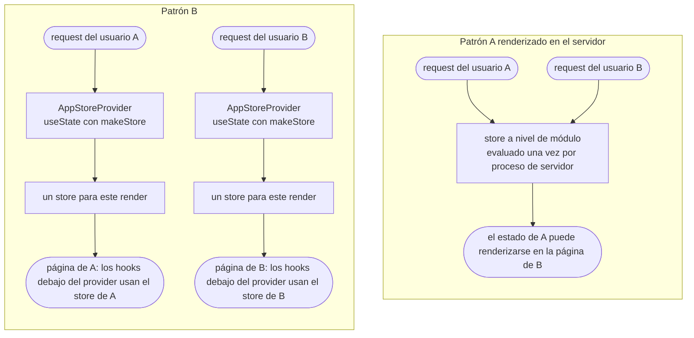

# Yoltra con Next.js

> [🇺🇸 English](../en/NEXTJS_GUIDE.md) &nbsp;|&nbsp; 👉 Español

Yoltra funciona en Next.js como estado **del lado del cliente**, en ambos routers, con un patrón para SSR seguro.

> **Guía completa:** [Next.js en yoltra.dev](https://yoltra.dev/es/yoltra/docs/nextjs/)

## Alcance: Yoltra es estado de cliente

SSR y los React Server Components están fuera de alcance por diseño: el estado vive en el navegador.
Trae los datos iniciales con las herramientas de Next (Server Components, `getServerSideProps`, route
handlers). **Los hooks corren en Client Components**: `"use client"` en el App Router; en el Pages Router ya lo son.

## Pages Router (el ejemplo incluido)

En el ejemplo [`yoltra-in-nextjs`](../../examples/v0/yoltra-in-nextjs) ([▶ Abrir la demo en vivo](https://yoltra.dev/es/demos/in-nextjs/)),
`createYoltra` se llama una vez en `state/yoltra.ts` y los componentes importan sus hooks sin
Provider. Envuelve con `<StoreProvider>` en `_app.tsx` solo para acotar una instancia específica.

## App Router

Los componentes del App Router son **Server Components por defecto**; pon el store y quien lo lee
detrás de `"use client"`. Un store de módulo (Patrón A) se evalúa una vez por proceso de servidor,
así que en SSR se comparte entre requests. Si renderizas en el servidor, créalo por render (Patrón B):



```tsx
// state/StoreProvider.tsx
"use client";
import { useState, type ReactNode } from "react";
import { StoreProvider as YoltraProvider } from "@/state/yoltra";
import { makeStore } from "@/state/makeStore";

export function AppStoreProvider({ children }: { children: ReactNode }) {
  // Un store nuevo por render de cliente, nunca compartido entre requests.
  const [store] = useState(() => makeStore());
  return <YoltraProvider store={store}>{children}</YoltraProvider>;
}
```

Monta `AppStoreProvider` una vez en `app/layout.tsx`; los hooks debajo de él usan esa instancia.

## DevTools en Next.js

`withDevtools` usa el `WebSocket` del navegador, así que protégelo con `typeof window !== "undefined"`,
inicia el hub (`npx @yoltra/devtools-server --port 9800`) y abre el [panel de la extensión](../../devtools/devtools-ext/README.es.md).

## Checklist

Client Components; un store **por request** en SSR; `withDevtools` protegido; datos de servidor emitidos en el cliente.

## Siguientes pasos

- [Guía de Migración](./MIGRATION_GUIDE.md) · [Guía de Testing](./TESTING_GUIDE.md) · [API de @yoltra/react](../../packages/react/README.es.md)

> **Guía completa:** [Next.js en yoltra.dev](https://yoltra.dev/es/yoltra/docs/nextjs/)
