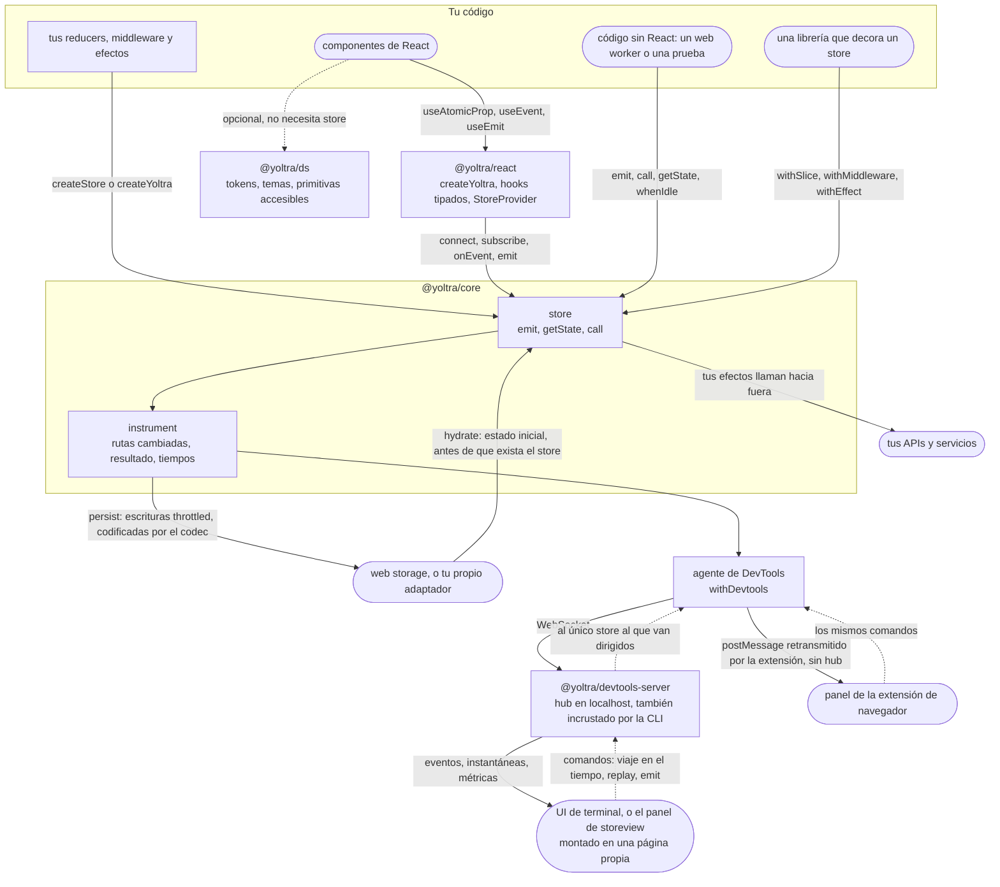
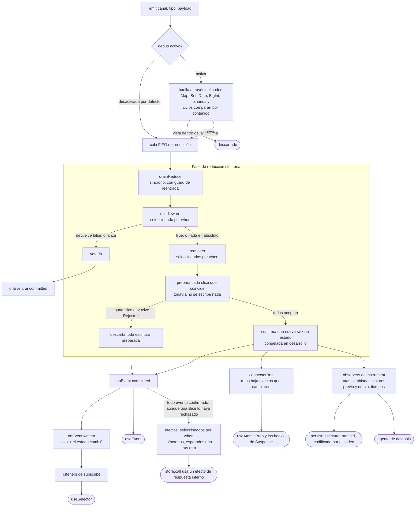
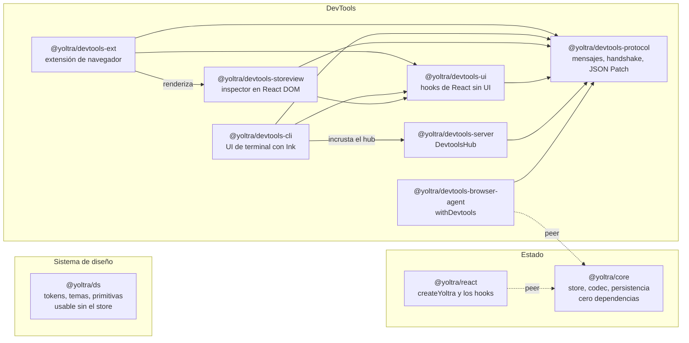

# Yoltra

> 👉 🇲🇽 Versión en Español | [ 🇺🇸 English Version](../../README.md)

[](https://www.npmjs.com/package/@yoltra/core)
[](https://www.npmjs.com/package/@yoltra/core)
[](https://www.npmjs.com/package/@yoltra/core)
[](https://github.com/yoltra/yoltra/blob/main/LICENSE)
[](https://github.com/yoltra/yoltra/actions/workflows/ci.yml)

**Estado reactivo de grano fino, basado en eventos (event-sourced), con devtools que incluyen viaje en el
tiempo. Para aplicaciones complejas e interactivas.**


> 3000 círculos, cada uno suscrito a su propia posición. Cada círculo se re-renderiza de forma
> independiente; el resto del árbol no se toca. Sin selectores. Sin memoización.
> [Ver el código fuente de la demo.](https://github.com/yoltra/yoltra/blob/main/examples/v0/yoltra-kinetic-logo/README.es.md) · [▶ Abrir la demo en vivo](https://yoltra.dev/es/demos/kinetic-logo/)

Una librería de estado para TypeScript y React: emites eventos, reducers puros calculan el siguiente
estado, cada componente se suscribe a las rutas exactas que lee, y las DevTools reproducen el log.

> **Guía completa:** [Yoltra en yoltra.dev](https://yoltra.dev/es/yoltra/)

## La propuesta en 30 segundos

Una sola llamada te da el store **y** los hooks totalmente tipados. Te suscribes a una ruta con un
accessor tipado, y el componente se re-renderiza solo cuando esa ruta exacta cambia:

```tsx
import { createYoltra } from "@yoltra/react";

// Una llamada: store + hooks tipados. Sin context, sin createHooks, sin boilerplate.
export const { useAtomicProp, useEmit } = createYoltra({
  name: "App",
  reducer: {
    todos: {
      state: { items: [{ id: "1", title: "Buy milk", done: false }] },
      when: { keys: [["todos", "rename"]] },
      reducer: (s, e) =>
        e.type === "rename"
          ? { items: s.items.map((t) => (t.id === e.payload.id ? { ...t, title: e.payload.title } : t)) }
          : s,
    },
  },
});

function TodoTitle() {
  // Forma objeto: suscríbete a la ruta exacta `items.0.title`.
  // Se re-renderiza SOLO cuando esa ruta exacta cambia. Sin selectores, sin memo.
  const title = useAtomicProp({ reducer: "todos", property: "items.0.title" });
  const emit = useEmit();
  return <span onClick={() => emit("todos", "rename", { id: "1", title: "New title" })}>{title}</span>;
}
```

La suscripción **_es_** la optimización.

> Yoltra es un fork de [Quo.js](https://github.com/quojs/quojs). Dejamos de usar el nombre
> **Quo.js** para no luchar en SEO con librerías zombis.

## Para quién es Yoltra

Equipos que construyen aplicaciones complejas e interactivas (dashboards operativos, UIs de trading
y back-office, productos multi-pestaña, plataformas de micro-frontends) cansados de intercambiar
depurabilidad por rendimiento de render. Redux es observable pero grueso; Jotai, Valtio y signals
son de grano fino pero opacos. Yoltra rechaza ese intercambio.

## Qué hace diferente a Yoltra

|                    | Grano fino (sin memo manual) | Log de eventos + viaje en el tiempo | Setup de una llamada | Rutas tipadas / tipos de extremo a extremo |
| ---------------- | :--------------------------: | :---------------------------------: | :------------------: | :----------------------------------------: |
| **Redux Toolkit**  |     ✗ selectores + memo      |    ✓ (por eso muchos se quedan)     |    ✗ boilerplate     |                  parcial                   |
| **Zustand**        |      ✗ igualdad manual       |                  ✗                  |          ✓           |                  parcial                   |
| **Jotai / Recoil** |           ✓ átomos           |                  ✗                  |          ✓           |                     ✓                      |
| **Valtio / MobX**  |       ✓ magia de proxy       |                  ✗                  |          ✓           |                  parcial                   |
| **Signals**        |              ✓               |                  ✗                  |          ✓           |                     ✓                      |
| **Yoltra**         |   ✓ suscripciones por ruta   |           ✓ **integrado**           |   ✓ `createYoltra`   |            ✓ accessors tipados             |

- **Sin optimización manual de renders:** suscríbete a `items.0.title` o al comodín `items.*.done`; sin selectores ni memo.
- **El estado está al día cuando `emit()` retorna:** la reducción es síncrona; la promesa resuelve al terminar los efectos.
- **Sin sorpresas silenciosas:** el dedup está apagado por defecto (`dedupWindowMs`, o `dedupKey` por emit); escribir cuesta O(cambio).
- **Eventos que puedes interceptar:** tuplas `(channel, type, payload)`; el middleware puede rechazar uno como evento _no confirmado_.
- **Baterías:** `createEntityAdapter`, `persist`/`hydrate` versionados, `dehydrate()` para SSR, hooks de Suspense.

Más en yoltra.dev: [los dolores que Yoltra elimina](https://yoltra.dev/es/yoltra/docs/overview/#lo-que-dejas-de-hacer---los-dolores-que-yoltra-elimina),
[las ganancias que crea](https://yoltra.dev/es/yoltra/docs/overview/#lo-que-empiezas-a-entregar---las-ganancias-que-yoltra-crea) y la [comparación de librerías](./design/state-management-library-comparison.md).

## Dónde encaja Yoltra en tu código

Tu código habla con un solo store. Los componentes de React llegan a él a través de
`@yoltra/react`; el resto del código (un web worker, una prueba, una librería que decora el store)
lo llama directamente. Todo lo que observa desde fuera (la persistencia, las DevTools) se conecta por
el mismo punto de `instrument()`, así que nada de eso le pide algo a tus reducers. Las flechas
punteadas son comandos de DevTools, que el agente ejecuta solo cuando están activados
(`allowReplay`, `allowEmit`).



## Cómo funciona un store

Un evento, de principio a fin. La fase de reducción es síncrona, así que `getState()` es correcto
en el instante en que `emit()` retorna; los efectos corren después, como una tarea independiente.



Un solo matcher `when` apunta eventos para reducers, middleware y efectos: `keys` (pares tipados,
búsqueda O(1)) o `any`, `channel`, `channels` (evaluados en tiempo de ejecución). El **codec** lleva
y trae `Map`, `Set`, `Date`, `BigInt` y ciclos; `registerSlice` y compañía amplían un store vivo y sus
tipos; el **guard de cascada** detiene y nombra un ciclo de eventos. Más en yoltra.dev: [despacho de `when`](https://yoltra.dev/es/yoltra/docs/overview/#when-un-matcher-dos-rutas-de-despacho), [las comodidades](https://yoltra.dev/es/yoltra/docs/overview/#las-comodidades-y-dónde-se-conectan).

## Paquetes

| Paquete | Descripción |
| --- | --- |
| **[@yoltra/core](https://github.com/yoltra/yoltra/blob/main/packages/core/README.es.md)** | Store agnóstico de framework: reducers, middleware, efectos, detección de cambios de grano fino, instrumentación tipada, entity adapter, persistencia + hidratación. Cero dependencias |
| **[@yoltra/react](https://github.com/yoltra/yoltra/blob/main/packages/react/README.es.md)** | Hooks de React: suscripciones de grano fino, accessors de ruta tipados, `createYoltra`, hooks de entidades, Suspense. Toma core como peer |
| **[@yoltra/ds](https://github.com/yoltra/yoltra/blob/main/packages/ds/README.es.md)** | Sistema de diseño: primitivas de React accesibles, tokens `--yl-*` en tres niveles, temas claro/oscuro con el contraste verificado en ambos. Independiente, usable sin el store |
| **@yoltra/devtools-\*** | Suite de DevTools: protocolo, servidor hub, agente de navegador y la UI del panel (extensión de navegador + CLI) |



## Inicio rápido (React)

Tres pasos, desde la instalación hasta una app funcional y totalmente tipada:

1. **Instala:** `npm install @yoltra/core @yoltra/react` (`@yoltra/react` solo es necesario al usar React).
2. **Crea el store y sus hooks tipados** con una sola llamada a `createYoltra`, como en la propuesta de arriba.
3. **Usa los hooks:** lee con `useAtomicProp`, cambia el estado con `useEmit`. No necesitas `<Provider>`.

La [Guía de inicio rápido](https://github.com/yoltra/yoltra/blob/main/docs/es/QUICK_START_GUIDE.md) recorre los mismos tres pasos con un contador tipado.

## DevTools

El agente de navegador (`withDevtools`) consume la costura tipada `store.instrument(...)` y alimenta
la extensión de navegador, o el hub en localhost detrás de la CLI de terminal y del panel storeview
embebible: log de eventos, árbol de estado en vivo, parches RFC-6902 exactos, métricas, viaje en el
tiempo y replay. Un evento que no se confirmó dice por qué, y nombra al middleware que lo vetó.

## Ejemplos en vivo

- **[Orbital Mission Control](https://github.com/yoltra/yoltra/blob/main/examples/v0/yoltra-mission-control/README.es.md)**, la demo insignia: cada funcionalidad y el panel de DevTools en una pantalla, sin instalar nada · [Tour guiado](https://github.com/yoltra/yoltra/blob/main/examples/v0/yoltra-mission-control/GUIDE.es.md) · [▶ Demo en vivo](https://yoltra.dev/es/demos/mission-control/)
- **[Logo cinético (3000 partículas)](https://github.com/yoltra/yoltra/blob/main/examples/v0/yoltra-kinetic-logo/README.es.md)**: una suscripción de ruta independiente por círculo · [▶ Demo en vivo](https://yoltra.dev/es/demos/kinetic-logo/)
- **[App de tareas con Profiler](https://github.com/yoltra/yoltra/blob/main/examples/v0/yoltra-in-react/README.es.md)**: flamegraphs lado a lado con Redux ([resultados](https://github.com/yoltra/yoltra/blob/main/examples/v0/yoltra-in-react/redux-yoltra-profiler.es.md)) · [▶ Demo en vivo](https://yoltra.dev/es/demos/in-react/)
- **[Contador](https://github.com/yoltra/yoltra/blob/main/examples/v0/yoltra-react-counter/README.es.md)**: el ejemplo mínimo de extremo a extremo · [▶ Demo en vivo](https://yoltra.dev/es/demos/react-counter/)
- **[Selector de tema en Next.js](https://github.com/yoltra/yoltra/blob/main/examples/v0/yoltra-in-nextjs/README.es.md)**: Yoltra del lado del cliente en el Pages Router · [▶ Demo en vivo](https://yoltra.dev/es/demos/in-nextjs/)

## Documentación

Cada documento del repositorio es la versión breve; su página completa vive en yoltra.dev, junto a
la [referencia de la API](https://yoltra.dev/es/yoltra/api/) y [lo nuevo en 0.10](https://yoltra.dev/es/yoltra/releases/0.10/).

| En el repositorio | Qué cubre | En yoltra.dev |
| --- | --- | --- |
| [Guía de inicio rápido](https://github.com/yoltra/yoltra/blob/main/docs/es/QUICK_START_GUIDE.md) | 3 pasos hacia una app funcional | [Inicio rápido](https://yoltra.dev/es/yoltra/docs/quick-start/) |
| [Guía de migración](https://github.com/yoltra/yoltra/blob/main/docs/es/MIGRATION_GUIDE.md) | Si vienes de Redux, Zustand o Jotai | [Migración](https://yoltra.dev/es/yoltra/docs/migration/) |
| [Petición y respuesta](https://github.com/yoltra/yoltra/blob/main/docs/es/REQUEST_REPLY_GUIDE.md) | `store.call()`: correlación sin ids, progreso en streaming con backpressure | [Petición y respuesta](https://yoltra.dev/es/yoltra/docs/request-reply/) |
| [Guía de decoración](https://github.com/yoltra/yoltra/blob/main/docs/es/DECORATION_GUIDE.md) | Agregar una slice, middleware o efecto al store de alguien más, con los tipos | [Decoración](https://yoltra.dev/es/yoltra/docs/decoration/) |
| [Guía de testing](https://github.com/yoltra/yoltra/blob/main/docs/es/TESTING_GUIDE.md) | Probar stores, efectos, middleware y componentes | [Testing](https://yoltra.dev/es/yoltra/docs/testing/) |
| [Guía de Next.js](https://github.com/yoltra/yoltra/blob/main/docs/es/NEXTJS_GUIDE.md) | Uso en cliente con Pages y App Router | [Next.js](https://yoltra.dev/es/yoltra/docs/nextjs/) |
| [Actualizar a 0.10.0](https://github.com/yoltra/yoltra/blob/main/docs/es/UPGRADE_0.10.md) | Qué cambió, cómo lo notarías, qué hacer | [Migración a 0.10](https://yoltra.dev/es/yoltra/releases/0.10/migration/) |
| [Actualizar a 0.8.0](https://github.com/yoltra/yoltra/blob/main/docs/es/UPGRADE_0.8.md) | Qué cambió, cómo lo notarías, qué hacer | [Migración a 0.8](https://yoltra.dev/es/yoltra/releases/0.8/migration/) |
| [@yoltra/core](https://github.com/yoltra/yoltra/blob/main/packages/core/README.es.md) | Store, middleware, efectos, matchers `When`, instrumentación | [core](https://yoltra.dev/es/yoltra/packages/core/) |
| [@yoltra/react](https://github.com/yoltra/yoltra/blob/main/packages/react/README.es.md) | Hooks, accessors tipados, `createYoltra`, Suspense | [react](https://yoltra.dev/es/yoltra/packages/react/) |
| [@yoltra/ds](https://github.com/yoltra/yoltra/blob/main/packages/ds/README.es.md) | Componentes, tokens, temas, el contrato con SSR y la migración a 0.4.0 (38 tokens renombrados, un codemod) | [ds](https://yoltra.dev/es/ds/docs/overview/) |
| [Arquitectura del pipeline de eventos](https://github.com/yoltra/yoltra/blob/main/docs/es/design/event-queue-architecture.md) | El pipeline de reducción síncrona y efectos asíncronos | [Pipeline de eventos](https://yoltra.dev/es/yoltra/docs/design/event-queue-architecture/) |
| [Comparación de librerías](https://github.com/yoltra/yoltra/blob/main/docs/es/design/state-management-library-comparison.md) | Comparación arquitectónica con Redux, Zustand, Jotai y otras | [Comparación](https://yoltra.dev/es/yoltra/docs/design/state-management-comparison/) |

## Contribuir

Las contribuciones son bienvenidas. Lee la [Guía de contribución](https://github.com/yoltra/yoltra/blob/main/docs/es/CONTRIBUTING.md), el [Código de conducta](https://github.com/yoltra/yoltra/blob/main/docs/es/CODE_OF_CONDUCT.md),
la [Gobernanza](https://github.com/yoltra/yoltra/blob/main/docs/es/GOVERNANCE.md) y la [Política de seguridad](https://github.com/yoltra/yoltra/blob/main/docs/es/SECURITY.md).

## Desarrollo (Monorepo)

`npm i -g @microsoft/rush`, luego `rush install`, `rush build` y `rush test`. La
**[Guía del desarrollador](https://github.com/yoltra/yoltra/blob/main/docs/es/DEVELOPER_GUIDE.md)** tiene el resto.

## Estado

**Release Candidate.** Las APIs de core y React son estables y se usan en producción; los tipos son
estrictos; el CI hace cumplir cobertura, tamaño de bundle y benchmarks. Las APIs menores aún pueden
evolucionar antes de v1.0.

## Licencia

**MIT**, para proyectos comerciales y de código abierto; cada paquete `@yoltra/*` publicado se
distribuye bajo ella. Consulta [LICENSE](https://github.com/yoltra/yoltra/blob/main/LICENSE). «Yoltra» y el logo de
Yoltra son marcas; la licencia cubre el código, no las marcas. Consulta [TRADEMARKS](https://github.com/yoltra/yoltra/blob/main/docs/es/TRADEMARKS.md).

## Comunidad

- **Sitio web:** [yoltra.dev](https://yoltra.dev)
- **Twitter/X:** [@yoltra_dev](https://twitter.com/yoltra_dev)
- **GitHub Discussions:** [Únete a la conversación](https://github.com/yoltra/yoltra/discussions)
- **Issues:** [Reporta errores o solicita funcionalidades](https://github.com/yoltra/yoltra/issues)

> **Guía completa:** [Yoltra en yoltra.dev](https://yoltra.dev/es/yoltra/)
