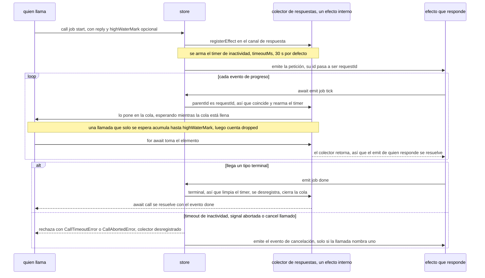

# Petición y respuesta

> 👉 🇲🇽 Versión en Español&nbsp; | &nbsp;[ 🇺🇸 English Version](../en/REQUEST_REPLY_GUIDE.md)

Un bus de eventos es unidireccional, pero algunas interacciones son pregunta y respuesta. `store.call()`
las empareja por ti, con progreso, contrapresión, timeouts y cancelación incluidos.

> **Guía completa:** [Petición y respuesta en yoltra.dev](https://yoltra.dev/es/yoltra/docs/request-reply/)

## La llamada

```typescript
const res = await store.call("rpc", "ask", { q: "quien?" }, { reply: ["rpc", "answer"] });
res.payload.text;
```

Quien responde es un efecto común que contesta con el `emit` que recibió; el store marca `parentId`
en esa respuesta, así que no hay id de correlación que generar ni devolver. `payload` es la
petición. `reply` nombra los tipos que terminan la llamada, que se resuelve con el **evento** de
respuesta: con varios (`["rpc", ["answer", "error"]]`), discrimina por `res.type`.



## Progreso, y por qué el productor espera

```typescript
const call = store.call("job", "start", { id }, {
  reply: ["job", "done"],
  highWaterMark: 4,
});

for await (const step of call) {
  await renderProgress(step.payload);
}

const { payload } = await call; // la respuesta terminal
```

Los eventos correlacionados no terminales son progreso. El `await emit(...)` de quien responde espera
mientras el lector va atrás; si solo se espera la llamada, acumula hasta `highWaterMark` y cuenta el resto en `dropped`.

## Rendirse

```typescript
const call = store.call("job", "start", { id }, {
  reply: ["job", "done"],
  timeoutMs: 5_000,
  signal: AbortSignal.timeout(60_000),
});
```

`timeoutMs` es de inactividad, no total: todo evento correlacionado lo reinicia. `signal` es una fecha
límite real, y `call.cancel(reason)` termina antes. Termine como termine, la suscripción se quita y se
libera al productor detenido; liberar el store rechaza las llamadas pendientes con `CallAbortedError`.

## Avisarle a quien responde que te rendiste

Pasa `cancel: ["job", "cancel"]`, un evento con tipo `CallCancellation` (`{ requestId, reason, detail? }`),
y la llamada lo emite cuando se cancela, se aborta o expira, nunca después de una respuesta
terminal. Quien responde aborta el trabajo de ese `requestId`, combinado con su propio `ctx.signal`.

## Más en yoltra.dev

- [La forma del problema](https://yoltra.dev/es/yoltra/docs/request-reply/#la-forma-del-problema): la versión escrita a mano y sus dos bugs habituales.
- [No saber qué va a regresar](https://yoltra.dev/es/yoltra/docs/request-reply/#no-saber-que-va-a-regresar): las tres formas de `reply`. [La contrapresión es real](https://yoltra.dev/es/yoltra/docs/request-reply/#la-contrapresión-es-real) y [entra cuando empiezas a iterar](https://yoltra.dev/es/yoltra/docs/request-reply/#la-contrapresión-entra-cuando-empiezas-a-iterar).
- [Cuando la respuesta no puede ser hija directa](https://yoltra.dev/es/yoltra/docs/request-reply/#cuando-la-respuesta-no-puede-ser-hija-directa): `correlationId` y `correlation: "either" | "causal" | "id"`.
- [Probar una llamada](https://yoltra.dev/es/yoltra/docs/request-reply/#probar-una-llamada): un efecto que responde, y un `scheduler` que dispara el timer de inactividad. Ver también el [README de `@yoltra/core`](../../packages/core/README.es.md) y la [arquitectura del pipeline de eventos](./design/event-queue-architecture.md).

> **Guía completa:** [Petición y respuesta en yoltra.dev](https://yoltra.dev/es/yoltra/docs/request-reply/)
