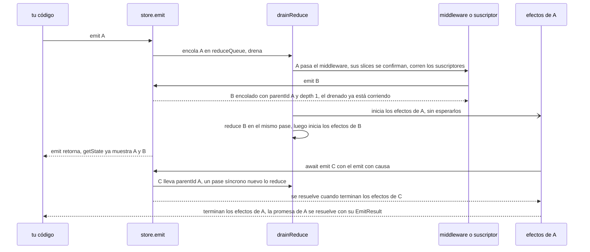
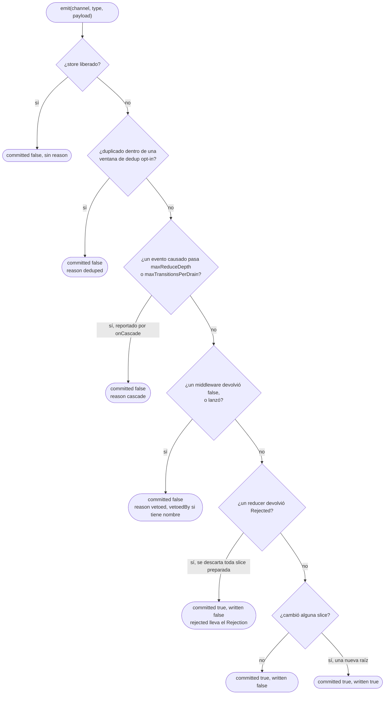

# Arquitectura del Pipeline de Eventos

> [🇺🇸 English](../../en/design/event-queue-architecture.md) &nbsp;|&nbsp; 👉 Español

**Aplica a:** `@yoltra/core` 0.10.0
**Última actualización:** Octubre 2026
**Estado:** Estable

Cómo procesa un evento un store de Yoltra: qué corre en cada fase, qué devuelve `emit()` y cuándo,
cómo funcionan el orden y la deduplicación, y cómo falla el pipeline de forma segura.

> **Guía completa:** [Arquitectura del Pipeline de Eventos en yoltra.dev](https://yoltra.dev/es/yoltra/docs/design/event-queue-architecture/)

## Descripción General

Cada evento pasa por **dos fases**:

1. **Una fase de reducción síncrona.** El middleware, los reducers, los suscriptores de eventos y
   los oyentes gruesos corren en el mismo tick, antes de que `emit()` retorne, así que `getState()`
   es correcto en el instante en que `emit()` retorna, con o sin middleware. Los reducers
   **preparan** su resultado, y todas las slices se escriben bajo una sola raíz nueva antes de
   notificar nada: ningún suscriptor ve un evento a medio aplicar.
2. **Una fase de efectos asíncrona.** Los efectos de cada evento confirmado corren después, como una
   **tarea independiente**. La promesa que devuelve `emit()` se resuelve cuando terminan los efectos
   de _ese evento_.

Las transiciones de estado son síncronas y predecibles; los efectos secundarios son asíncronos y no
bloqueantes, sin una capa de orquestación aparte. Los reducers y el middleware son síncronos; lo
asíncrono pertenece a un efecto.

## Reentrada y ordenamiento

- Los eventos se reducen desde **una sola cola FIFO**, en el orden en que se emiten. El orden de los
  reducers siempre es estricto.
- Un `emit()` dentro de middleware o de un suscriptor se une a la cola y lo reduce el pase que ya
  está corriendo, después del evento actual, sin intercalar reducers.
- Un `emit()` dentro de un efecto inicia un pase síncrono nuevo.
- Los efectos de eventos distintos pueden estar en vuelo a la vez: el orden en que terminan no se
  serializa. Si un efecto debe ir después de otro, emite el siguiente desde dentro del primero.

## Deduplicación (opt-in)

La deduplicación está **desactivada por defecto**: dos emits idénticos y rápidos se despachan los
dos. Actívala por contenido con `createStore({ dedupWindowMs: N })`, o por identidad con
`emit(c, t, p, { dedupKey })`, la herramienta correcta para la doble invocación de React Strict Mode
en desarrollo. Las builds de desarrollo avisan, por store, cuando dos pares `(channel, type)` se
unen en la misma clave interna.

## El contrato de la promesa de `emit()`

`emit()` devuelve una `Promise<EmitResult>` que se resuelve **cuando terminan los efectos de ese
evento en concreto**. Para entonces el estado ya cambió; espérala solo para esperar los efectos.

| Campo       | Significado                                                                |
| ----------- | -------------------------------------------------------------------------- |
| `committed` | El middleware lo permitió: llegó a los reducers                            |
| `written`   | El estado cambió de verdad                                                 |
| `rejected`  | El `Rejection` que devolvió un reducer, cuando alguno rechazó              |
| `reason`    | Por qué no se confirmó: `"vetoed"`, `"deduped"` o `"cascade"`              |
| `vetoedBy`  | El nombre del middleware que vetó, si lo tiene                             |

Cada forma en que puede terminar un `emit()`, en el orden en que el store las revisa. Solo el último
resultado escribe estado; los cuatro que terminan con `committed: false` nunca llegan a un reducer.

Cada evento tiene su propia promesa de finalización, así que `await emit(b)` nunca se resuelve antes
de tiempo porque otro evento estuviera en vuelo.

## Modos de fallo

- **Veto del middleware.** Solo un `false` explícito veta; un middleware que lanza también veta. Los
  reducers y los efectos nunca ven el evento, y se disparan los suscriptores `uncommitted`.
- **Errores de efectos.** Un efecto que lanza se captura y se registra; los demás efectos y el
  pipeline continúan. Los efectos deben capturar sus errores y emitir eventos de fallo.
- **Reducers largos.** Los reducers corren en el hilo principal; mantenlos rápidos y puros.
- **Rechazo de un reducer.** Un reducer que devuelve `Rejected(reason)` hace ceder al evento entero:
  no se escribe ninguna slice, y quien llama sabe por qué mediante `EmitResult.rejected`.
- **Re-emisión descontrolada.** Cada evento causado lleva `parentId` y `depth`; `maxReduceDepth`
  (64 por defecto) rechaza una cadena más larga y lo reporta por `onCascade`.
  `maxTransitionsPerDrain` acota el ancho de una ráfaga y es opt-in.

## Más en yoltra.dev

- [Mecanismo central](https://yoltra.dev/es/yoltra/docs/design/event-queue-architecture/#mecanismo-central): la cola de reducción, el punto de entrada `emit()` y el flujo de procesamiento.
- [Fase 1 - Reducción síncrona](https://yoltra.dev/es/yoltra/docs/design/event-queue-architecture/#fase-1---reducción-síncrona) y [Fase 2 - Efectos asíncronos](https://yoltra.dev/es/yoltra/docs/design/event-queue-architecture/#fase-2---efectos-asíncronos), en código.
- [Suscripciones de eventos](https://yoltra.dev/es/yoltra/docs/design/event-queue-architecture/#suscripciones-de-eventos): las fases `committed`, `written`, `uncommitted` y `all`.
- [Comparación con otras librerías](https://yoltra.dev/es/yoltra/docs/design/event-queue-architecture/#comparación-con-otras-librerías) y [justificación de diseño](https://yoltra.dev/es/yoltra/docs/design/event-queue-architecture/#justificación-de-diseño).
- [Apéndice: referencia de implementación](https://yoltra.dev/es/yoltra/docs/design/event-queue-architecture/#apéndice-referencia-de-implementación), el [glosario](https://yoltra.dev/es/yoltra/docs/design/event-queue-architecture/#glosario) y el [historial de revisiones](https://yoltra.dev/es/yoltra/docs/design/event-queue-architecture/#historial-de-revisiones).

> **Guía completa:** [Arquitectura del Pipeline de Eventos en yoltra.dev](https://yoltra.dev/es/yoltra/docs/design/event-queue-architecture/)
