# Quo.js vs Redux Toolkit : Comparaison de Profileur

> [ 🇲🇽 Versión en Español](./redux-quojs-profiler.es.md)&nbsp; | &nbsp;[ 🇵🇹 Versão Portuguesa](./redux-quojs-profiler.pt.md)&nbsp; | &nbsp;[ 🇺🇸 English Version](./redux-quojs-profiler.md)&nbsp; | &nbsp;[ 🇫🇷 Version française](./redux-quojs-profiler.fr.md) 

## Scénario de test

Les deux implémentations affichent la même liste de tâches interactive :

- **Fabrique de TODOs** pour la création de tâches.
- **Filtres de TODOs** pour filtrer les _todos_ par statut et par catégorie.
- **Liste de TODOs** avec des éléments pouvant être activés/désactivés.

Ce scénario met à l'épreuve les performances de re-rendu, et Quo.js se distingue par ses
**abonnements granulaires natifs**.

## Flamegraphs de Quo.js (Trames 01--19)

Les mises à jour de Quo.js sont systématiquement **plates et localisées**. Chaque commit touche
uniquement le composant qui s'est abonné au _todo_ effectivement modifié. Les abonnements
atomiques aux propriétés font toute la différence.

| Trame | Notes                                                                                                                                    | Quo.js                                                                                          | Redux (RTK)                                                                                 |
| ----- | ---------------------------------------------------------------------------------------------------------------------------------------- | ----------------------------------------------------------------------------------------------- | ------------------------------------------------------------------------------------------- |
| 01    | Rendu initial                                                                                                                            | 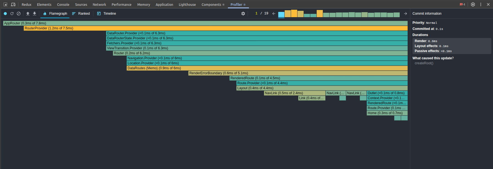 |  |
|       | Les deux bibliothèques rendent toute l’interface utilisateur au départ (aucun TODO pour l’instant).                                      |                                                                                                 |                                                                                             |
| 02    | Récupération des TODOs                                                                                                                   |  | 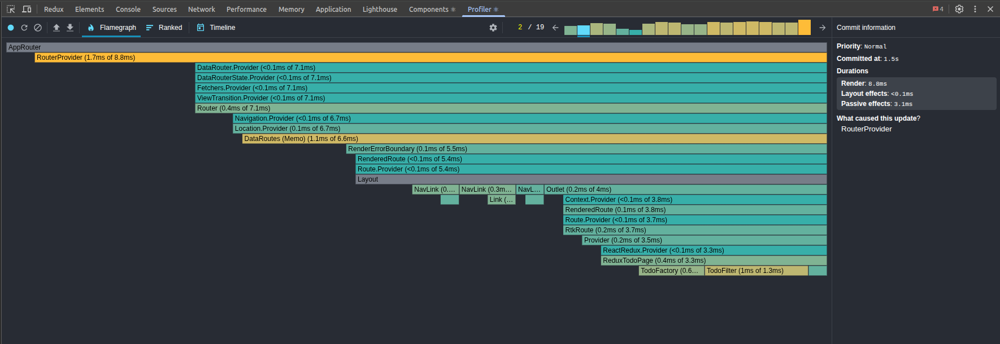 |
|       | Une action asynchrone est déclenchée pour récupérer les TODOs depuis un service externe.                                                 |                                                                                                 |                                                                                             |
| 03    | TODOs reçus                                                                                                                              |  |  |
|       | Les deux bibliothèques rendent la liste complète.                                                                                        |                                                                                                 |                                                                                             |
| 04    | Filtres activés                                                                                                                          | 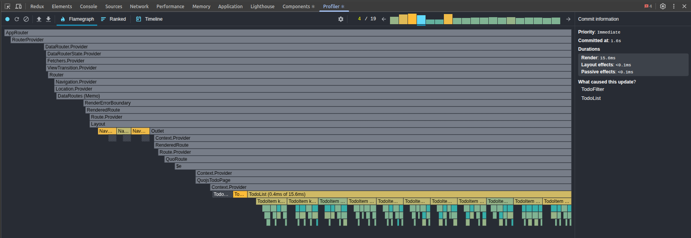 | 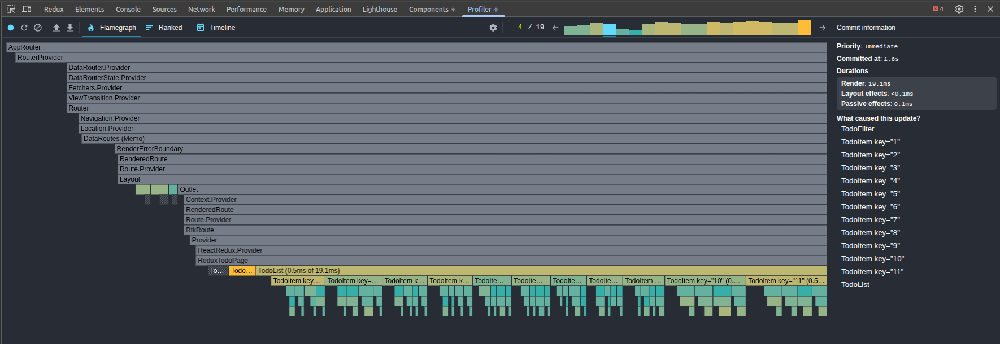 |
|       | Les filtres sont reconstruits avec la catégorie des TODOs reçus. Les deux bibliothèques re-rendent la liste entière.                     |                                                                                                 |                                                                                             |
| 05    | Créer un nouveau TODO, étape #1                                                                                                          | 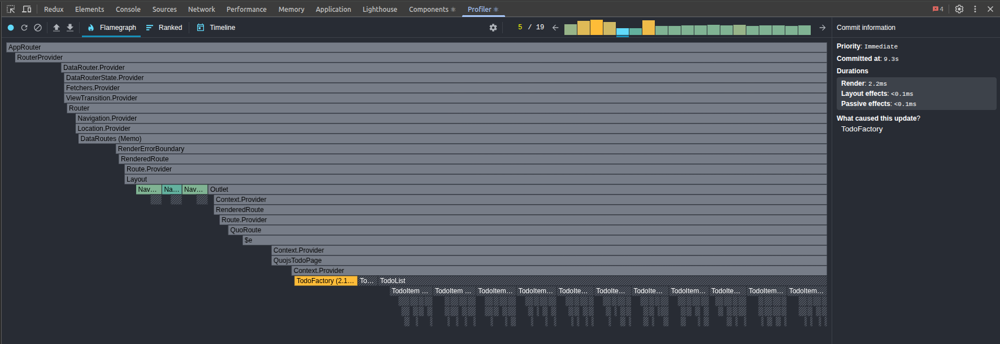 |  |
|       | Dans la fabrique de TODOs, le nom (test) est collé dans le champ ‘title’. Les deux bibliothèques re-rendent uniquement la fabrique.      |                                                                                                 |                                                                                             |
| 06    | Créer un nouveau TODO, étape #2                                                                                                          | 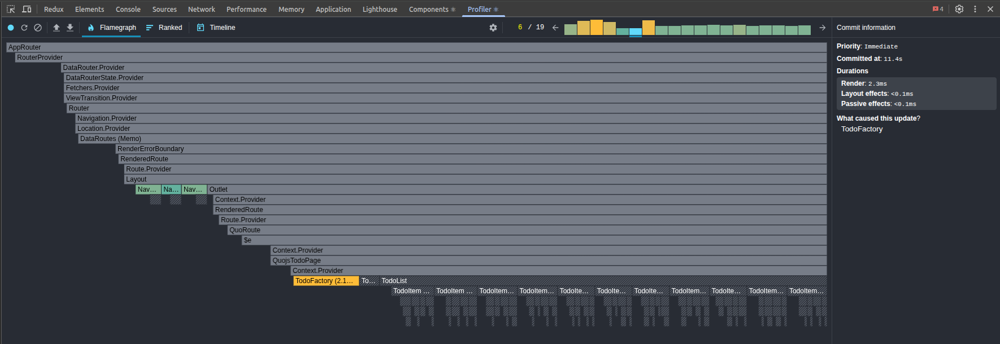 |  |
|       | Dans la fabrique de TODOs, la catégorie (test) est collée dans le champ ‘category’. Les deux re-rendent seulement la fabrique.           |                                                                                                 |                                                                                             |
| 07    | Créer un nouveau TODO, étape #3                                                                                                          | 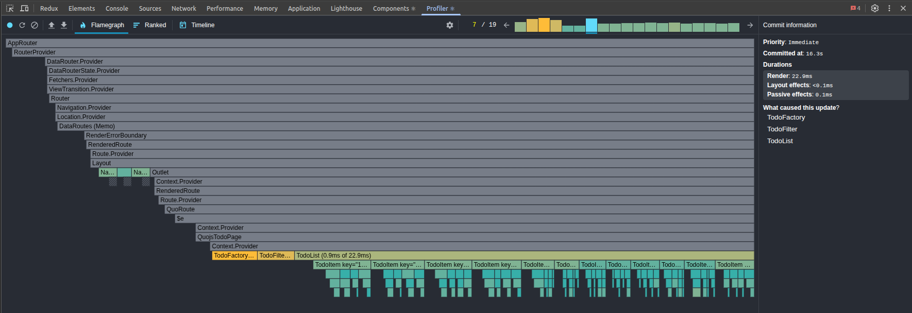 |  |
|       | Le bouton ‘Ajouter’ est cliqué et le TODO est ajouté à la liste. Les deux bibliothèques re-rendent la liste + les filtres + la fabrique. |                                                                                                 |                                                                                             |
| 08    | TODO avec clé `1` est basculé. Mise à jour automatique.                                                                                  |  |  |
|       |                                                                                                                                          | Quo.js re-rend uniquement le TODO concerné.                                                     | RTK re-rend toute la liste de TODOs.                                                        |
| 09    | TODO avec clé `2` est basculé. Mise à jour automatique.                                                                                  | 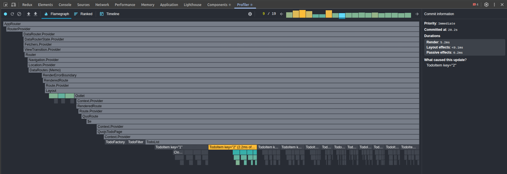 |  |
|       |                                                                                                                                          | Quo.js re-rend uniquement le TODO concerné.                                                     | RTK re-rend toute la liste de TODOs.                                                        |
| 10    | TODO avec clé `3` est basculé. Mise à jour automatique.                                                                                  | 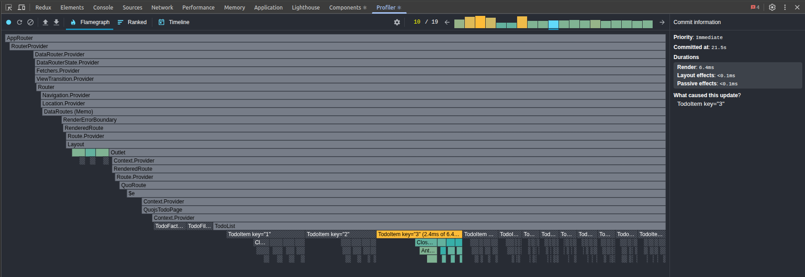 | 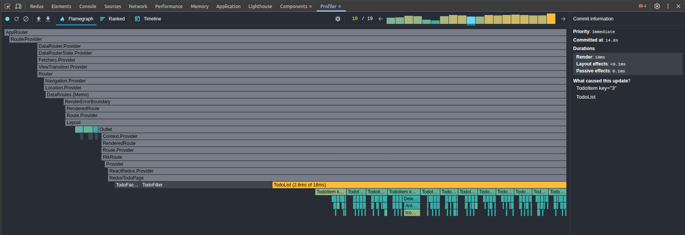 |
|       |                                                                                                                                          | Quo.js re-rend uniquement le TODO concerné.                                                     | RTK re-rend toute la liste de TODOs.                                                        |
| 11    | TODO avec clé `4` est basculé. Mise à jour automatique.                                                                                  | 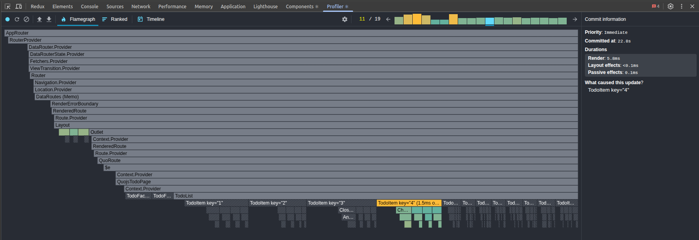 |  |
|       |                                                                                                                                          | Quo.js re-rend uniquement le TODO concerné.                                                     | RTK re-rend toute la liste de TODOs.                                                        |
| 12    | TODO avec clé `5` est basculé. Mise à jour automatique.                                                                                  | 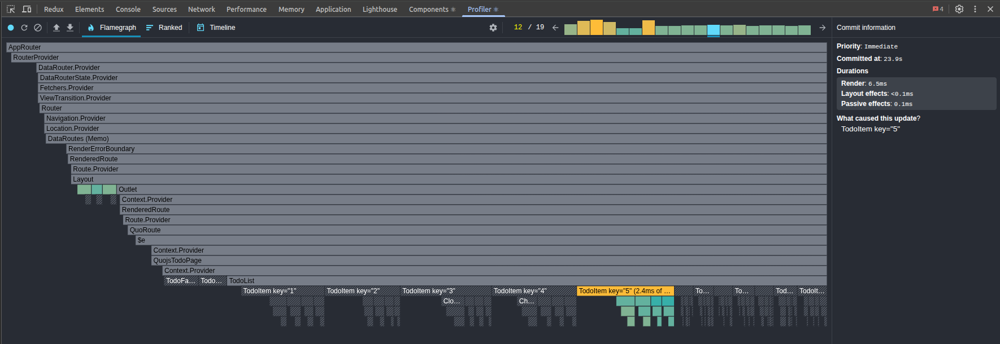 |  |
|       |                                                                                                                                          | Quo.js re-rend uniquement le TODO concerné.                                                     | RTK re-rend toute la liste de TODOs.                                                        |
| 13    | TODO avec clé `6` est basculé. Mise à jour automatique.                                                                                  | 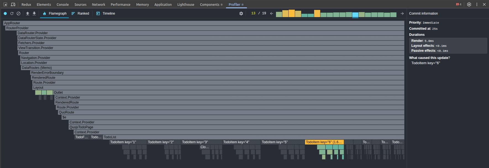 |  |
|       |                                                                                                                                          | Quo.js re-rend uniquement le TODO concerné.                                                     | RTK re-rend toute la liste de TODOs.                                                        |
| 14    | TODO avec clé `7` est basculé. Mise à jour automatique.                                                                                  |  | 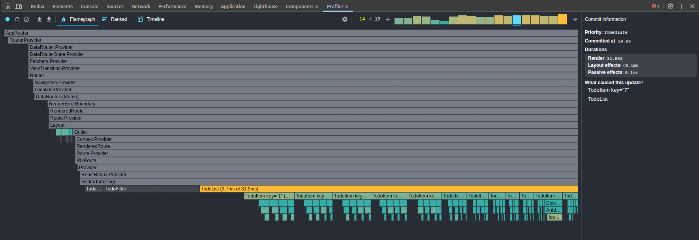 |
|       |                                                                                                                                          | Quo.js re-rend uniquement le TODO concerné.                                                     | RTK re-rend toute la liste de TODOs.                                                        |
| 15    | TODO avec clé `8` est basculé. Mise à jour automatique.                                                                                  |  | 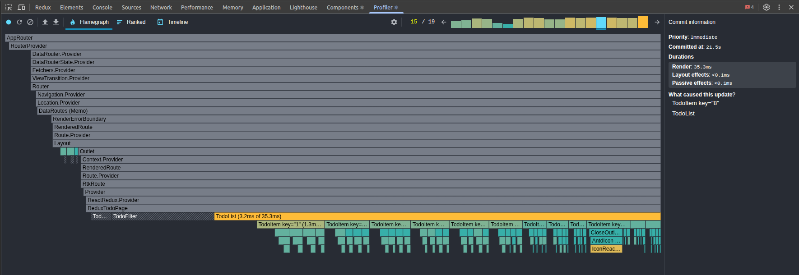 |
|       |                                                                                                                                          | Quo.js re-rend uniquement le TODO concerné.                                                     | RTK re-rend toute la liste de TODOs.                                                        |
| 16    | TODO avec clé `9` est basculé. Mise à jour automatique.                                                                                  | 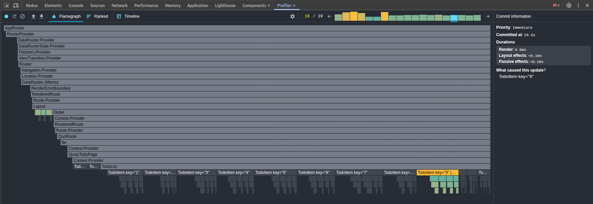 | 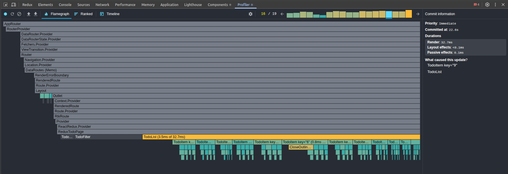 |
|       |                                                                                                                                          | Quo.js re-rend uniquement le TODO concerné.                                                     | RTK re-rend toute la liste de TODOs.                                                        |
| 17    | TODO avec clé `10` est basculé. Mise à jour automatique.                                                                                 | 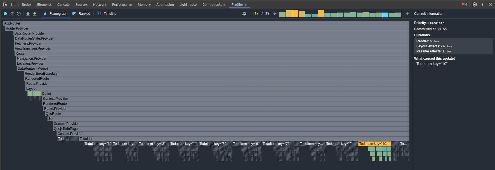 |  |
|       |                                                                                                                                          | Quo.js re-rend uniquement le TODO concerné.                                                     | RTK re-rend toute la liste de TODOs.                                                        |
| 18    | TODO avec clé `11` est basculé. Mise à jour automatique.                                                                                 | 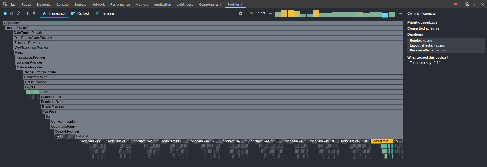 | 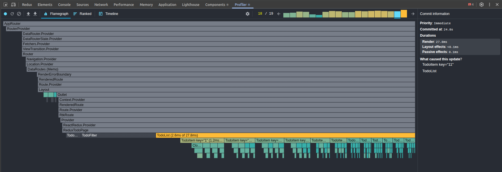 |
|       |                                                                                                                                          | Quo.js re-rend uniquement le TODO concerné.                                                     | RTK re-rend toute la liste de TODOs.                                                        |
| 19    | TODO avec clé `12` est basculé. (créé dans la trame #7). Mise à jour automatique.                                                        | 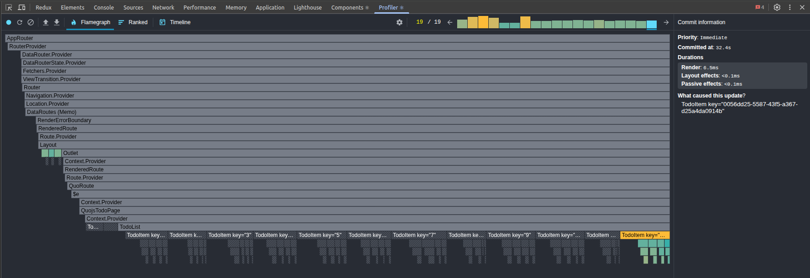 | 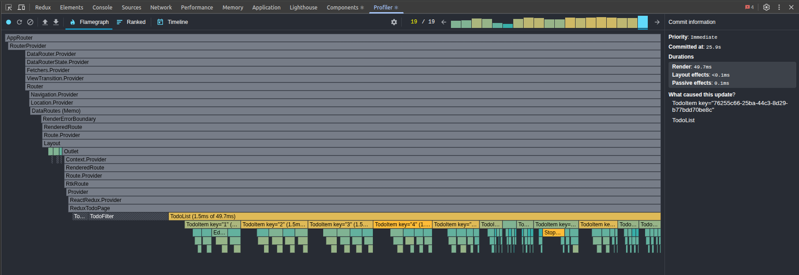 |
|       | Rapport du profileur (JSON)                                                                                                              | [Quo.js](./public/assets/profiler/quojs/profiling-data.quojs.10-20-2025.22-30-26.json)          | [RTK](./public/assets/profiler/rtk/profiling-data.rtk.10-20-2025.22-32-54.json)             |

## Observations Clés

Dans l'implémentation RTK, le basculement de chaque todo (12 au total) a entraîné le re-rendu
des 11 autres, soit un total de **144 re-rendus** ! Cela représente **132 re-rendus inutiles**.

1.  **Abonnements atomiques (Quo.js) vs fabriques de sélecteurs (RTK).**

    - **Quo.js** : Chemin direct (`todo.data.4.status`) → un seul composant.
    - **RTK** : Nécessite `createSelector` + mémoïsation ; facile à mal configurer, facile à
      réveiller toute la liste.

2.  **Agrégation générique.**

    - **Quo.js** : `todo.filter.*` met automatiquement à jour les filtres.
    - **RTK** : Nécessite des sélecteurs ligne par ligne ; l'approche par défaut provoque un
      rechargement complet.

3.  **Effets asynchrones.**

    - **Quo.js** : Sémantique native d'annulation et de délai intégrée.
    - **RTK** : Nécessite un middleware personnalisé ou des chaînes de thunks ; aucune
      annulation naturelle.

4.  **Résultats du profileur.**

    - **Quo.js** : Flamegraphs plats, prévisibles, avec des mises à jour limitées.
    - **RTK** : Flamegraphs larges, tailles de commit incohérentes, coût CPU plus élevé.

## Pourquoi C'est Important

Pour les petites applications, les deux semblent « assez rapides ».

Mais à grande échelle :

- **Quo.js** évolue de manière linéaire avec le nombre d'éléments affectés.
- **RTK** évolue de manière superlinéaire, à moins d'un investissement important dans la
  discipline des sélecteurs.

Cette démonstration illustre **pourquoi Quo.js existe** : pour offrir des abonnements atomiques
aux propriétés, des effets asynchrones de première classe et une agrégation générique **sans
cérémonie pour le développeur**.
