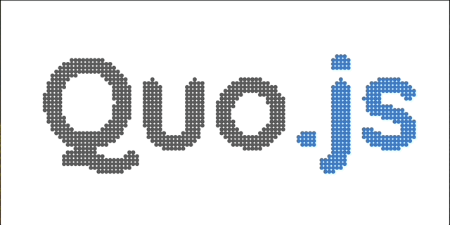

# Logo Cinético de Quo.js (React + SVG)



> 👉 [ 🇲🇽 Versión en Español](./README.es.md)&nbsp; |
> &nbsp;[ 🇵🇹 Versão Portuguesa](./README.pt.md)&nbsp; | &nbsp;
> [ 🇺🇸 English Version](./README.md)&nbsp; | &nbsp;[ 🇫🇷 Version française](./README.fr.md)

**Un logo cinético hecho con ~1.5k círculos SVG, impulsado por un mini motor de simulación y sincronizado con un store de Quo.js.**  

Este ejemplo vive en el monorepo de Rush en:

```
examples/v0/quojs-dots
``` 

Demuestra a Quo.js como un contenedor de estado **predecible, tipado y dirigido por eventos** con **suscripciones atómicas** que mantienen los re‑renders de React al mínimo, incluso cuando miles de ítems se actualizan cada frame.

---

## ¿Por qué Quo.js aquí?

- **Canales + eventos (sin sopa de action types):** despachamos en el canal `"logo"` con eventos como `"batchUpdate"`, `"fps"`, etc.
- **Selectores Atómicos:** cada `<Circle/>` se suscribe a su **propio** nodo `logo[group][id]` vía `useAtomicProp`, evitando re‑renders del slice completo.
- **Reducer inmutable y ergonómico:** un solo reducer (`Logo.reducer.ts`) maneja actualizaciones atómicas y en lote sin magia.
- **Hooks tipados:** `createQuoHooks` genera `useStore`, `useEmit`, `useSelector`, `useAtomicProp`, `useAtomicProps` con inferencia completa de TS.
- **Efectos de eventos:** el motor escucha efectos del store (p. ej., `"logo":"start" | "stop"`) para coordinar el ciclo de vida de la simulación.

Resultado: **60fps suaves** en equipos capaces, con React tocando el DOM sólo para los círculos que realmente se movieron.

---

## Cómo funciona (vista general)

1. **Engine + Simulation**  
   - `Engine` corre un loop de `rAF`, suaviza FPS y despacha `logo/fps` cada ~250ms.
   - `Simulation` posee ítems `Circle`. Cada ítem llega desde un inicio aleatorio hasta su píxel “hogar” (el logo) y luego queda inactivo—repelido por el mouse y relajándose de vuelta.

2. **Imagen → specs (una vez)**  
   - `extractCircleSpecsFromImage()` muestrea un PNG transparente (`assets/logo.png`) para producir `CircleSpec[]` con `group: "d" | "u" | "x"`.  
   - Despachamos `logo/size` y `logo/count` para que la UI conozca el tamaño del lienzo y los totales por grupo.

3. **Actualizaciones por frame → escrituras en lote al store**  
   - En cada frame, `Simulation.loop()` recolecta actualizaciones y despacha **un** `logo/batchUpdate` con muchos cambios.  
   - El reducer hace upsert sólo de los nodos que cambiaron, manteniendo el store pequeño y React preciso.

4. **Render granular**  
   - Cada `<Circle group id>` se suscribe a `logo[group][id]` vía `useAtomicProp`. Si un círculo no se movió, **no re‑renderiza**.

5. **Fin de intro + métricas**  
   - Mientras corre la intro, `logo/introProgress` lleva el conteo restante. Cuando todos llegan a casa, despachamos `logo/introComplete`.

---

## Ejecutarlo (monorepo Rush)

> Asume que estás en la **raíz** del monorepo de Quo.js.

1) **Instalar + compilar paquetes** (para que el ejemplo resuelva los workspaces `@quojs/*`)
```bash
rush install
rush build     # o: rush build -t quojs-dots
```

2) **Levantar el dev server del ejemplo**
```bash
cd examples/v0/quojs-dots
rushx dev      # corre Vite
```

3) Abre la URL local impresa (usualmente `http://localhost:5173`). Mueve el mouse sobre el logo—los puntos orbitan/evitan y luego regresan a casa.

> Alternativa desde la raíz del monorepo:
```bash
rushx -p quojs-dots dev
```

---

## Estructura del proyecto (archivos clave)

```
src/
  App.tsx                       # inicia Engine, extrae specs del PNG del logo, conecta Simulation → Store
  components/screen/Screen.*    # contenedor de pantalla (SVG), lee store.size, renderiza la lista de <Circle/>
  components/screen/items/circle/
    Circle.component.tsx        # se suscribe a su propio nodo logo[group][id] vía useAtomicProp
  context/Store.context.tsx     # contexto de React para el store tipado de Quo
  state/
    types.ts                    # AppState, LogoState, mapas de acciones tipados (LogoAM, AppAM)
    logo/Logo.reducer.ts        # reducer inmutable; updates atómicos + en lote, fps, intro, size
    hooks.ts                    # createQuoHooks(...): hooks tipados de React
    store.ts                    # createStore(...) con el reducer de logo
  utils/
    engine/                     # Engine (loop rAF), Simulation (ítems + quadtree), lógica de Circle
    image/                      # PNG → ImageData + extractor → CircleSpec[]
    Quadtree.ts                 # índice espacial para consultar círculos cercanos en mouse move
    index.ts                    # utilidades numéricas (expApproach, orbit/avoid, etc.)
  assets/logo.png               # imagen fuente para el muestreo
```

---

## Específicos de Quo.js aquí

- **`batchUpdate`**: una acción, muchas actualizaciones → menos trabajo del reducer y menos commits de React.
- **`useAtomicProp`**: suscripción directa a una ruta profunda (`logo["d"]["circle_d_42"]`). Sin trampas de memo, sin selectores que asignan objetos nuevos cada render.
- **API de efectos** (`store.onEffect("logo", "start" | "stop")`): el motor reacciona a eventos de estado a traves del pipeline asincrono integrado.
- **Reducer puro e inmutable**: `upsertItem()` aplica no‑op cuando nada cambió → se propagan menos actualizaciones.

Si este patrón te gusta en un demo, escala limpio a UIs reales con miles de nodos, cargas de streaming/animación y presupuestos de render estrictos.

---

## Solución de problemas

- **Pantalla en blanco o error de fetch**: verifica que `assets/logo.png` exista (Vite dev server) y que el navegador soporte `createImageBitmap`. Hay un fallback, pero algunas CSP pueden bloquear.
- **Lento en equipos modestos**: baja `maxCircles` en `App.tsx` (p. ej., 800) o sube `spacing` del extractor (p. ej., de `3` a `5`).