# Yoltra vs Redux Toolkit: Análisis con _profiler_

> [ 🇲🇽 Versión en Español](./redux-yoltra-profiler.es.md)&nbsp; | &nbsp; 👉 🇺🇸 English Version

## Escenario de Prueba

Ambas implementaciones renderizan la misma lista de tareas (para evitar la confución con la
palabra _ToDo_ en Ingles) interactiva:

- **Todo Factory** para la creación de _tareas_.
- **Todo Filters** para filtrar _tareas_ por estado y categoría.
- **Todo List** con _tareas_ que pueden activarse/desactivarse.

Este escenario pone a prueba el rendimiento de re-renderizado. Yoltra destaca gracias a sus
**suscripciones granulares** nativas.

## Flamegraphs de Yoltra (Frames 01-19)

Las actualizaciones de Yoltra son consistentemente **planas y localizadas**. Cada commit toca
únicamente el componente suscrito a la _tarea_ afectada.

| Frame | Notas                                                                                                                                               | Yoltra                                                                                            | Redux (RTK)                                                                                 |
| ----- | --------------------------------------------------------------------------------------------------------------------------------------------------- | ------------------------------------------------------------------------------------------------- | ------------------------------------------------------------------------------------------- |
| 01    | Render Inicial                                                                                                                                      |  | 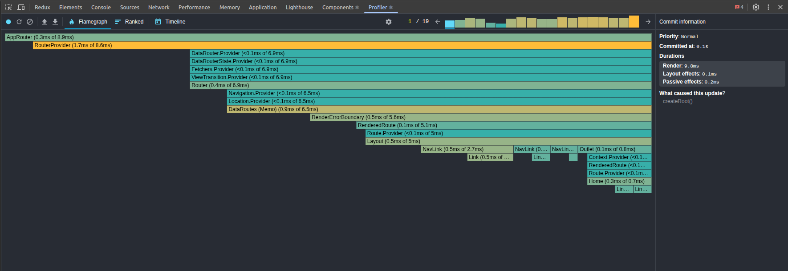 |
|       | Ambas bibliotecas renderizan toda la interfaz inicialmente (aún no hay Items).                                                                      |                                                                                                   |                                                                                             |
| 02    | Obtener Items                                                                                                                                       | 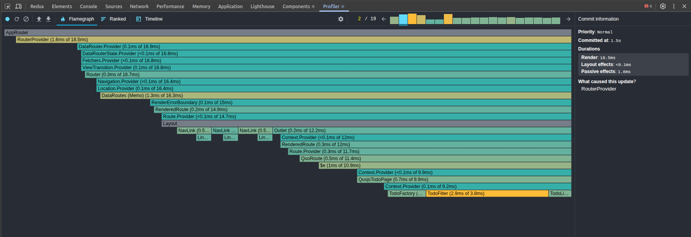 |  |
|       | Se despacha una acción asíncrona para obtener los Items desde un servicio externo.                                                                  |                                                                                                   |                                                                                             |
| 03    | Los Items llegan                                                                                                                                    | 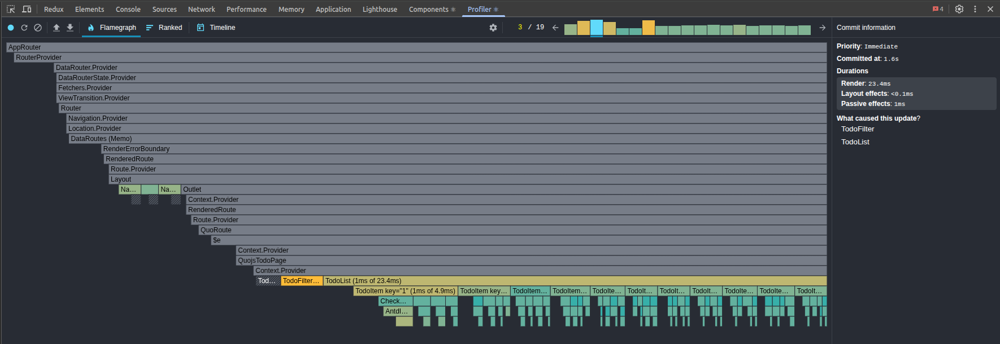 | 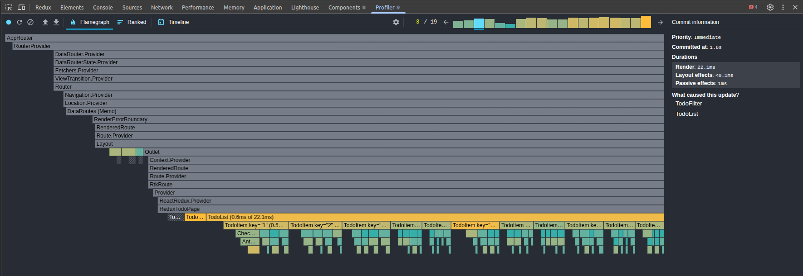 |
|       | Ambas bibliotecas renderizan toda la lista.                                                                                                         |                                                                                                   |                                                                                             |
| 04    | Los Filtros se activan                                                                                                                              |  |  |
|       | Los filtros se reconstruyen con la categoría de los Items entrantes. Ambas bibliotecas re-renderizan toda la lista.                                 |                                                                                                   |                                                                                             |
| 05    | Crear nuevo Item, paso #1                                                                                                                           |  |  |
|       | En el factory de Items, el nombre del todo (test) se pega en el campo 'title'. Ambas bibliotecas re-renderizan solo el factory de Items.            |                                                                                                   |                                                                                             |
| 06    | Crear nuevo Item, paso #2                                                                                                                           |  | 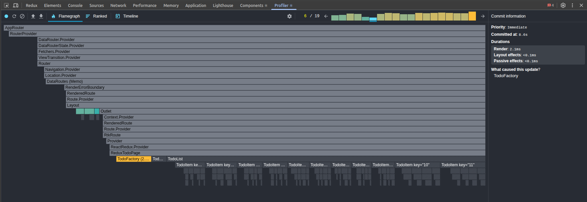 |
|       | En el factory de Items, la categoría del todo (test) se pega en el campo 'category'. Ambas bibliotecas re-renderizan solo el factory de Items.      |                                                                                                   |                                                                                             |
| 07    | Crear nuevo Item, paso #3                                                                                                                           |  | 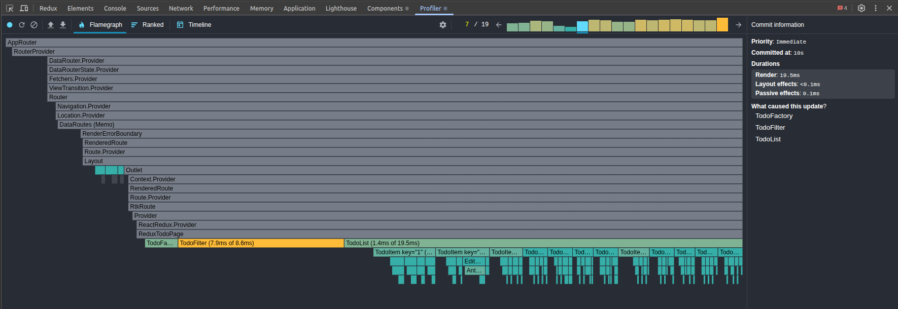 |
|       | Se hizo clic en el botón 'Agregar' y el Item se añade a la lista Ambas bibliotecas re-renderizan toda la lista + los filtros + el factory de Items. |                                                                                                   |                                                                                             |
| 08    | Alternamos el estado del Item con clave `1`. Actualización atómica.                                                                                 | 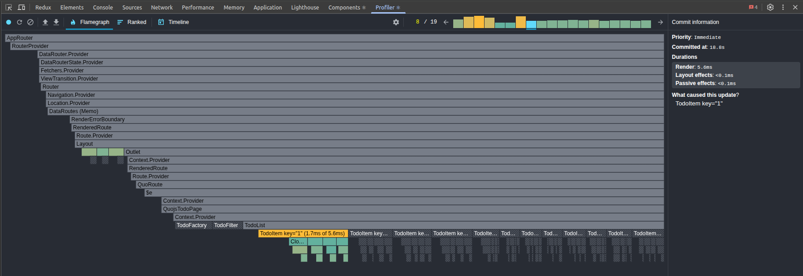 |  |
|       |                                                                                                                                                     | Yoltra re-renderiza solo el Item específico.                                                      | RTK re-renderiza toda la lista de Items.                                                    |
| 09    | Alternamos el estado del Item con clave `2`. Actualización atómica.                                                                                 |  | 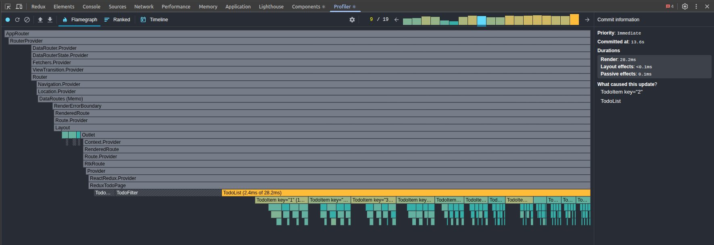 |
|       |                                                                                                                                                     | Yoltra re-renderiza solo el Item específico.                                                      | RTK re-renderiza toda la lista de Items.                                                    |
| 10    | Alternamos el estado del Item con clave `3`. Actualización atómica.                                                                                 |  |  |
|       |                                                                                                                                                     | Yoltra re-renderiza solo el Item específico.                                                      | RTK re-renderiza toda la lista de Items.                                                    |
| 11    | Alternamos el estado del Item con clave `4`. Actualización atómica.                                                                                 |  | 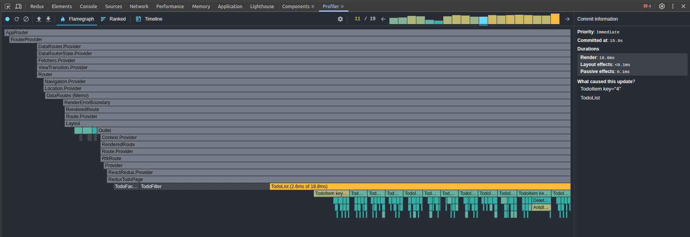 |
|       |                                                                                                                                                     | Yoltra re-renderiza solo el Item específico.                                                      | RTK re-renderiza toda la lista de Items.                                                    |
| 12    | Alternamos el estado del Item con clave `5`. Actualización atómica.                                                                                 |  |  |
|       |                                                                                                                                                     | Yoltra re-renderiza solo el Item específico.                                                      | RTK re-renderiza toda la lista de Items.                                                    |
| 13    | Alternamos el estado del Item con clave `6`. Actualización atómica.                                                                                 |  | 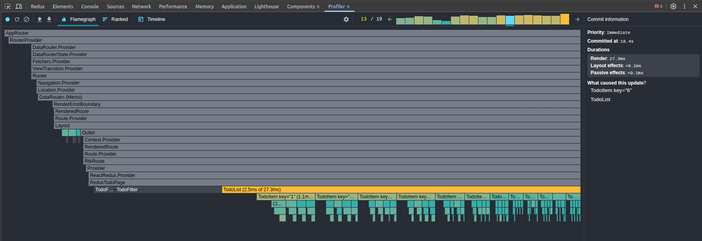 |
|       |                                                                                                                                                     | Yoltra re-renderiza solo el Item específico.                                                      | RTK re-renderiza toda la lista de Items.                                                    |
| 14    | Alternamos el estado del Item con clave `7`. Actualización atómica.                                                                                 | 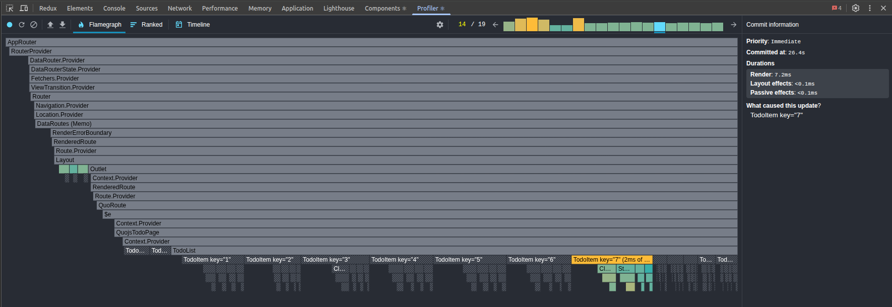 |  |
|       |                                                                                                                                                     | Yoltra re-renderiza solo el Item específico.                                                      | RTK re-renderiza toda la lista de Items.                                                    |
| 15    | Alternamos el estado del Item con clave `8`. Actualización atómica.                                                                                 | 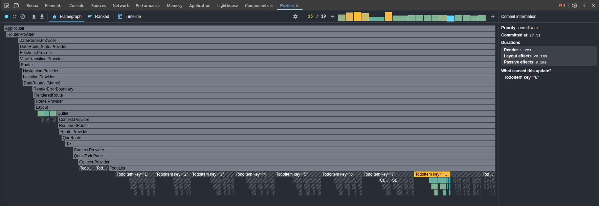 |  |
|       |                                                                                                                                                     | Yoltra re-renderiza solo el Item específico.                                                      | RTK re-renderiza toda la lista de Items.                                                    |
| 16    | Alternamos el estado del Item con clave `9`. Actualización atómica.                                                                                 |  |  |
|       |                                                                                                                                                     | Yoltra re-renderiza solo el Item específico.                                                      | RTK re-renderiza toda la lista de Items.                                                    |
| 17    | Alternamos el estado del Item con clave `10`. Actualización atómica.                                                                                |  |  |
|       |                                                                                                                                                     | Yoltra re-renderiza solo el Item específico.                                                      | RTK re-renderiza toda la lista de Items.                                                    |
| 18    | Alternamos el estado del Item con clave `11`. Actualización atómica.                                                                                |  |  |
|       |                                                                                                                                                     | Yoltra re-renderiza solo el Item específico.                                                      | RTK re-renderiza toda la lista de Items.                                                    |
| 19    | Alternamos el estado del Item con clave `12` (creada en el frame #7). Actualización atómica.                                                        |  |  |
|       | Profiler report (JSON)                                                                                                                              | [Yoltra](./public/assets/profiler/yoltra/profiling-data.yoltra.10-20-2025.22-30-26.json)          | [RTK](./public/assets/profiler/rtk/profiling-data.rtk.10-20-2025.22-32-54.json)             |

## Observaciones Clave

En la implementación con RTK, al alternar el estatus de cada _tarea_ (12 en total) las otras 11
también se vuelven a renderizar, lo que da un total de 12 renderizados por _tarea_. ¡Eso
significa 144 renderizados en total, 132 de los cuales eran innecesarios!

1. **Suscripciones atómicas (Yoltra) vs Fábricas de selectores (RTK).**
   - **Yoltra**: Ruta directa (`todo.data.4.status`) → un solo componente.
   - RTK: Requiere `createSelector` + memoización; fácil de usar mal y despertar toda la lista.

2. **Agregación con comodines.**
   - **Yoltra**: `todo.filter.*` actualiza filtros automáticamente.
   - RTK: Hay que escribir selectores manuales por fila; el enfoque por defecto causa
     re-renderizado de la lista completa.

3. **Efectos asíncronos.**
   - **Yoltra**: Semánticas de cancelación/retardo incorporadas.
   - RTK: Requiere middleware personalizado o cadenas de thunks; sin cancelación natural.

4. **Resultado en el perfilador.**
   - **Yoltra** flamegraphs: planos, predecibles, actualizaciones acotadas.
   - RTK flamegraphs: re-renderizados amplios, commits inconsistentes, mayor coste de CPU.

## Por qué Importa

En aplicaciones pequeñas, ambas parecen “suficientemente rápidas”.

A escala:

- **Yoltra escala linealmente** con el número de _tareas_ afectados.
- **RTK escala superlinealmente** a menos que se invierta mucho en disciplina con los
  selectores.

Esta demo ilustra **por qué existe Yoltra**: para dar suscripciones atómicas por propiedad,
efectos asíncronos de primera clase y agregación con comodines **sin ceremonia extra para el
desarrollador**.
