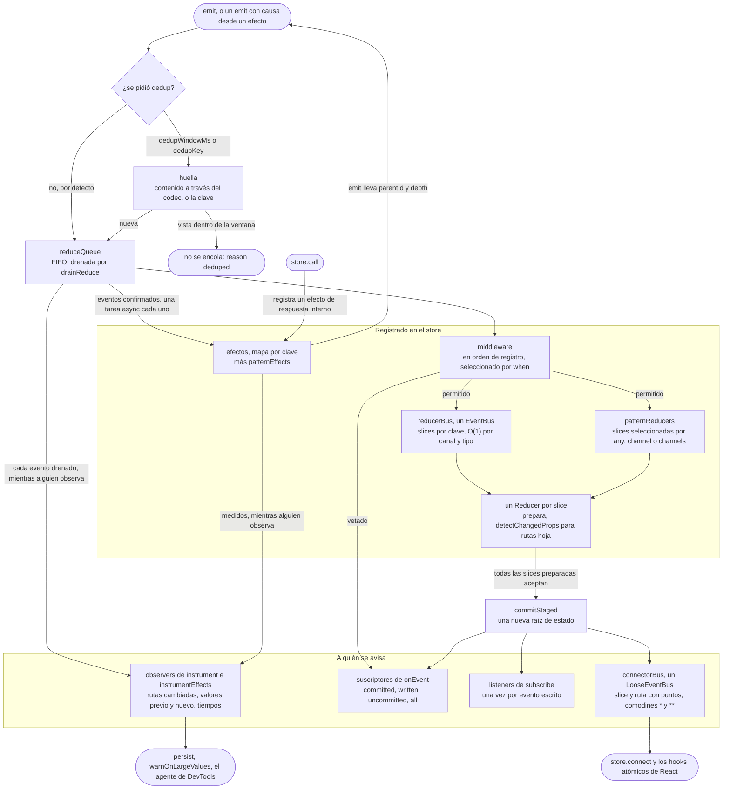

# @yoltra/core

> 👉 🇲🇽 Versión en Español&nbsp; |
> &nbsp;[ 🇺🇸 English Versión](./README.md)&nbsp;

[](https://www.npmjs.com/package/@yoltra/core)
[](https://www.npmjs.com/package/@yoltra/core)
[](https://www.npmjs.com/package/@yoltra/core)
[](https://github.com/yoltra/yoltra/blob/main/LICENSE)

**Contenedor de estado orientado a eventos, agnóstico de framework, con suscripciones de grano
fino por ruta.**

`@yoltra/core` es la base de [yoltra](../../README.md). Proporciona el store, el pipeline de
eventos, middleware, efectos y el sistema de suscripciones `connect()`. Cero dependencias de
framework. Este README nombra cada función en breve; la página del paquete tiene las
explicaciones completas, los casos límite y los ejemplos.

> **Documentación completa:** [@yoltra/core en yoltra.dev](https://yoltra.dev/es/yoltra/packages/core/)

## Instalación

```bash
npm install @yoltra/core
```

## El Pipeline de Eventos

Cada `emit(channel, type, payload)` fluye por un pipeline determinista: deduplicación opt-in, una
fase de reducción **síncrona** (middleware, reducers, suscriptores de eventos, suscriptores
gruesos) y luego los efectos, una tarea async por evento. `getState()` es correcto en el instante
en que `emit()` retorna; su promesa se resuelve cuando terminan los efectos de ese evento.
`store.instrument()` expone todo el flujo (rutas cambiadas, tiempos, fase, `reason` y `vetoedBy`)
a las DevTools.



## Conceptos Fundamentales

### Eventos basados en canales

Los eventos son tuplas `(channel, type, payload)`, y los canales les dan namespacing natural. Un
store es un conjunto de slices, cada una con su estado y su reducer. Una slice no tiene por qué
ser un objeto: un primitivo, un `Map`, un `Set` o una `Date` es un estado de slice válido.

```typescript
const store = createStore({
  name: "session",
  reducer: {
    token: {
      state: null as string | null,
      when: { keys: [["auth", "login"]] },
      reducer: (_state, event) => event.payload.token,
    },
  },
});

await store.emit("auth", "login", { token: "abc123" });
store.getState().token; // "abc123"
```

### Suscripciones de grano fino e inmutabilidad

Suscríbete a rutas de estado exactas con notación de puntos y los wildcards `*` (un segmento) y
`**` (cero o más segmentos). `"**"` observa una slice completa de cualquier forma; `""` es la raíz
de la slice, para una slice que contiene un solo valor. `Map` y `Set` se comparan por referencia
y no tienen rutas debajo. El estado se congela profundamente antes de confirmarse, así que
mutarlo lanza error en modo estricto; los valores binarios (typed arrays, `DataView`,
`ArrayBuffer`) se guardan tal cual y se comparan por referencia.

```typescript
// Wildcard de un segmento: se dispara cuando el titulo de CUALQUIER item cambia
store.connect({ reducer: "todos", property: "items.*.title" }, (change) =>
  console.log("some title changed at", change.path),
);
```

## Consumo de Eventos con Matchers `When`

Los reducers, efectos y middleware declaran sus eventos con un matcher `When`: `{ keys }`
(recomendado: `eventKeys<AppEM>()([...])` preserva la correlación de tipos), `{ channel }`,
`{ channels }` o `{ any: true }`. El middleware acepta además `{ channelPattern }` (`*` es cero o
más caracteres) para canales que no se pueden nombrar de antemano; un reducer o efecto registrado
con un patrón lanza. Canal y tipo se unen en una clave `"canal::tipo"`, y las builds de
desarrollo avisan cuando dos pares colisionan. `matchesWhen` y `describeWhenProblem` se exportan.

## Middleware

El middleware se ejecuta **síncronamente, antes** de los reducers. Devolver `false` veta el
evento (un evento "no confirmado"); no devolver nada lo permite. Cuando un evento no se confirma,
`emit` dice por qué en `reason` (`"vetoed"`, `"deduped"` o `"cascade"`) y nombra al middleware que
lo vetó en `vetoedBy`. Pásalo en el spec del store, o agrégalo después con
`store.registerMiddleware`.

```typescript
// Middleware con target: solo se ejecuta para eventos del canal admin
const adminGuard: MiddlewareSpec<AppState, AppEM> = {
  when: { channel: "admin" },
  middleware: (state, event) => {
    if (!state.auth.isAdmin) return false; // Rechazar → crea evento "no confirmado"
    return true;
  },
  meta: { type: "middleware", name: "adminGuard" },
};
```

## Efectos

Los efectos se ejecutan **después** de los reducers, ven el estado final y hacen el trabajo
async. Decláralos en el spec del store, con `store.registerEffect` o con el atajo
`store.onEffect`. Los efectos de un evento corren uno tras otro, y la promesa de su `emit()` se
resuelve cuando termina el último. El cuarto argumento, `ctx`, lleva un `signal` que se aborta
cuando el efecto deja de estar registrado. `store.instrumentEffects` reporta la fase de efectos
de cada evento, con tiempos por efecto.

```typescript
store.registerEffect({
  when: { keys: [["search", "query"]] },
  effect: async (event, getState, emit, ctx) => {
    const res = await fetch(`/api/search?q=${event.payload}`, { signal: ctx.signal });
    if (ctx.signal.aborted) return;
    await emit("search", "results", await res.json());
  },
});
```

## Suscripciones a Eventos

`store.onEvent(channel, type, handler, phase?)` se suscribe a eventos en lugar de al estado, para
notificaciones, animaciones y acciones rechazadas. La fase es `"committed"` (por defecto: no
vetado), `"uncommitted"`, `"written"` (el estado cambió de verdad) o `"all"`. Recorrer una línea
de tiempo de DevTools no llama a estos handlers salvo que lo activen con
`{ duringReplay: true }`, y `store.isReplaying` existe para el código que deba ramificar.

## Rechazar una escritura

Un reducer ve solo su propia slice y el evento, y escribe solo esa slice. Un evento que toca
varias slices las escribe todas antes de avisar a nadie, así que nadie observa un evento aplicado
a medias. Para declinar, un reducer devuelve `Rejected(reason)`: se rechaza el **evento
completo**, ninguna slice escribe, se llama a `onRejected`, y el `EmitResult` al que resuelve
`emit` lleva `committed: true`, `written: false` y `rejected.reason`.

## Petición y respuesta: `store.call()`

`store.call` emite una petición y resuelve al evento de respuesta, sin id que generar ni devolver:
quien responde lo hace con el `emit` que recibió, y el store correlaciona ambos. `reply` puede
nombrar varios tipos terminales; cualquier otro evento correlacionado es progreso, que se consume
iterando la llamada, con contrapresión real. `timeoutMs` (inactividad, 30 s por defecto), `signal`
y `call.cancel()` terminan una llamada, y `correlationId` cubre a quien no puede responder
directamente.

```typescript
const res = await store.call("rpc", "ask", { q: "quien?" }, { reply: ["rpc", "answer"] });
res.payload.text;
```

## Guardar y restaurar estado

`hydrate` lee una instantánea antes de que exista el store, `withHydration` hace que el store
nazca con ella, y `persist` escribe las slices observadas mientras corre, con throttle. Nada lanza
en el arranque: una instantánea ausente, ilegible o imposible de migrar vuelve a tus valores por
defecto y se reporta por `onError`. Una versión distinta se rechaza salvo que pases `migrate`, una
instantánea parcial nunca se escribe, y `dehydrate` produce el payload para un render en servidor.

```ts
import { createStore, createWebStorageAdapter, hydrate, persist, withHydration } from '@yoltra/core';

const adapter = createWebStorageAdapter(localStorage);
const hydration = await hydrate({ key: 'app', adapter, version: 3 });

const store = createStore({
  name: 'App',
  reducer: withHydration({ todos: todosSpec, ui: uiSpec }, hydration),
});

const stop = persist(store, { key: 'app', adapter, version: 3, slices: ['todos'] });
```

## Más en el store

- **Leer un valor al suscribirse:** `connect(spec, handler, { immediate: true })`.
- **De dónde vino un cambio:** un `Change` lleva el `eventId`, `channel` y `type` que lo causaron.
- **La deduplicación** está desactivada por defecto; actívala con `dedupWindowMs` o un `dedupKey`.
- **Tráfico que no es historia:** el replay y casi todos los observadores omiten los canales `ephemeral`.
- **Los valores que cambian muchas veces por segundo** van fuera del store; limítalos en el productor.
- **Tiempo y timers:** inyecta un `clock` y un `scheduler`; los timers falsos funcionan por defecto.
- **Atar recursos al store:** `store.signal`, `dispose()`, `metrics()` y `whenIdle()`.
- **Protección contra cascadas:** rechaza cadenas más allá de `maxReduceDepth` (64), con `onCascade`.
- **Reducers dinámicos:** `registerReducer`, `registerSlice`, y `withSlice` para re-tipar el store.
- **Hot Module Replacement:** `replace*` y `hotReplace` conservan lo que registró una librería.
- **Errores y diagnósticos:** la costura `Diagnostic` (`diagnostics`, `onDiagnostic`), y `warnOnLargeValues`.
- **Listas que se reordenan:** `createEntityAdapter` deja dormidos a los suscriptores durante un `sort`.
- **Mejores prácticas:** `await` solo por los efectos, reducers rápidos, manejar errores de efectos.

## Rendimiento

Módulos ES tree-shakeable, cero dependencias, tipos completos. `rush size` empaqueta el paquete
como un consumidor (sacudido, minificado, con gzip), falla al pasar el presupuesto de
`package.json` y escribe la tabla de abajo, así que editarla a mano hace fallar el CI.

La cifra que importa es lo que importas, no lo que el paquete exporta:

<!-- size-table:start -->
| Import | Tamaño | Presupuesto |
| --- | --- | --- |
| `{ createStore }` | 14.3 KB | 16 KB |
| `{ createStore, hydrate, persist }` | 15.7 KB | 18 KB |
| todo | 17.5 KB | 20 KB |
<!-- size-table:end -->

Son cifras de producción; el presupuesto se verifica contra el build de desarrollo, que es mayor.

## Documentación

- [Referencia de la API](https://yoltra.dev/es/yoltra/api/core/), el [README raíz](../../docs/es/README.md)
  y [@yoltra/react](../react/README.es.md).
- Guías: [Inicio Rápido](https://yoltra.dev/es/yoltra/docs/quick-start/), [Decoración](https://yoltra.dev/es/yoltra/docs/decoration/),
  [Petición y Respuesta](https://yoltra.dev/es/yoltra/docs/request-reply/), [Actualizar a 0.10](https://yoltra.dev/es/yoltra/releases/0.10/migration/),
  [Actualizar a 0.8](https://yoltra.dev/es/yoltra/releases/0.8/migration/), [Arquitectura de Cola de Eventos](https://yoltra.dev/es/yoltra/docs/design/event-queue-architecture/),
  [Comparación de Bibliotecas](https://yoltra.dev/es/yoltra/docs/design/state-management-comparison/).
- Cada sección completa en la página del paquete:
  [El Pipeline de Eventos](https://yoltra.dev/es/yoltra/packages/core/#el-pipeline-de-eventos), [Conceptos Fundamentales](https://yoltra.dev/es/yoltra/packages/core/#conceptos-fundamentales),
  [Matchers `When`](https://yoltra.dev/es/yoltra/packages/core/#consumo-de-eventos-con-matchers-when), [Middleware](https://yoltra.dev/es/yoltra/packages/core/#middleware),
  [Efectos](https://yoltra.dev/es/yoltra/packages/core/#efectos), [Suscripciones a Eventos](https://yoltra.dev/es/yoltra/packages/core/#suscripciones-a-eventos),
  [Commits atómicos](https://yoltra.dev/es/yoltra/packages/core/#los-commits-son-atómicos-entre-slices), [Una slice por reducer](https://yoltra.dev/es/yoltra/packages/core/#un-reducer-ve-una-slice-y-escribe-una-slice),
  [Rechazar una escritura](https://yoltra.dev/es/yoltra/packages/core/#rechazar-una-escritura), [Petición y respuesta](https://yoltra.dev/es/yoltra/packages/core/#petición-y-respuesta-storecall),
  [Leer un valor al suscribirse](https://yoltra.dev/es/yoltra/packages/core/#leer-un-valor-al-suscribirse), [De dónde vino un cambio](https://yoltra.dev/es/yoltra/packages/core/#de-dónde-vino-un-cambio),
  [Deduplicación](https://yoltra.dev/es/yoltra/packages/core/#deduplicación-de-eventos-opt-in), [Tráfico que no es historia](https://yoltra.dev/es/yoltra/packages/core/#tráfico-que-no-es-historia),
  [Valores que cambian muchas veces por segundo](https://yoltra.dev/es/yoltra/packages/core/#valores-que-cambian-muchas-veces-por-segundo), [Tiempo y timers](https://yoltra.dev/es/yoltra/packages/core/#tiempo-y-timers),
  [Atar recursos al store](https://yoltra.dev/es/yoltra/packages/core/#atar-recursos-al-store), [Protección contra cascadas](https://yoltra.dev/es/yoltra/packages/core/#protección-contra-cascadas-activada-por-defecto),
  [Reducers Dinámicos](https://yoltra.dev/es/yoltra/packages/core/#reducers-dinámicos), [Hot Module Replacement](https://yoltra.dev/es/yoltra/packages/core/#hot-module-replacement),
  [Mejores Prácticas](https://yoltra.dev/es/yoltra/packages/core/#mejores-prácticas), [Errores y diagnósticos](https://yoltra.dev/es/yoltra/packages/core/#errores-y-diagnósticos),
  [Resumen de API](https://yoltra.dev/es/yoltra/packages/core/#resumen-de-api), [Guardar y restaurar estado](https://yoltra.dev/es/yoltra/packages/core/#guardar-y-restaurar-estado),
  [Listas que se reordenan](https://yoltra.dev/es/yoltra/packages/core/#listas-que-se-reordenan), [Rendimiento](https://yoltra.dev/es/yoltra/packages/core/#rendimiento).

## Ejemplos

- **[App de Tareas](https://github.com/yoltra/yoltra/blob/main/examples/v0/yoltra-in-react)**:
  CRUD completo con perfilado de rendimiento · [▶ Abrir la demo en vivo](https://yoltra.dev/es/demos/in-react/)
- **[Logo Cinético](https://github.com/yoltra/yoltra/blob/main/examples/v0/yoltra-kinetic-logo)**:
  3000 círculos con simulación física. · [▶ Abrir la demo en vivo](https://yoltra.dev/es/demos/kinetic-logo/)
- **[Integración con Next.js](https://github.com/yoltra/yoltra/blob/main/examples/v0/yoltra-in-nextjs)**:
  Pages Router, estado de cliente + cambio de tema · [▶ Abrir la demo en vivo](https://yoltra.dev/es/demos/in-nextjs/)

## Estado y licencia

**Release Candidate**. Las APIs son estables, usadas en producción, cambios menores posibles
antes de v1.0.0. Licencia **MIT**. Para contribuir, ver la [raíz del monorepo](../../docs/es/README.md)
y la [Guía de Contribución](https://github.com/yoltra/yoltra/blob/main/CONTRIBUTING.md).

> **Documentación completa:** [@yoltra/core en yoltra.dev](https://yoltra.dev/es/yoltra/packages/core/)
