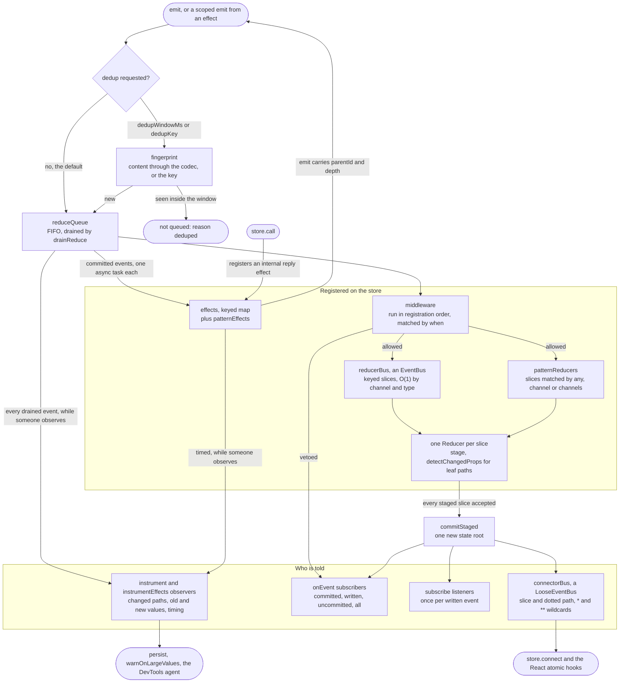

# @yoltra/core

> [ 🇲🇽 Versión en Español](./README.es.md)&nbsp;
> | &nbsp; 👉 🇺🇸 English Version

[](https://www.npmjs.com/package/@yoltra/core)
[](https://www.npmjs.com/package/@yoltra/core)
[](https://www.npmjs.com/package/@yoltra/core)
[](https://github.com/yoltra/yoltra/blob/main/LICENSE)

**Framework-agnostic event-driven state container with fine-grained path subscriptions.**

`@yoltra/core` is the foundation of [yoltra](../../README.md). It provides the store, event
pipeline, middleware, effects, and the `connect()` subscription system. Zero framework
dependencies. This README names every feature briefly; the package page has the full
explanations, edge cases and examples.

> **Full documentation:** [@yoltra/core on yoltra.dev](https://yoltra.dev/en/yoltra/packages/core/)

## Installation

```bash
npm install @yoltra/core
```

## The Event Pipeline

Every `emit(channel, type, payload)` flows through a deterministic pipeline: opt-in
deduplication, a **synchronous** reduce phase (middleware, reducers, event subscribers, coarse
subscribers), then effects, one async task per event. `getState()` is correct the instant `emit()`
returns; its promise resolves when that event's effects finish. `store.instrument()` exposes the
whole flow (changed paths, timing, phase, `reason` and `vetoedBy`) to the DevTools.



## Core Concepts

### Channel-based events

Events are `(channel, type, payload)` tuples, and channels namespace them naturally. A store is a
set of slices, each with its own state and reducer. A slice does not have to be an object: a
primitive, a `Map`, a `Set` or a `Date` is a valid slice state.

```typescript
const store = createStore({
  name: "session",
  reducer: {
    token: {
      state: null as string | null,
      when: { keys: [["auth", "login"]] },
      reducer: (_state, event) => event.payload.token,
    },
  },
});

await store.emit("auth", "login", { token: "abc123" });
store.getState().token; // "abc123"
```

### Fine-grained subscriptions and immutability

Subscribe to exact state paths with dotted notation and the `*` (one segment) and `**` (zero or
more segments) wildcards. `"**"` watches a whole slice of any shape; `""` is the slice root, for a
slice that holds a single value. `Map` and `Set` are compared by reference and have no paths
beneath them. State is deep-frozen before committing, so mutating it throws in strict mode;
binary values (typed arrays, `DataView`, `ArrayBuffer`) are stored as they are and compared by
reference.

```typescript
// Single-segment wildcard: fires when ANY item's title changes
store.connect({ reducer: "todos", property: "items.*.title" }, (change) =>
  console.log("some title changed at", change.path),
);
```

## Event Targeting with `When` Matchers

Reducers, effects and middleware declare their events with one `When` matcher: `{ keys }`
(recommended: `eventKeys<AppEM>()([...])` preserves type correlation), `{ channel }`,
`{ channels }` or `{ any: true }`. Middleware also accepts `{ channelPattern }` (`*` is zero or
more characters) for channels that cannot be named in advance; a reducer or effect registered
with a pattern throws. Channel and type join into one `"channel::type"` key, and development
builds warn when two pairs collide. `matchesWhen` and `describeWhenProblem` are exported.

## Middleware

Middleware runs **synchronously, before** reducers. Returning `false` vetoes the event (an
"uncommitted" event); returning nothing allows it. When an event does not commit, `emit` says why
in `reason` (`"vetoed"`, `"deduped"` or `"cascade"`) and names a vetoing middleware in `vetoedBy`.
Pass middleware in the store spec, or add it later with `store.registerMiddleware`.

```typescript
// Targeted middleware: only runs for admin channel events
const adminGuard: MiddlewareSpec<AppState, AppEM> = {
  when: { channel: "admin" },
  middleware: (state, event) => {
    if (!state.auth.isAdmin) return false; // Reject → creates "uncommitted" event
    return true;
  },
  meta: { type: "middleware", name: "adminGuard" },
};
```

## Effects

Effects run **after** reducers, see the final state and do the async work. Declare them in the
store spec, with `store.registerEffect`, or with the `store.onEffect` shorthand. An event's
effects run one after another, and its `emit()` promise settles when the last one finishes. The
fourth argument, `ctx`, carries a `signal` that aborts when the effect stops being registered.
`store.instrumentEffects` reports each event's effect phase, with timing per effect.

```typescript
store.registerEffect({
  when: { keys: [["search", "query"]] },
  effect: async (event, getState, emit, ctx) => {
    const res = await fetch(`/api/search?q=${event.payload}`, { signal: ctx.signal });
    if (ctx.signal.aborted) return;
    await emit("search", "results", await res.json());
  },
});
```

## Event Subscriptions

`store.onEvent(channel, type, handler, phase?)` subscribes to events rather than state, for
notifications, animations and rejected actions. The phase is `"committed"` (the default: not
vetoed), `"uncommitted"`, `"written"` (state actually changed) or `"all"`. Replaying a DevTools
timeline does not call these handlers unless they opt in with `{ duringReplay: true }`, and
`store.isReplaying` is there for code that has to branch.

## Refusing a write

A reducer sees only its own slice and the event, and writes only that slice. An event that
touches several slices writes all of them before anyone is notified, so nothing observes a
half-applied event. To decline, a reducer returns `Rejected(reason)`: the **whole event** is
rejected, no slice writes, `onRejected` is called, and the `EmitResult` that `emit` resolves to
carries `committed: true`, `written: false` and `rejected.reason`.

## Request and reply: `store.call()`

`store.call` emits a request and resolves to the reply event, with no id to mint or echo: the
responder replies through the `emit` it was handed, and the store correlates the two. `reply` can
name several terminal types; any other correlated event is progress, consumed by iterating the
call, with real backpressure. `timeoutMs` (idle, 30 s by default), `signal` and `call.cancel()`
end a call, and `correlationId` covers a responder that cannot reply directly.

```typescript
const res = await store.call("rpc", "ask", { q: "who?" }, { reply: ["rpc", "answer"] });
res.payload.text;
```

## Saving and restoring state

`hydrate` reads a snapshot before the store exists, `withHydration` makes the store born with it,
and `persist` writes the watched slices while it runs, throttled. Nothing throws on boot: a
missing, unparseable or unmigratable snapshot falls back to your declared defaults and reports
through `onError`. A version mismatch is refused unless you supply `migrate`, a partial snapshot
is never written, and `dehydrate` produces the payload for a server render.

```ts
import { createStore, createWebStorageAdapter, hydrate, persist, withHydration } from '@yoltra/core';

const adapter = createWebStorageAdapter(localStorage);
const hydration = await hydrate({ key: 'app', adapter, version: 3 });

const store = createStore({
  name: 'App',
  reducer: withHydration({ todos: todosSpec, ui: uiSpec }, hydration),
});

const stop = persist(store, { key: 'app', adapter, version: 3, slices: ['todos'] });
```

## More in the store

- **Reading a value as you subscribe:** `connect(spec, handler, { immediate: true })`.
- **Where a change came from:** a `Change` carries the `eventId`, `channel` and `type` behind it.
- **Event deduplication** is off by default; opt in with `dedupWindowMs` or a `dedupKey`.
- **Traffic that is not history:** `ephemeral` channels are skipped by replay and most observers.
- **Values that change many times a second** stay outside the store; throttle in the producer.
- **Time and timers:** inject a `clock` and a `scheduler`; fake timers work with the defaults.
- **Tying resources to the store:** `store.signal`, `dispose()`, `metrics()` and `whenIdle()`.
- **Cascade protection** refuses chains deeper than `maxReduceDepth` (64) and calls `onCascade`.
- **Dynamic reducers:** `registerReducer`, `registerSlice`, and `withSlice` to re-type the store.
- **Hot Module Replacement:** `replace*` and `hotReplace` keep what a library registered.
- **Errors and diagnostics:** one `Diagnostic` seam (`diagnostics`, `onDiagnostic`), plus
  `warnOnLargeValues` in development.
- **Lists that reorder:** `createEntityAdapter` keeps subscribers asleep through a sort.
- **Best practices:** `await` only for effects, keep reducers fast, handle effect errors.

## Performance

Tree-shakeable ES modules, zero dependencies, full type definitions. `rush size` bundles the
package as a consumer would (tree-shaken, minified, gzipped), fails past the budget in
`package.json`, and writes the table below, so editing it by hand fails CI.

The number that matters is what you import, not what the package exports:

<!-- size-table:start -->
| Import | Size | Budget |
| --- | --- | --- |
| `{ createStore }` | 14.3 KB | 16 KB |
| `{ createStore, hydrate, persist }` | 15.7 KB | 18 KB |
| everything | 17.5 KB | 20 KB |
<!-- size-table:end -->

These are production figures; the budget is checked against the larger development build.

## Documentation

- [API reference](https://yoltra.dev/en/yoltra/api/core/), the [root README](../../README.md) and
  [@yoltra/react](../react/README.md).
- Guides: [Quick Start](https://yoltra.dev/en/yoltra/docs/quick-start/), [Decoration](https://yoltra.dev/en/yoltra/docs/decoration/),
  [Request and Reply](https://yoltra.dev/en/yoltra/docs/request-reply/), [Upgrading to 0.10](https://yoltra.dev/en/yoltra/releases/0.10/migration/),
  [Upgrading to 0.8](https://yoltra.dev/en/yoltra/releases/0.8/migration/), [Event Queue Architecture](https://yoltra.dev/en/yoltra/docs/design/event-queue-architecture/),
  [Library Comparison](https://yoltra.dev/en/yoltra/docs/design/state-management-comparison/).
- Every section in full on the package page:
  [The Event Pipeline](https://yoltra.dev/en/yoltra/packages/core/#the-event-pipeline), [Core Concepts](https://yoltra.dev/en/yoltra/packages/core/#core-concepts),
  [Event Targeting](https://yoltra.dev/en/yoltra/packages/core/#event-targeting-with-when-matchers), [Middleware](https://yoltra.dev/en/yoltra/packages/core/#middleware),
  [Effects](https://yoltra.dev/en/yoltra/packages/core/#effects), [Event Subscriptions](https://yoltra.dev/en/yoltra/packages/core/#event-subscriptions),
  [Atomic commits](https://yoltra.dev/en/yoltra/packages/core/#commits-are-atomic-across-slices), [One slice per reducer](https://yoltra.dev/en/yoltra/packages/core/#a-reducer-sees-one-slice-and-writes-one-slice),
  [Refusing a write](https://yoltra.dev/en/yoltra/packages/core/#refusing-a-write), [Request and reply](https://yoltra.dev/en/yoltra/packages/core/#request-and-reply-storecall),
  [Reading a value as you subscribe](https://yoltra.dev/en/yoltra/packages/core/#reading-a-value-as-you-subscribe), [Where a change came from](https://yoltra.dev/en/yoltra/packages/core/#where-a-change-came-from),
  [Deduplication](https://yoltra.dev/en/yoltra/packages/core/#event-deduplication-opt-in), [Traffic that is not history](https://yoltra.dev/en/yoltra/packages/core/#traffic-that-is-not-history),
  [Values that change many times a second](https://yoltra.dev/en/yoltra/packages/core/#values-that-change-many-times-a-second), [Time and timers](https://yoltra.dev/en/yoltra/packages/core/#time-and-timers),
  [Tying resources to the store](https://yoltra.dev/en/yoltra/packages/core/#tying-resources-to-the-store), [Cascade protection](https://yoltra.dev/en/yoltra/packages/core/#cascade-protection-on-by-default),
  [Dynamic Reducers](https://yoltra.dev/en/yoltra/packages/core/#dynamic-reducers), [Hot Module Replacement](https://yoltra.dev/en/yoltra/packages/core/#hot-module-replacement),
  [Best Practices](https://yoltra.dev/en/yoltra/packages/core/#best-practices), [Errors and diagnostics](https://yoltra.dev/en/yoltra/packages/core/#errors-and-diagnostics),
  [API Overview](https://yoltra.dev/en/yoltra/packages/core/#api-overview), [Saving and restoring state](https://yoltra.dev/en/yoltra/packages/core/#saving-and-restoring-state),
  [Lists that reorder](https://yoltra.dev/en/yoltra/packages/core/#lists-that-reorder), [Performance](https://yoltra.dev/en/yoltra/packages/core/#performance).

## Examples

- **[Todo App](https://github.com/yoltra/yoltra/blob/main/examples/v0/yoltra-in-react)**: Full
  CRUD with performance profiling · [▶ Open the live demo](https://yoltra.dev/en/demos/in-react/)
- **[Kinetic Logo](https://github.com/yoltra/yoltra/blob/main/examples/v0/yoltra-kinetic-logo)**:
  3000 circles with physics simulation · [▶ Open the live demo](https://yoltra.dev/en/demos/kinetic-logo/)
- **[Next.js Integration](https://github.com/yoltra/yoltra/blob/main/examples/v0/yoltra-in-nextjs)**:
  Pages Router, client-side state + theme switcher · [▶ Open the live demo](https://yoltra.dev/en/demos/in-nextjs/)

## Status and license

**Release Candidate**. APIs are stable, used in production, minor changes possible before v1.0.0.
**MIT** licensed. To contribute, see the [monorepo root](../../README.md) and the
[Contributing Guide](https://github.com/yoltra/yoltra/blob/main/CONTRIBUTING.md).

> **Full documentation:** [@yoltra/core on yoltra.dev](https://yoltra.dev/en/yoltra/packages/core/)
