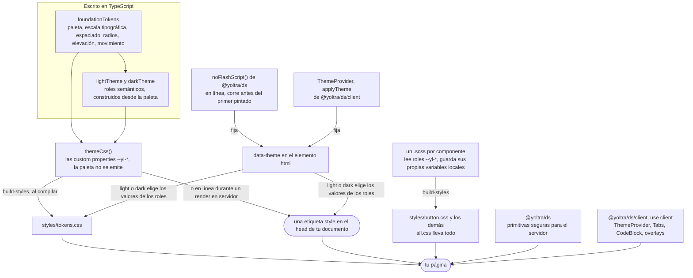

# @yoltra/ds

> 👉 🇲🇽 Versión en Español&nbsp; | &nbsp;[ 🇺🇸 English Version](./README.md)

[](https://www.npmjs.com/package/@yoltra/ds)
[](https://www.npmjs.com/package/@yoltra/ds)
[](https://www.npmjs.com/package/@yoltra/ds)
[](https://github.com/yoltra/yoltra/blob/main/LICENSE)

El **Sistema de Diseño de Yoltra**: tokens de fundación, temas semánticos claro/oscuro, un
generador de hoja de estilos basada en variables CSS y componentes primitivos de React
compartidos por el sitio web, la documentación y los ejemplos de [Yoltra](https://yoltra.dev/es/yoltra/).
Cada export está en la [referencia de la API](https://yoltra.dev/es/ds/api/ds/).

> **Documentación completa:** [Sistema de Diseño de Yoltra en yoltra.dev](https://yoltra.dev/es/ds/docs/overview/)

## Instalación

```bash
npm install @yoltra/ds
```

## Uso

Inyecta la hoja de estilos una vez en la raíz de tu app y usa los primitivos donde quieras:

```tsx
import { themeCss, Button, Callout, CodeBlock } from "@yoltra/ds";

export default function RootLayout({ children }: { children: React.ReactNode }) {
  return (
    <html lang="es" data-theme="light">
      <head>
        <style dangerouslySetInnerHTML={{ __html: themeCss() }} />
      </head>
      <body className="yl-root">{children}</body>
    </html>
  );
}
```

El tema lo controla el atributo **`data-theme="light" | "dark"`** en la raíz del documento. Los
colores se resuelven con variables CSS, así que los primitivos se renderizan en el servidor; solo
los controles interactivos (tema, pestañas, copiar) son de cliente, en `@yoltra/ds/client`.

## Contenido

| Export | Propósito |
| --- | --- |
| `foundationTokens`, `lightTheme`, `darkTheme`, `themes` | Primitivos crudos, y los roles semánticos de cada tema. |
| `themeCss()` | Emite las propiedades personalizadas `--yl-*` de ambos temas. **Solo propiedades**, sin reglas de componentes. |
| `ThemeProvider`, `useTheme`, `applyTheme`, `noFlashScript()`, `THEME_STORAGE_KEY` | Controlador de tema, y el script en línea que restaura el tema antes del primer pintado. |
| `Heading`, `Text`, `Link`, `InlineCode`, `Kbd`, `Button`, `ButtonLink`, `IconButton`, `ButtonGroup` | Tipografía y acciones. |
| `Input`, `Textarea`, `Select`, `Checkbox`, `Radio`, `RadioGroup`, `Switch`, `Slider`, `Label`, `FormField`, `Fieldset` | Controles de formulario y su etiquetado. |
| `Card`, `Container`, `Stack`, `Inline`, `Grid`, `Divider`, `AuthCard` | Maquetación y composición. |
| `Badge`, `Chip`, `Callout`, `Stat`, `StatGrid`, `Spinner`, `Skeleton`, `ProgressBar`, `EmptyState` | Estado, cifras y retroalimentación. |
| `Table`, `TableScroll`, `THead`, `TBody`, `TR`, `TH`, `TD`, `CodeBlock`, `Tabs`, `VisuallyHidden` | Tablas y todo lo demás. |
| `Portal`, `Dialog`, `Drawer`, `Popover`, `Menu`, `MenuItem`, `MenuSeparator`, `ContextMenu`, `Tooltip` | Overlays modales y anclados. |
| `useFocusTrap`, `useDismiss`, `useReturnFocus`, `useScrollLock`, `focusableWithin`, `resolvePlacement`, `useControllableState` | Los comportamientos con los que están hechos los overlays, y estado controlado o no para tus propios controles. |

Cada componente tiene su `README.md` al lado de su código, con ejemplos ejecutables y su
contrato de accesibilidad: [`src/primitives/Button/README.md`](src/primitives/Button/README.md)
y así con cada uno (en inglés). Quien maneja su propio estado puede fijar `data-theme` sin `ThemeProvider`.

## Cómo encaja todo

Los tokens se escriben una sola vez, en TypeScript, y se convierten en custom properties de CSS.
Las hojas de estilo de los componentes leen solo los roles semánticos, y un único atributo
`data-theme` en la raíz del documento decide a qué valor resuelve cada rol.



## Marca

Azul primario `#1A7FE2`, carbón `#0F172A`. Tipografía: **Inter** + **JetBrains Mono**.

## Instalando los estilos

El paquete publica **una hoja de estilos por componente**, así que una aplicación carga solo los
estilos de lo que importa. `tokens.css` y `base.css` hacen falta siempre; agrega una hoja por
componente que uses (`@yoltra/ds/styles/button.css` y así), o `all.css` para un prototipo.

## 1rem son 10px

`base.css` define `html { font-size: 62.5% }`, así que `1.6rem` son 16px y la preferencia de
tamaño de fuente del lector sigue escalando la interfaz. Los breakpoints y los bordes finos van en
píxeles, y una aplicación que no acepte una raíz global importa `base-no-root.css`.

## Overlays

`Dialog` y `Drawer` se renderizan con `Portal` bajo `document.body`, son controlados (`open`,
`onClose`), atrapan y restauran el foco, bloquean el scroll y se descartan en orden apilado;
`title` es obligatorio. `Popover`, `Menu` y `ContextMenu` no son modales y dan a su `trigger` el
cableado ARIA; `Tooltip` usa `aria-describedby`. `resolvePlacement` voltea solo si el otro lado cabe.

## Tamaño

Medido como lo publica un consumidor (empaquetado, sacudido, minificado, comprimido con gzip) y
verificado por `rush size` en cada build.

<!-- size-table:start -->
| Import | Tamaño | Presupuesto |
| --- | --- | --- |
| `{ Button, Card, Stack, Text }` | 0.9 KB | 1.2 KB |
| todo | 6.4 KB | 8 KB |
| `{ Dialog }` desde `/client` | 1.8 KB | 3 KB |
| todo `/client` | 4.8 KB | 5.5 KB |
<!-- size-table:end -->

## Tokens

Tres niveles: **primitivos** (`--yl-space-4`), **roles semánticos** que leen los componentes
(`--yl-color-bg-canvas`) y **locales del componente**; la paleta no se emite. Cubren también
z-index, elevación, movimiento, breakpoints, contenedores, pesos, bordes y una escala tipográfica
de doce roles. El tema oscuro se mezcla del par de marca, y cada combinación prueba su contraste.

**Migrar desde 0.3.x:** se renombraron 38 propiedades, con un codemod incluido en el paquete.
Ver [migrar a 0.4](https://yoltra.dev/es/ds/releases/0.4/migration/).

## Autoría de estilos

Los estilos son SASS, compilados un archivo por componente con `scripts/build-styles.mjs`. SASS
nunca es dueño de un valor: colores, espaciado y radios se leen como `var(--yl-*)`, y stylelint
rechaza colores, tamaños y pesos de fuente literales en la hoja de un componente.

## Licencia

MIT © Manu Ramirez

> **Documentación completa:** [Sistema de Diseño de Yoltra en yoltra.dev](https://yoltra.dev/es/ds/docs/overview/)
