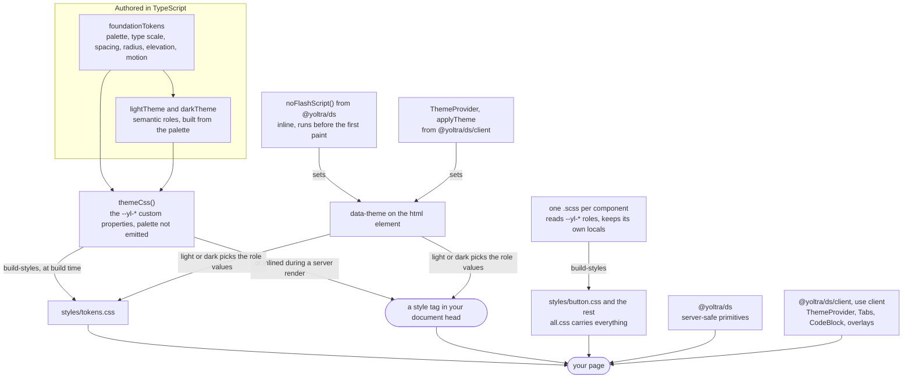

# @yoltra/ds

> [ 🇲🇽 Versión en Español](./README.es.md)&nbsp; | 👉 🇺🇸 English Version &nbsp;

[](https://www.npmjs.com/package/@yoltra/ds)
[](https://www.npmjs.com/package/@yoltra/ds)
[](https://www.npmjs.com/package/@yoltra/ds)
[](https://github.com/yoltra/yoltra/blob/main/LICENSE)

The **Yoltra Design System**: foundation tokens, semantic light/dark themes, a CSS-variable
stylesheet generator, and primitive React components shared across the
[Yoltra](https://yoltra.dev/en/yoltra/) website, documentation, and examples. Every export is in the
[API reference](https://yoltra.dev/en/ds/api/ds/).

> **Full documentation:** [Yoltra Design System on yoltra.dev](https://yoltra.dev/en/ds/docs/overview/)

## Install

```bash
npm install @yoltra/ds
```

## Usage

Inject the stylesheet once at your app root, then use the primitives anywhere:

```tsx
import { themeCss, Button, Callout, CodeBlock } from "@yoltra/ds";

export default function RootLayout({ children }: { children: React.ReactNode }) {
  return (
    <html lang="en" data-theme="light">
      <head>
        <style dangerouslySetInnerHTML={{ __html: themeCss() }} />
      </head>
      <body className="yl-root">{children}</body>
    </html>
  );
}
```

Theming is driven by a **`data-theme="light" | "dark"`** attribute on the document root. Colors
resolve through CSS custom properties, so primitives render on the server; only interactive
controls (theme toggle, tabs, copy button) are client components, from `@yoltra/ds/client`.

## What's inside

| Export | Purpose |
| --- | --- |
| `foundationTokens`, `lightTheme`, `darkTheme`, `themes` | Raw primitives, and the semantic roles of each theme. |
| `themeCss()` | Emits the `--yl-*` custom properties for both themes. **Properties only**, no component rules. |
| `ThemeProvider`, `useTheme`, `applyTheme`, `noFlashScript()`, `THEME_STORAGE_KEY` | Theme controller, and the inline script that restores the theme before the first paint. |
| `Heading`, `Text`, `Link`, `InlineCode`, `Kbd`, `Button`, `ButtonLink`, `IconButton`, `ButtonGroup` | Typography and actions. |
| `Input`, `Textarea`, `Select`, `Checkbox`, `Radio`, `RadioGroup`, `Switch`, `Slider`, `Label`, `FormField`, `Fieldset` | Form controls and their labelling. |
| `Card`, `Container`, `Stack`, `Inline`, `Grid`, `Divider`, `AuthCard` | Layout and composition. |
| `Badge`, `Chip`, `Callout`, `Stat`, `StatGrid`, `Spinner`, `Skeleton`, `ProgressBar`, `EmptyState` | Status, figures and feedback. |
| `Table`, `TableScroll`, `THead`, `TBody`, `TR`, `TH`, `TD`, `CodeBlock`, `Tabs`, `VisuallyHidden` | Tables and everything else. |
| `Portal`, `Dialog`, `Drawer`, `Popover`, `Menu`, `MenuItem`, `MenuSeparator`, `ContextMenu`, `Tooltip` | Modal and anchored overlays. |
| `useFocusTrap`, `useDismiss`, `useReturnFocus`, `useScrollLock`, `focusableWithin`, `resolvePlacement`, `useControllableState` | The behaviours the overlays are built from, and controlled-or-uncontrolled state for your own controls. |

Every component keeps a `README.md` beside its source, with runnable examples and its
accessibility contract: [`src/primitives/Button/README.md`](src/primitives/Button/README.md) and
so on. A consumer that owns its state can skip `ThemeProvider` and set `data-theme` itself.

## How it fits together

Tokens are authored once, in TypeScript, and turned into CSS custom properties. Component
stylesheets read only the semantic roles, and one `data-theme` attribute on the document root
decides which value each role resolves to.



## Brand

Primary blue `#1A7FE2`, carbon `#0F172A`. Type: **Inter** + **JetBrains Mono**.

## Installing styles

The package ships **one stylesheet per component**, so an application carries styles only for
what it imports. `tokens.css` and `base.css` are always needed; add one sheet per component you
use (`@yoltra/ds/styles/button.css` and so on), or `all.css` for a prototype.

## 1rem is 10px

`base.css` sets `html { font-size: 62.5% }`, so `1.6rem` is 16px while a reader's font-size
preference still scales the interface. Breakpoints and hairline borders stay in pixels, and an
application that cannot accept a global root size imports `base-no-root.css` instead.

## Overlays

`Dialog` and `Drawer` render through `Portal` under `document.body`, are controlled (`open` and
`onClose`), trap and restore focus, lock page scroll and dismiss in stacked order; `title` is
required. `Popover`, `Menu` and `ContextMenu` are non-modal and hand their `trigger` the ARIA
wiring; `Tooltip` uses `aria-describedby`. `resolvePlacement` flips only when the other side fits.

## Size

Measured the way a consumer ships it (bundled, tree-shaken, minified, gzipped) and checked by
`rush size` on every build.

<!-- size-table:start -->
| Import | Size | Budget |
| --- | --- | --- |
| `{ Button, Card, Stack, Text }` | 0.9 KB | 1.2 KB |
| everything | 6.4 KB | 8 KB |
| `{ Dialog }` from `/client` | 1.8 KB | 3 KB |
| all of `/client` | 4.8 KB | 5.5 KB |
<!-- size-table:end -->

## Tokens

Three tiers: **primitives** (`--yl-space-4`), **semantic roles** that components read
(`--yl-color-bg-canvas`), and **component locals**; the palette is not emitted. Tokens also cover
z-index, elevation, motion, breakpoints, containers, font weights, border widths and a twelve-role
type scale. The dark theme is mixed from the brand pair, and every pairing is contrast-tested.

**Upgrading from 0.3.x:** 38 properties were renamed, with a codemod that ships in the package.
See [migrating to 0.4](https://yoltra.dev/en/ds/releases/0.4/migration/).

## Authoring

Component styles are SASS, compiled one file per component by `scripts/build-styles.mjs`. SASS
never owns a value: colours, spacing and radii are read as `var(--yl-*)`, and stylelint rejects
literal colours, font sizes and weights in a component stylesheet.

## License

MIT © Manu Ramirez

> **Full documentation:** [Yoltra Design System on yoltra.dev](https://yoltra.dev/en/ds/docs/overview/)
