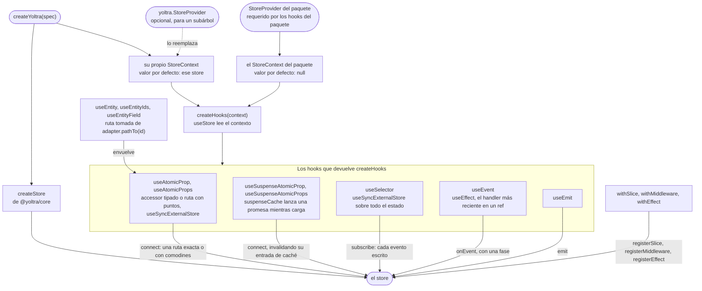

# @yoltra/react

> 👉 🇲🇽 Versión en Español&nbsp; |
> &nbsp;[ 🇺🇸 English Versión](./README.md)&nbsp;

[](https://www.npmjs.com/package/@yoltra/react)
[](https://www.npmjs.com/package/@yoltra/react)
[](https://www.npmjs.com/package/@yoltra/react)
[](https://github.com/yoltra/yoltra/blob/main/LICENSE)

**Hooks de React para [yoltra](../../README.md) con
suscripciones de grano fino por ruta.**

Suscríbete a `"items.0.title"` o `"items.*.done"`. El componente se re-renderiza solo cuando
esa ruta exacta cambia. Sin selectores, sin memoización, sin optimización manual.
[Ver la comparación de flamegraph (Redux vs yoltra).](https://github.com/yoltra/yoltra/blob/main/examples/v0/yoltra-in-react/redux-yoltra-profiler.md)

> **Documentación completa:** [@yoltra/react en yoltra.dev](https://yoltra.dev/es/yoltra/packages/react/)

## Instalación

```bash
npm install @yoltra/core @yoltra/react
```

**Dependencias peer:** React 18+

## Configuración con `createYoltra` (recomendado)

`createYoltra(spec)` recibe el mismo spec que `createStore` y devuelve el store **y** todos los
hooks tipados en una sola llamada (`export const { store, useAtomicProp, useEmit, StoreProvider } =
createYoltra({ ... })` en un módulo `yoltra.ts`), sin archivo de context ni provider obligatorio.
Los parámetros de tipo se infieren de tu reducer, así que los componentes no necesitan generics.
Suscríbete con un spec **`{ reducer, property }`**, donde el `property` con puntos nombra la ruta
exacta que se lee:

```tsx
// Counter.tsx
import { useAtomicProp, useEmit } from "./yoltra";

export function Counter() {
  // Forma objeto: se re-renderiza solo cuando counter.value cambia. Sin selectores, sin memo.
  const value = useAtomicProp({ reducer: "counter", property: "value" });
  const emit = useEmit();

  return (
    <div>
      <h1>Count: {value}</h1>
      <button onClick={() => emit("counter", "increment", 1)}>+</button>
      <button onClick={() => emit("counter", "decrement", 1)}>-</button>
      <button onClick={() => emit("counter", "reset", null)}>Reset</button>
    </div>
  );
}
```

Un `<StoreProvider>` solo se necesita para acotar una instancia **diferente** del store a un
subárbol (p. ej. un store nuevo por test).

## Cableado manual y decoración

`createHooks(context)` vincula los mismos hooks a un context de React propio, para compartir un
conjunto de hooks entre varias instancias de store; provee el store con
`<AppStoreContext.Provider>`. Una librería también puede montar una slice en un store que no
creó: `withSlice`, `withMiddleware` y `withEffect` sobre un `Yoltra` devuelven uno cuyos hooks
conocen la slice nueva. Llámalos en el ámbito del módulo, una vez, antes del primer render; el
store y el contexto siguen siendo los mismos objetos. La
[guía de decoración](https://yoltra.dev/es/yoltra/docs/decoration/) tiene el contrato completo.

## Cómo llegan los hooks al store

Cada hook es una capa delgada sobre un método del store, así que el store decide qué cambió y
React re-renderiza solo los componentes cuya suscripción se disparó. `createYoltra` da a sus hooks
un contexto cuyo valor por defecto es su propio store; los hooks que exporta el paquete leen un
contexto que empieza vacío, y necesitan un `<StoreProvider>`.



## API de Hooks

- **`useAtomicProp({ reducer, property }, map?, isEqual?)`**: una ruta, exacta (`"items.0.title"`),
  dinámica o con comodines (`*` un segmento, `**` cero o más). Con un comodín, `map` recibe el
  slice completo. También existe una sobrecarga con accessor tipado,
  `useAtomicProp("todos", (s) => s.items[0].title)`.
- **`useAtomicProps(specs, selector, isEqual?)`**: varias rutas, recalculado cuando alguna cambia.
  En desarrollo el selector lanza, nombrando la ruta, cuando lee estado no declarado en `specs`.
- **`useEvent(channel, type, handler, phase?, options?)`**: eventos del store en un componente, con
  las fases `committed` (por defecto), `uncommitted`, `written` y `all`. En silencio durante el
  replay de DevTools salvo `{ duringReplay: true }`.
- **`useEmit()`**: el `emit` tipado, con referencia estable.
- **`useSelector(selector, isEqual?)`**: selector de grano grueso sobre todo el estado.
- **`useStore()`**: la instancia del store. `getState()` en el cuerpo del render no se suscribe a
  nada, así que lee lo que renderizas con `useAtomicProp` o `useSelector`.
- **`useSuspenseAtomicProp(spec, options)`** y **`useSuspenseAtomicProps(specs, options)`**: lanzan
  una promesa mientras corre `load`, para un boundary `<Suspense>`. Impórtalos del resultado de tu
  propio `createYoltra` o `createHooks`, no del barrel. La caché es por store y se limpia con
  `invalidateAtomicProp`, `invalidateAtomicPropsByReducer` y `clearSuspenseCache`.
- **`shallowEqual`**: comparador superficial para el argumento `isEqual`.
- **`useEntityIds`, `useEntity`, `useEntityField`**: colecciones normalizadas con
  `createEntityAdapter`, así que una fila despierta solo cuando cambia su propia entidad.

## Compatibilidad con React 18+

Todos los hooks usan `useSyncExternalStore`, así que son seguros en Concurrent Mode; la
deduplicación de eventos cubre el doble procesamiento de Strict Mode. Cada fila de una lista se
suscribe a su propia ruta, así que un cambio re-renderiza esa fila y no la lista completa.

## Ejemplos

- **[App de Tareas con Profiler](https://github.com/yoltra/yoltra/tree/main/examples/v0/yoltra-in-react)**: CRUD completo con
  comparación de flamegraph · [▶ Abrir la demo en vivo](https://yoltra.dev/es/demos/in-react/)
- **[Logo Cinético (3000 particulas)](https://github.com/yoltra/yoltra/tree/main/examples/v0/yoltra-kinetic-logo)**: Suscripciones
  independientes por circulo SVG · [▶ Abrir la demo en vivo](https://yoltra.dev/es/demos/kinetic-logo/)
- **[Next.js (Pages Router)](https://github.com/yoltra/yoltra/tree/main/examples/v0/yoltra-in-nextjs)**: estado de cliente + cambio de tema · [▶ Abrir la demo en vivo](https://yoltra.dev/es/demos/in-nextjs/)

## Documentación

- [Referencia de la API](https://yoltra.dev/es/yoltra/api/react/), el [README raíz](../../docs/es/README.md),
  [@yoltra/core](../core/README.es.md) y el [Inicio Rápido](https://yoltra.dev/es/yoltra/docs/quick-start/).
- Cada sección completa en la página del paquete:
  [Configuración con createYoltra](https://yoltra.dev/es/yoltra/packages/react/#configuración-con-createyoltra-recomendado), [Cableado manual con createHooks](https://yoltra.dev/es/yoltra/packages/react/#avanzado-cableado-manual-con-createhooks),
  [Agregar a un store](https://yoltra.dev/es/yoltra/packages/react/#agregar-a-un-store-con-sus-tipos), [Cómo llegan los hooks al store](https://yoltra.dev/es/yoltra/packages/react/#cómo-llegan-los-hooks-al-store),
  [API de Hooks](https://yoltra.dev/es/yoltra/packages/react/#api-de-hooks), [Hooks de Suspense](https://yoltra.dev/es/yoltra/packages/react/#hooks-de-suspense),
  [shallowEqual](https://yoltra.dev/es/yoltra/packages/react/#shallowequal), [Rendimiento: Antes y Después](https://yoltra.dev/es/yoltra/packages/react/#rendimiento-antes-y-después),
  [Colecciones normalizadas](https://yoltra.dev/es/yoltra/packages/react/#colecciones-normalizadas), [Compatibilidad con React 18+](https://yoltra.dev/es/yoltra/packages/react/#compatibilidad-con-react-18).

## Estado y licencia

**Release Candidate**. Las APIs son estables, usadas en producción, cambios menores posibles
antes de v1.0.0. Licencia **MIT**. Para contribuir, ver la [raíz del monorepo](https://github.com/yoltra/yoltra)
y la [Guía de Contribución](../../CONTRIBUTING.md).

> **Documentación completa:** [@yoltra/react en yoltra.dev](https://yoltra.dev/es/yoltra/packages/react/)
