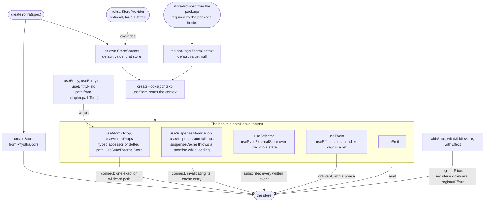

# @yoltra/react

> [ 🇲🇽 Versión en Español](./README.es.md)&nbsp;
> | &nbsp; 👉 🇺🇸 English Version

[](https://www.npmjs.com/package/@yoltra/react)
[](https://www.npmjs.com/package/@yoltra/react)
[](https://www.npmjs.com/package/@yoltra/react)
[](https://github.com/yoltra/yoltra/blob/main/LICENSE)

**React hooks for [yoltra](../../README.md) with
fine-grained path subscriptions.**

Subscribe to `"items.0.title"` or `"items.*.done"`. The component re-renders only when that
exact path changes. No selectors, no memoization, no manual optimization.
[See the flamegraph comparison (Redux vs yoltra).](https://github.com/yoltra/yoltra/blob/main/examples/v0/yoltra-in-react/redux-yoltra-profiler.md)

> **Full documentation:** [@yoltra/react on yoltra.dev](https://yoltra.dev/en/yoltra/packages/react/)

## Installation

```bash
npm install @yoltra/core @yoltra/react
```

**Peer dependencies:** React 18+

## Setup with `createYoltra` (recommended)

`createYoltra(spec)` takes the same spec as `createStore` and returns the store **and** every
fully-typed hook in one call (`export const { store, useAtomicProp, useEmit, StoreProvider } =
createYoltra({ ... })` in a `yoltra.ts` module), with no context file and no required provider.
Type parameters are inferred from your reducer, so components need no generics. Subscribe with a
**`{ reducer, property }`** spec, where the dotted `property` names the exact path to read:

```tsx
// Counter.tsx
import { useAtomicProp, useEmit } from "./yoltra";

export function Counter() {
  // Object form: re-renders only when counter.value changes. No selectors, no memo.
  const value = useAtomicProp({ reducer: "counter", property: "value" });
  const emit = useEmit();

  return (
    <div>
      <h1>Count: {value}</h1>
      <button onClick={() => emit("counter", "increment", 1)}>+</button>
      <button onClick={() => emit("counter", "decrement", 1)}>-</button>
      <button onClick={() => emit("counter", "reset", null)}>Reset</button>
    </div>
  );
}
```

A `<StoreProvider>` is only needed to scope a **different** store instance to a subtree (e.g. a
fresh store per test).

## Manual wiring and decoration

`createHooks(context)` binds the same hooks to a React context of your own, for one set of hooks
shared across several store instances; provide the store with `<AppStoreContext.Provider>`.
A library can also mount a slice on a store it did not create: `withSlice`, `withMiddleware` and
`withEffect` on a `Yoltra` return one whose hooks know the new slice. Call them at module scope,
once, before the first render; the store and context stay the same objects. The
[decoration guide](https://yoltra.dev/en/yoltra/docs/decoration/) has the full contract.

## How the hooks reach the store

Every hook is a thin wrapper over one store method, so the store decides what changed and React
re-renders only the components whose subscription fired. `createYoltra` gives its hooks a context
whose default value is its own store; the hooks exported from the package itself read a context
that starts empty, and need a `<StoreProvider>`.



## Hooks API

- **`useAtomicProp({ reducer, property }, map?, isEqual?)`**: one path, exact (`"items.0.title"`),
  dynamic or wildcard (`*` one segment, `**` zero or more). With a wildcard, `map` receives the
  whole slice. A typed-accessor overload, `useAtomicProp("todos", (s) => s.items[0].title)`, also
  exists.
- **`useAtomicProps(specs, selector, isEqual?)`**: several paths, recomputed when any changes. In
  development the selector throws, naming the path, when it reads state not declared in `specs`.
- **`useEvent(channel, type, handler, phase?, options?)`**: store events in a component, with the
  phases `committed` (default), `uncommitted`, `written` and `all`. Silent during DevTools replay
  unless `{ duringReplay: true }`.
- **`useEmit()`**: the typed `emit`, a stable reference.
- **`useSelector(selector, isEqual?)`**: coarse selector over the whole state.
- **`useStore()`**: the store instance. `getState()` in a render body subscribes to nothing, so
  read what you render with `useAtomicProp` or `useSelector`.
- **`useSuspenseAtomicProp(spec, options)`** and **`useSuspenseAtomicProps(specs, options)`**: throw
  a promise while `load` runs, for a `<Suspense>` boundary. Import them from your own
  `createYoltra` or `createHooks` result, not the package barrel. The cache is per store, cleared
  with `invalidateAtomicProp`, `invalidateAtomicPropsByReducer` and `clearSuspenseCache`.
- **`shallowEqual`**: shallow comparator for the `isEqual` argument.
- **`useEntityIds`, `useEntity`, `useEntityField`**: normalised collections built with
  `createEntityAdapter`, so a row wakes only when its own entity changes.

## React 18+ Compatibility

All hooks use `useSyncExternalStore`, so they are safe in Concurrent Mode; event deduplication
covers Strict Mode double-processing. Each row of a list subscribes to its own path, so a change
re-renders that row and not the whole list.

## Examples

- **[Todo App with Profiler](https://github.com/yoltra/yoltra/tree/main/examples/v0/yoltra-in-react)**: Full CRUD with flamegraph
  comparison · [▶ Open the live demo](https://yoltra.dev/en/demos/in-react/)
- **[Kinetic Logo (3000 particles)](https://github.com/yoltra/yoltra/tree/main/examples/v0/yoltra-kinetic-logo)**: Independent
  subscriptions per circle · [▶ Open the live demo](https://yoltra.dev/en/demos/kinetic-logo/)
- **[Next.js (Pages Router)](https://github.com/yoltra/yoltra/tree/main/examples/v0/yoltra-in-nextjs)**: client-side state + theme switcher · [▶ Open the live demo](https://yoltra.dev/en/demos/in-nextjs/)

## Documentation

- [API reference](https://yoltra.dev/en/yoltra/api/react/), the [root README](../../README.md),
  [@yoltra/core](../core/README.md) and the [Quick Start](https://yoltra.dev/en/yoltra/docs/quick-start/).
- Every section in full on the package page:
  [Setup with createYoltra](https://yoltra.dev/en/yoltra/packages/react/#setup-with-createyoltra-recommended), [Manual wiring with createHooks](https://yoltra.dev/en/yoltra/packages/react/#advanced-manual-wiring-with-createhooks),
  [Adding to a store](https://yoltra.dev/en/yoltra/packages/react/#adding-to-a-store-with-its-types), [How the hooks reach the store](https://yoltra.dev/en/yoltra/packages/react/#how-the-hooks-reach-the-store),
  [Hooks API](https://yoltra.dev/en/yoltra/packages/react/#hooks-api), [Suspense Hooks](https://yoltra.dev/en/yoltra/packages/react/#suspense-hooks),
  [shallowEqual](https://yoltra.dev/en/yoltra/packages/react/#shallowequal), [Performance: Before and After](https://yoltra.dev/en/yoltra/packages/react/#performance-before-and-after),
  [Normalised collections](https://yoltra.dev/en/yoltra/packages/react/#normalised-collections), [React 18+ Compatibility](https://yoltra.dev/en/yoltra/packages/react/#react-18-compatibility).

## Status and license

**Release Candidate**. APIs are stable, used in production, minor changes possible before v1.0.0.
**MIT** licensed. To contribute, see the [monorepo root](https://github.com/yoltra/yoltra) and the
[Contributing Guide](../../CONTRIBUTING.md).

> **Full documentation:** [@yoltra/react on yoltra.dev](https://yoltra.dev/en/yoltra/packages/react/)
